# 第 1 章 -- RISC-V 處理器

## 前言

RISC-V 開放指令集處理器是加州大學柏克萊分校的 Krste Asanović 教授在 2010年開始的一個專案，後來《計算機結構教科書的著名作者 David Patterson 也加入了此一計畫。

David Patterson 等人對 RISC 管線 (pipeline) 處理器的知識非常深厚，因此設計出來的 RISC-V 指令集除了精簡之外，還能具有良好的效能，加上採用開放原始碼的方式，逐漸在 x86, ARM 等強勢處理器的世界裡，打開了一條道路。

目前 RISC-V 所佔有的市場遠不如 x86, ARM，但逐漸在嵌入式領域擁有了一群公司與使用者投入，但為數並不能算很多。

雖然 RISC-V 佔有市場不高，但是技術資源卻相當豐富，您可以從以下官方網站取得很多 RISC-V 相關技術資訊，包含開發工具鏈與技術手冊等等。

* RISC-V 官網 -- https://riscv.org/
    * 軟體 -- https://riscv.org/exchange/software/
    * 開發板 -- https://riscv.org/exchange/
    * 處理器原始碼 -- https://riscv.org/exchange/cores-socs/
    * 技術手冊 -- https://riscv.org/technical/specifications/

未來若 RISC-V 能成功吸引《Arduino, Raspberry Pi 等開發板》改採 RISC-V 處理器的話，那麼 RISC-V 處理器就能在嵌入式系統領域有更好的發展。

但是對於我們這樣的大學老師而言， RISC-V 最有價值的地方不是商業佔有率，而是《開放原始碼硬體的授權》，這讓我們能夠基於 RISC-V 發展對應的《計算機結構、系統程式、作業系統、嵌入式系統》等教材，而不會受到商用處理器架構不斷修修改改，導致教材不斷過時的問題。

在本書中，我們將詳細講解《從計算機結構、系統程式到作業系統》如何在 RISC-V 處理器上實現的那些技術與知識。

## RISC-V 處理器的架構

RISC-V 處理器內含 32 個整數暫存器 (x0-x31)，若掛上浮點運算單元，則會再多出 32 個浮點暫存器 (f0-f31)。

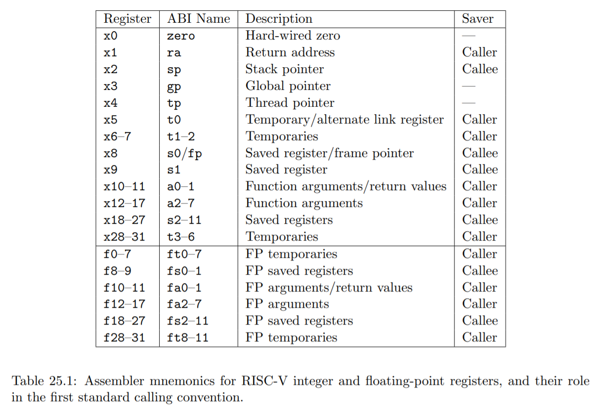

這些暫存器通常有個比較好記的別名 (ABI Name)，例如 x0 的別名為 Zero，因為該暫存器為唯讀，而且數值永遠都是 0。 x1 又稱 ra (return address) ，因為用來儲存返回位址。x2 又稱 sp (stack pointer) ，是堆疊暫存器。

另外有些暫存器的別名是一整群的，例如 t1-t6 (temporaries) 都是臨時變數暫存器。 a0-a7 為參數暫存器 (arguments)，s0-s11 則是 Saved Registers。

還有一個重要暫存器沒有被列入上表，那就是 PC (Program Counter) ， RISC-V 的 PC 不屬於 x0-x31 ，而是一個獨立的暫存器，一般指令無法存取，想要讀取 PC 得用 auipc 這樣的特殊指令。

除了這些基本暫存器之外，RISC-V 還定義一群控制暫存器 CSR (Control Status Registers)，以下是已經固定下來的 CSR 暫存器。

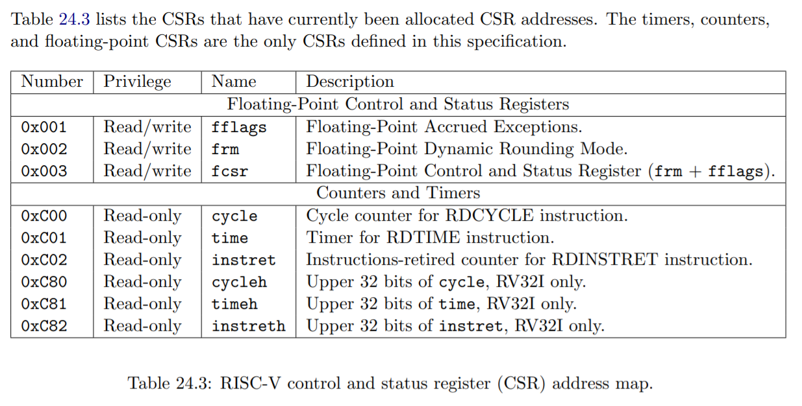

很多已定義的 CSR 暫存器沒在上表中列出來 (因為數量太多)，這類暫存器的預留上限為 4096 個，還有很多沒被分配，目前只用了一部分！

CSR 暫存器在設計作業系統時會很有用，例如我們可以透過讀取 time 得到目前的時間值。

但是這些特殊暫存器的用途較為複雜，我們將在後面設計作業系統的章節再來解說這個主題。

## RISC-V 指令集

商用的處理器通常定義了很多指令，處理器的設計公司 (像是 Intel, ARM) 會根據需要持續的擴充指令集。

RISC-V 的指令集可區分為很多群，最基礎的是 RV32I 整數指令集，若要納入整數乘除法，可加入 RV32M 指令集。因此若我們用 RV32IM 代表 32 位元含乘除法的指令集 (RV32IM = RV32I + RV32M)，以下是較常見的 RISC-V 指令集。

* RV32I：基础整数指令集 (固定不變了)
* RV32M：乘法和除法
* RV32F：單精度浮点操作（和 RV32D:雙精度浮點操作）
* RV32A：原子操作
* RV32C：可选的压缩扩展 (對應 32 位元的 RV32G)
* RV32B：基本擴展。
* RV32V：向量扩展（SIMD）指令
* RV64G：RISC-V 的 64 位地址版本。

RV32I 是必備的指令集，其指令與格式如下所式：

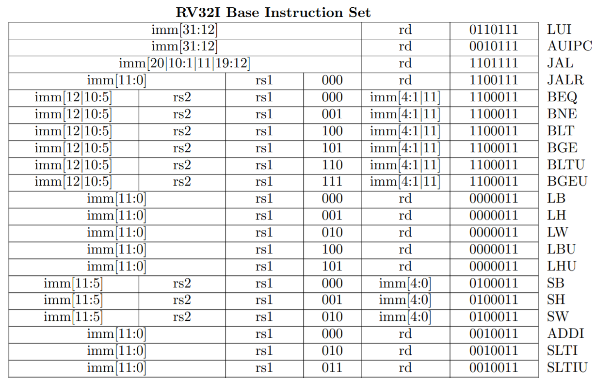
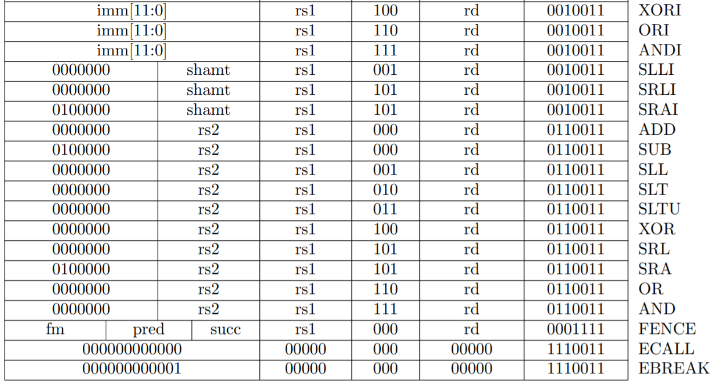

RV32G 是 RV32IMAFD 的簡稱，這是一個常見的指令集組合，也就是包含《整數、乘除、原子、浮點 (單精+雙精) 》這樣的組合。

## RISC-V 指令格式

RISC-V 的指令格式共有六種，如下圖所示：

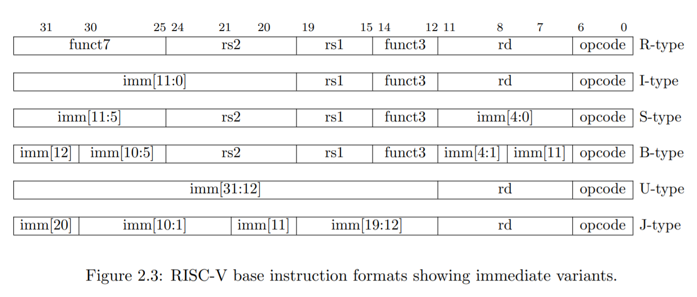

其中立即值的部分有時被分散成幾區，像是 S-Type 分為 imm[4:0]+imm[11:5]，而 B,J 等類型的指令，imm 被分為更多部分，這主要是為了相容與擴充性的考量，在用 Verilog 或 VHDL 設計電路時可以用 decoder 先將立即值組合成單一欄位，然後才開始執行該指令。

RV32M 的乘除法指令格式如下，由於兩個 32 位元整數相乘可能會變成 64 位元整數，因此會有超過 32 位元的高半部，所以有號數的乘法也分為 MUL, MULH 這兩種，其中 MULH 的結果為高半部，放入 rd 暫存器中。

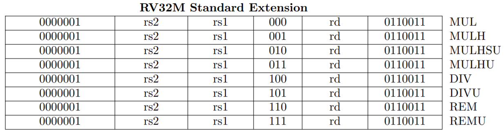

另外、無號數的乘除法指令，最後會以 U 結尾，像是 MULHSU, MULHU, DIVU, REMU 等都是無號數的乘除法指令，其中的 REM 代表取餘數 (Remainder)。

## 壓縮指令集

為了讓 RISC-V 處理器具有商業競爭力，所以指令集支援了壓縮模式 RV32C，其中很多指令都可以被壓縮表達為 16 位元模式，只要最低的兩個位元 aa 不是 11，哪麼就是壓縮的 16 位元指令。

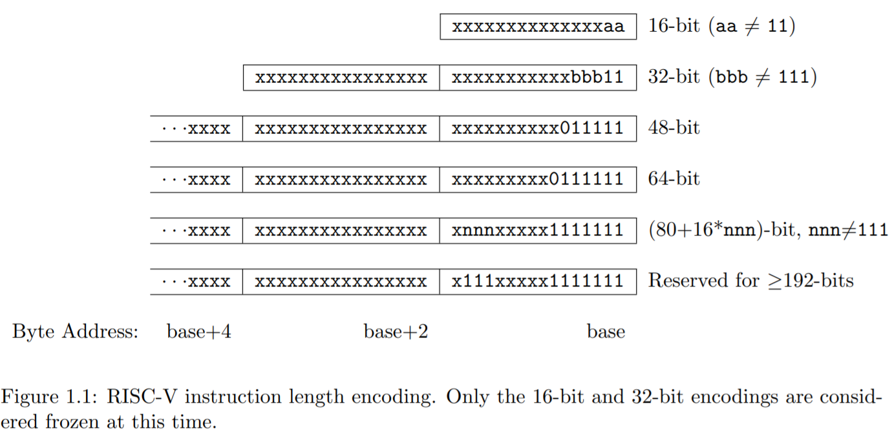

同樣的，若 aa=11 且 bbb 不是 111，那就是 32bit 指令。

透過上圖的方式，RISC-V 可以有 16, 32, 48, 64 等格式的指令，而且保留了更長指令的編碼空間。

RV32C 壓縮指令集為了縮減長度到 16 bit，除了縮減立即值 imm 的長度之外，也將 rd/rs1 用同一個欄位表示，這代表 rd/rs1 必須是同一個暫存器。

也就是說，對於 c.add x1, x2 代表了 x1=x1+x2 。

(c.add 代表壓縮版的 add 指令，用 c. 在前面，這樣才能和非壓縮版區隔開來)

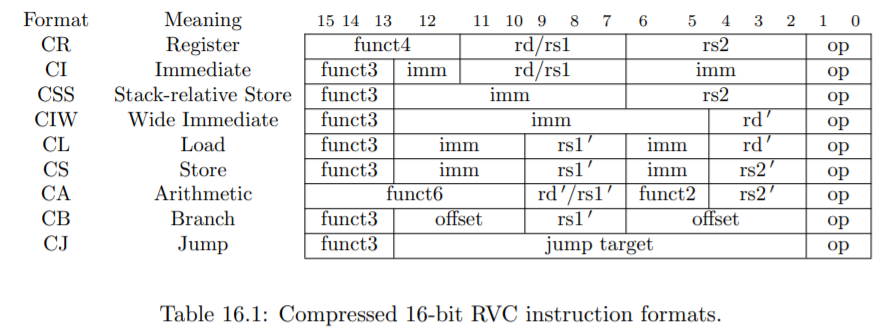

另外、對立即值的範圍，除了縮小之外，也可能採用對齊的方式處理 (例如只能存取 4 的倍數之位址，這樣就可以省掉兩個位元)。

## 浮點指令集

浮點指令分為單精度 float (32 位元浮點數) 與雙精度 double (64 位元浮點數) 指令。

以下是單精度浮點指令 RV32F 的格式表。

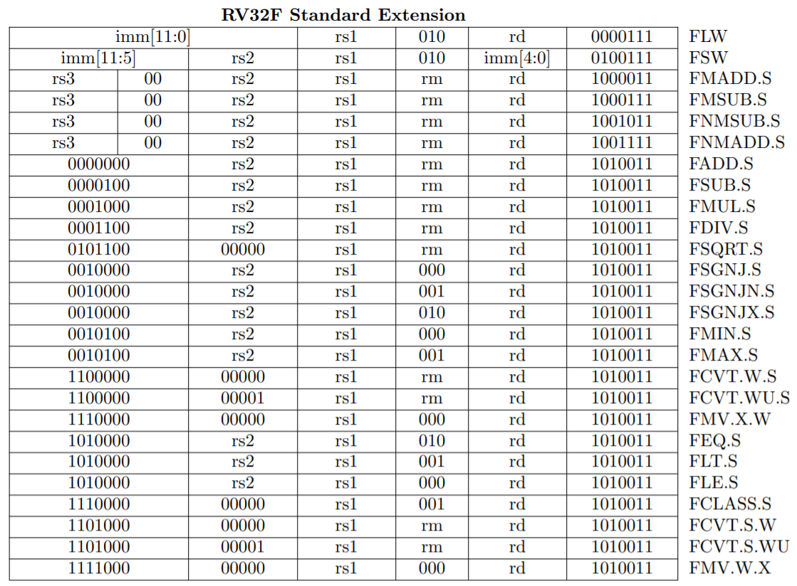

雙精度 RV32D 的格式類似，如下表所示。

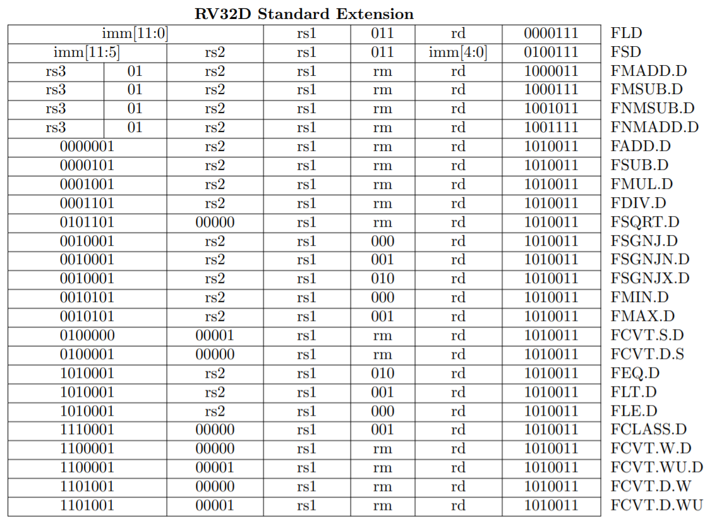

## 原子指令集

作業系統為了讓 thread 或 process 能共享變數卻不會產生《競爭情況》，必須創造出同步鎖定 (lock) 之類的運算，此時需要 RV32A《原子指令集》的支援，其指令格式如下。

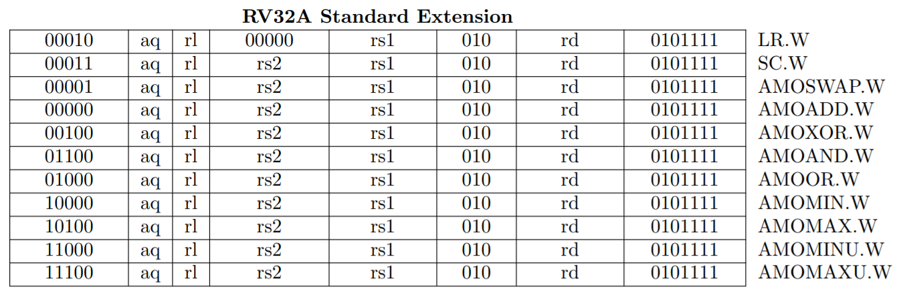

另外為了避免管線 pipeline 處理器的錯序 (out of order) 執行所可能造成的一些問題， RISC-V 提供了 Fence.i 這樣的指令。

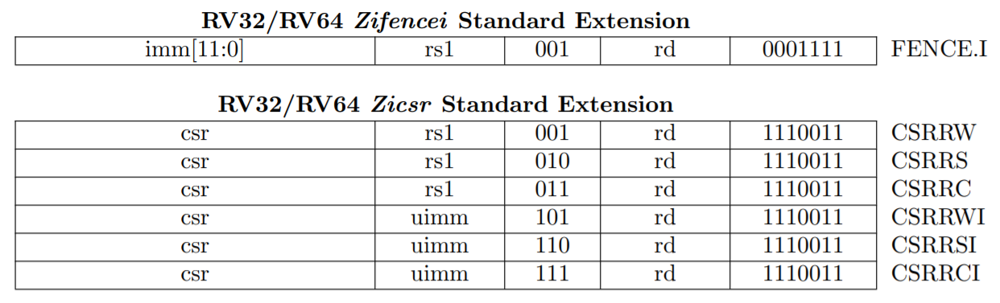

而為了存取控制暫存器，則可以用 CSR 的專用存取指令如上表所示。

## 64 位元指令集

對於 64 位元的架構，其基本指令和 32 位元相同，指令也仍然是 32 位元的架構，但是暫存器卻是 64 位元的。

例如 64 位元的 sub 指令是將兩個 64 位元的暫存器相減(但在 32 位元的處理器中，sub 則是將兩個 32 位元的暫存器相減)。

但是為了仍然可以存取 32 位元的資料，64 位元指令即必須做一些擴充，例如加入 Word 的觀念代表 32 位元的內容。

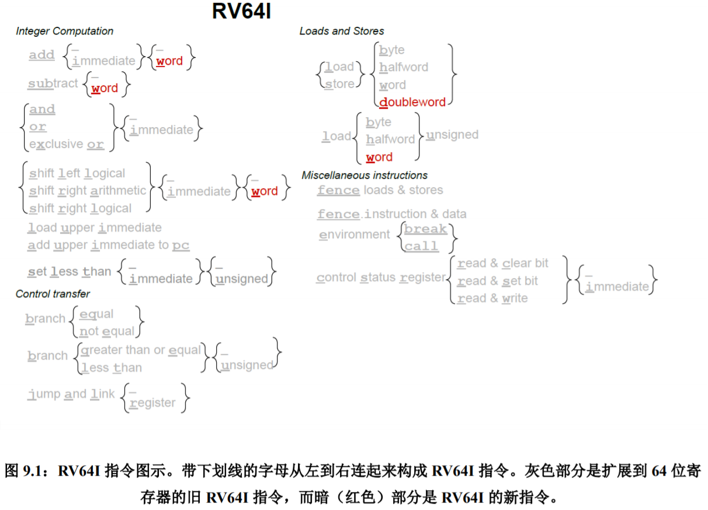

上圖中的 word 代表 32 位元整數，doubleword 代表 64 位元整數。

## 假指令

由於 RISC-V 的指令集相當精簡，因此其他處理器上具備的指令，在 RISC-V 不見得有對應的指令。

不過我們可以透過某些技巧，創造出對應的《假指令》，讓 RISC-V 的組合語言裡也能寫出這些指令。

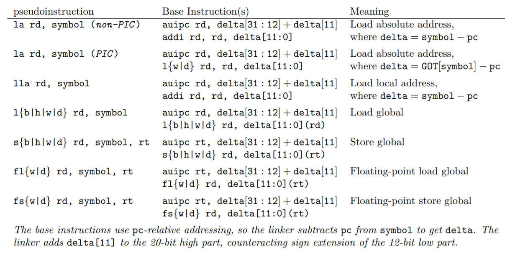

例如 RISC-V 沒有移動 (mv) 之類的指令，但由於 x0 永遠為 0 (zero)，因此我們可以用 addi rs, rd, 0 這樣的指令做到 mv rd, rs 的功能。

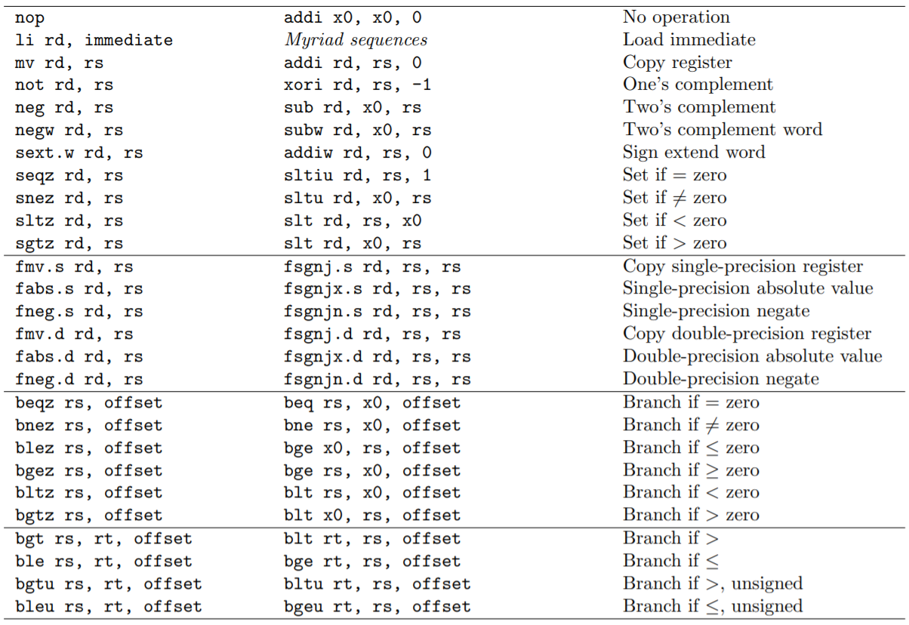

類似的，絕對定址的跳躍指令 j offset，可以透過 jal x0, offset 來完成。

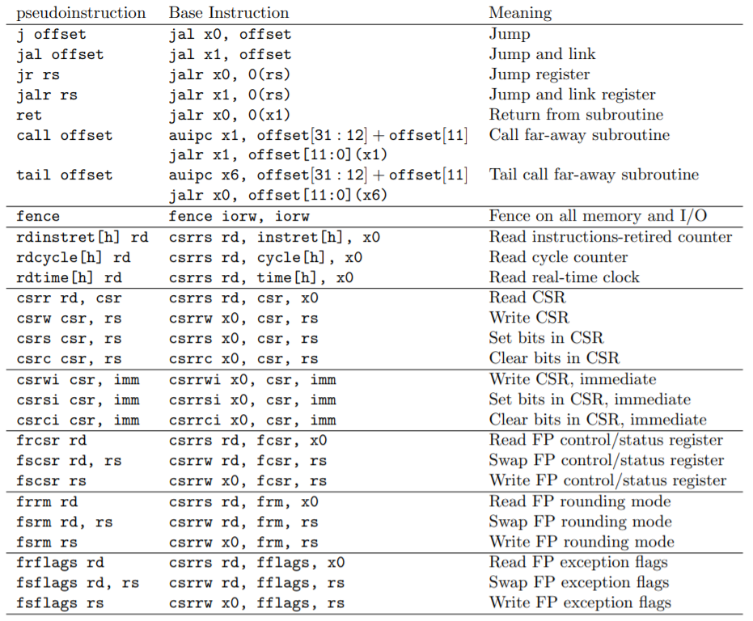

## 結語

RISC-V 處理器是開放原始碼的精簡指令集架構，以下是其規格手冊中的一段話，說明了為何要設計這個處理器架構的原因。

* 28.1 “Why Develop a new ISA?” Rationale from Berkeley Group
    * Commercial ISAs are proprietary
    * Commercial ISAs are only popular in certain market domains
    * Commercial ISAs come and go
    * Popular commercial ISAs are complex
    * Commercial ISAs alone are not enough to bring up applications
    * Popular commercial ISAs were not designed for extensibility
    * A modified commercial ISA is a new ISA

對於本書而言，採用 RISC-V 的主要原因是《開源且穩定》，我們需要一個不會因為商業公司競爭策略就經常修改的處理器指令集，這樣在《研究、閱讀與編寫教材》上，才不會一直變動而讓我們的教材失效。

以下是 RISC-V 規格中，各指令集群是否已經《凍結》的簡表。

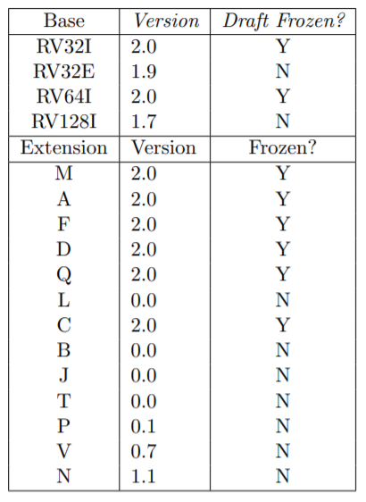

本書基本上主要使用 RV32IMAFD 與 RV64IMAFD (也就是 RV32G 和 RV64G)，這些都是已經凍結的規格，因此不會有改來改去的問題了，這對我們《學習與製作教材》都是很有幫助的一件事情。

接下來就請大家和我們一起進入 RISC-V 的系統程式世界吧！

## 參考文獻

* [The RISC-V Instruction Set Manual Volume I: Unprivileged ISA](https://github.com/riscv/riscv-isa-manual/releases/download/Ratified-IMAFDQC/riscv-spec-20191213.pdf), Document Version 20191213, Editors: Andrew Waterman, Krste Asanovic, SiFive Inc.
* [RISC-V 手册: 一本开源指令集的指南](http://riscvbook.com/chinese/RISC-V-Reader-Chinese-v2p1.pdf), DAVID PATTERSON, ANDREW WATERMAN. (翻译：勾凌睿、黄成、刘志刚, 校阅：包云岗)
* [The RISC-V Instruction Set Manual Volume II: Privileged Architecture](https://github.com/riscv/riscv-isa-manual/releases/download/Ratified-IMFDQC-and-Priv-v1.11/riscv-privileged-20190608.pdf), Editors: Andrew Waterman, Krste Asanovic, SiFive Inc.

<!--
1. 指令只有六种格式，并且所有的指令都是 32 位长，这简化了指令解码。
2. 提供三个寄存器操作数
3. 对于所有指令，要读写的寄存器的标识符总是在同一位置，意味着在解码指令之前，就可以先开始访问寄存器。
4. 这些格式的立即数字段总是符号扩展，符号位总是在指令中最高位。这意味着可能成为关键路径的立即数符号扩展，可以在指令解码之前进行。

* 为了帮助程序员，所有位全部是 0 是非法的 RV32I 指令。因此, 试图跳转到被清零的内存区域的错误跳转将会立即触发异常，这可以帮助调试。
-->