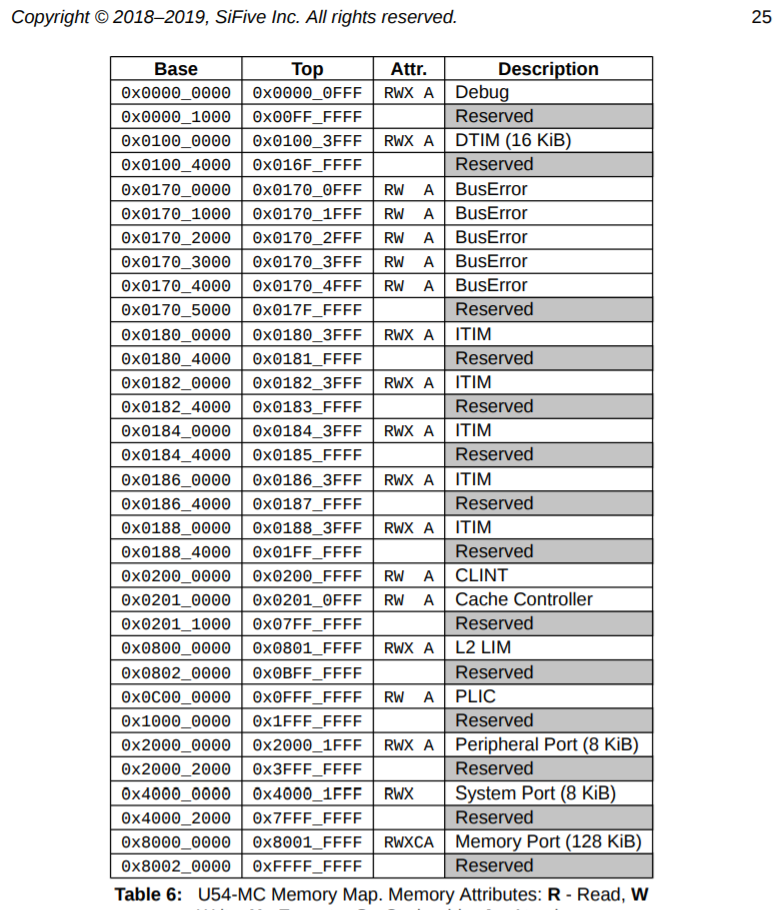

# c hello for RISC-V

* 來源 -- https://matrix89.github.io/writes/writes/experiments-in-riscv/

## 執行

```
user@DESKTOP-96FRN6B MINGW64 /d/ccc/ccc109/sp/10-riscv/06-chello (master)
$ ./run.sh
Hello RISC-V
QEMU: Terminated // 按 Ctrl-A-X 離開
```

## 參考

qemu : https://github.com/qemu/qemu/blob/master/hw/riscv/virt.c#L64

UART 位址從 0x10000000 開始！

```
static const struct MemmapEntry {
    hwaddr base;
    hwaddr size;
} virt_memmap[] = {
    [VIRT_DEBUG] =       {        0x0,         0x100 },
    [VIRT_MROM] =        {     0x1000,        0xf000 },
    [VIRT_TEST] =        {   0x100000,        0x1000 },
    [VIRT_RTC] =         {   0x101000,        0x1000 },
    [VIRT_CLINT] =       {  0x2000000,       0x10000 },
    [VIRT_PCIE_PIO] =    {  0x3000000,       0x10000 },
    [VIRT_PLIC] =        {  0xc000000, VIRT_PLIC_SIZE(VIRT_CPUS_MAX * 2) },
    [VIRT_UART0] =       { 0x10000000,         0x100 },
    [VIRT_VIRTIO] =      { 0x10001000,        0x1000 },
    [VIRT_FLASH] =       { 0x20000000,     0x4000000 },
    [VIRT_PCIE_ECAM] =   { 0x30000000,    0x10000000 },
    [VIRT_PCIE_MMIO] =   { 0x40000000,    0x40000000 },
    [VIRT_DRAM] =        { 0x80000000,           0x0 },
};

#define VIRT_FLASH_SECTOR_SIZE (256 * KiB)
```

* https://sifive.cdn.prismic.io/sifive%2Fdc4980ff-17db-448b-b521-4c7ab26b7488_sifive+u54-mc+manual+v19.08.pdf


