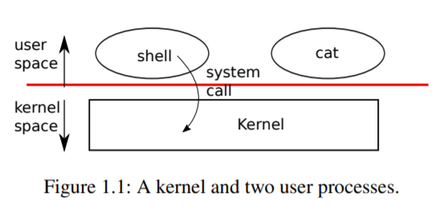
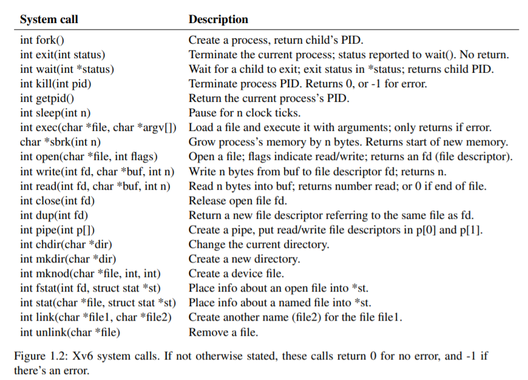

# Chapter 1 -- Operating system interfaces

操作系統的工作是在多個程序之間共享一台計算機，並提供一套比硬件單獨支持更有用的服務。操作系統管理和抽象低級硬件，因此，例如，文字處理機不需要關心正在使用哪種類型的磁盤硬件。操作系統在多個程序之間共享硬件，使它們能同時運行（或看起來是運行）。最後，操作系統為程序提供了可控的交互方式，使它們能夠共享數據或共同工作。

一個操作系統通過一個界面為用戶程序提供服務。設計一個好的界面原來是很困難的。一方面，我們希望界面簡單而狹窄，因為這樣更容易得到正確的實現。另一方面，我們可能會想為應用程序提供許多複雜的功能。解決這種緊張關系的訣竅是設計出依靠一些機制的接口，這些機制可以結合起來提供很多通用性。

本書以一個單一的操作系統作為具體的例子來說明操作系統的概念。該操作系統xv6提供了Ken Thompson和Dennis Ritchie的Unix操作系統[14]所介紹的基本接口，同時也模仿了Unix的內部設計。

Unix提供了一個狹窄的接口，其機制結合得很好，提供了驚人的通用性。這種接口非常成功，以至於現代操作系統--BSD、Linux、Mac OS X、Solaris，甚至在較小的程度上，微軟的Windows也有類似Unix的接口。

了解xv6是了解這些系統和其他許多系統的一個良好開端。

如圖1.1所示，xv6采用了傳統的內核形式，一個為運行中的程序提供服務的特殊程序。每個正在運行的程序，稱為進程，有包含指令、數據和堆棧的內存。指令實現了程序的計算。數據是計算作用的變量。棧組織了程序的過程調用。

一台特定的計算機通常有許多進程，但只有一個內核。

當一個進程需要調用一個內核服務時，它就會調用一個系統調用，也就是操作系統接口中的一個調用。系統調用進入內核，內核執行服務並返回。這樣一個進程就在用戶空間和內核空間中交替執行。



內核使用CPU[1]提供的硬件保護機制來確保在用戶空間執行的每個進程只能訪問自己的內存。內核以實現這些保護所需的硬件權限來執行，而用戶程序的執行則沒有這些權限。當用戶程序調用系統調用時，硬件會提高特權級別，並開始執行內核中預先安排好的函數。

內核提供的系統調用集合是用戶程序看到的界面。xv6內核提供了Unix內核傳統上提供的服務和系統調用的子集。

圖1.2列出了xv6的所有系統調用。




本章的其余部分概述了xv6的服務--處理、內存、文件描述符、管道和文件系統，並通過代碼片段和討論shell（Unix的命令行用戶界面）如何使用它們來說明。shell對系統調用的使用說明了它們是如何被精心設計的。

shell是一個普通的程序，它從用戶那里讀取命令並執行它們。事實上，shell是一個用戶程序，而不是內核的一部分，這說明了系統調用接口的力量：shell沒有什麽特別之處。這也意味著shell很容易替換；因此，現代Unix系統有多種shell可供選擇，每種shell都有自己的用戶界面和腳本功能。xv6 shell是Unix Bourne shell本質的簡單實現。它的實現可以在(user/sh.c:1)找到。

## 1.1 Processes and memory

一個xv6進程由用戶空間內存（指令、數據和堆棧）和內核私有的每個進程狀態組成。Xv6共享進程的時間：它透明地在等待執行的進程集之間切換可用的CPU。當一個進程不執行時，xv6會保存它的CPU寄存器，在下次運行進程時恢復它們。內核為每個進程關聯一個進程標識符，或PID。

一個進程可以使用fork系統調用創建一個新進程。Fork創建一個新的進程，稱為子進程，其內存內容與調用的進程，稱為父進程完全相同。在父進程和子進程中，fork都會返回。在父進程中，fork返回子進程的PID；在子進程中，fork返回0。例如，考慮以下用C程序語言編寫的程序片段[6]。

```cpp
int pid = fork();
if(pid > 0){
  printf("parent: child=%d\n", pid);
  pid = wait((int *) 0);
  printf("child %d is done\n", pid);
} else if(pid == 0){
  printf("child: exiting\n");
  exit(0);
} else {
  printf("fork error\n");
}
```

退出系統調用使調用進程停止執行，並釋放資源，如內存和打開的文件。exit需要一個整數狀態參數，傳統上0表示成功，1表示失敗。wait系統調用返回當前進程的一個已退出（或被殺死）的子進程的PID，並將該子進程的退出狀態複製到傳遞給wait的地址；如果調用者的子進程都沒有退出，則wait等待一個子進程退出。如果調用者沒有子女，wait立即返回-1。如果父代不關心子代的退出狀態，可以傳遞一個0地址給wait。

在這個例子中，輸出行可能以任何一種順序出來，這取決於父程序還是子程序先到它的printf調用。在子程序退出後，父程序的wait返回，導致父程序打印父程序：`child 1234 is done`


```
parent: child=1234
child: exiting
```

雖然子進程最初的內存內容與父進程相同，但父進程和子進程的執行內存和寄存器不同：改變其中一個進程的變量不會影響另一個進程。例如，當wait的返回值被存儲到父進程的pid中時，並不會改變子進程中的變量pid。子進程中的pid值仍然為零。

exec系統調用用從文件系統中存儲的文件加載的新內存映像替換調用進程的內存。該文件必須有特定的格式，它規定了文件中哪部分存放指令，哪部分是數據，在哪條指令啟動等，xv6使用ELF格式，第3章將詳細討論。當exec成功時，它並不返回到調用程序；相反，從文件中加載的指令在ELF頭聲明的入口點開始執行。exec需要兩個參數：包含可執行文件的文件名和一個字符串參數數組。例如

```cpp
char *argv[3];
argv[0] = "echo";
argv[1] = "hello";
argv[2] = 0;
exec("/bin/echo", argv);
printf("exec error\n");
```

這個片段將調用的程序替換為運行參數列表echo hello的程序/bin/echo的實例。大多數程序都會忽略參數數組的第一個元素，也就是傳統的程序名稱。

v6 shell使用上述調用代表用戶運行程序。shell的主要結構很簡單，參見main(user/sh.c:145)。主循環用getcmd讀取用戶的一行輸入，然後調用fork，創建shell的副本。然後調用fork，創建一個shell進程的副本。父循環調用wait，而子循環則運行命令。例如，如果用戶向shell輸入了 "echo hello"，那麽runcmd就會被調用，參數是 "echo hello"，runcmd(user/sh.c:58)運行實際的命令。對於 "echo hello"，它會調用exec (user/sh.c:78)。如果exec成功，那麽子程序將執行來自echo的指令，而不是runcmd。在某些時候，echo會調用exit，這將導致父程序從main(user/sh.c:145)中的wait返回。

你可能會問為什麽fork和exec不在一個調用中合並；我們稍後會看到shell在實現I/O重定向時利用了這種分離。為了避免創建一個重覆的進程，然後立即替換它（用exec）的浪費，操作內核通過使用虛擬內存技術（如copy-on-write）來優化這種用例的fork實現（見4.6節）。

Xv6隱式分配大部分用戶空間內存：fork分配子程序拷貝父程序內存所需的內存，exec分配足夠的內存來容納可執行文件。一個進程如果在運行時需要更多的內存（可能是為了malloc），可以調用sbrk(n)將其數據內存增長n個字節；sbrk返回新內存的位置。

## 1.2 I/O and File descriptors

文件描述符是一個小的整數，代表一個進程可以讀取或寫入的內核管理對象。一個進程可以通過打開一個文件、目錄或設備，或通過創建一個管道，或通過複製一個現有的描述符來獲得一個文件描述符。為了簡單起見，我們經常把文件描述符所指的對象稱為 "文件"；文件描述符接口抽象掉了文件、管道和設備之間的差異，使它們看起來都像字節流。我們會把輸入和輸出稱為I/O。

在內部，xv6內核使用文件描述符作為每個進程表的索引，因此每個進程都有一個從0開始的文件描述符私有空間。按照慣例，一個進程從文件描述符0(標準輸入)讀取數據，向文件描述符1(標準輸出)寫入輸出，向文件描述符2(標準錯誤)寫入錯誤信息。正如我們將看到的，shell利用了 慣例來實現I/O重定向和管道。shell確保它始終有三個文件描述符打開（user/sh.c:151），這些文件描述符默認是控制台的文件描述符。

讀寫系統調用從文件描述符命名的文件中讀取字節，並向打開的文件寫入字節。調用read(fd, buf, n)從文件描述符fd中最多讀取n個字節，將它們複製到buf中，並返回讀取的字節數。每個引用文件的文件描述符都有一個與之相關的偏移量。讀取從當前文件偏移量中讀取數據，然後按讀取的字節數推進偏移量：隨後的讀取將返回第一次讀取所返回的字節之後的字節。當沒有更多的字節可讀時，讀返回零，表示文件的結束。

調用write(fd, buf, n)將buf中的n個字節寫入文件描述符fd，並返回寫入的字節數。少於n個字節的數據只有在发生錯誤時才會寫入。和read一樣，write在當前文件偏移量處寫入數據，然後按寫入的字節數將偏移量向前推進：每次寫入都從上一次寫入的地方開始。

下面的程序片段（它構成了程序cat的本質）將數據從標準輸入複製到標準輸出。如果发生錯誤，它就會向標準錯誤寫入一條信息。

```cpp
char buf[512];
int n;
for(;;){
  n = read(0, buf, sizeof buf);
  if(n == 0)
    break;
  if(n < 0){
    fprintf((FILE*)2, "read error\n");
    exit(1);
  }
  if(write(1, buf, n) != n) {
    fprintf((FILE*)2, "write error\n");
    exit(1);
  }
}
```

在代碼片段中需要注意的是，cat不知道它是在從文件、控制台還是管道中讀取。同樣，cat也不知道它是打印到控制台、文件還是其他什麽地方。使用文件描述符和文件描述符 0 是輸入，文件描述符 1 是輸出的約定，使得 cat 的實現非常簡單。

關閉系統調用會釋放一個文件描述符，使它可以被未來的open、pipe或dup系統調用所自由重用（見下文）。新分配的文件描述符總是當前進程中編號最小的未使用描述符。

文件描述符和fork相互作用，使I/O重定向易於實現。Fork將父進程的文件描述符表和它的內存一起複製，這樣子進程開始時打開的文件和父進程完全一樣。系統調用exec替換了調用進程的內存，但保留了它的文件表。這種行為允許shell通過分叉實現I/O重定向，在子進程中重新打開選定的文件描述符，然後調用exec運行新的程序。下面是shell運行`cat < input.txt`命令的簡化版代碼。

```cpp
char *argv[2];
argv[0] = "cat";
argv[1] = 0;
if(fork() == 0) {
  close(0);
  open("input.txt", O_RDONLY);
  exec("cat", argv);
}
```

在子程序關閉文件描述符0後，open保證對新打開的input.txt使用該文件描述符。0將是最小的可用文件描述符。然後Cat執行時，文件描述符0（標準輸入）指的是input.txt。這個序列不會改變父進程的文件描述符，因為它只修改子進程的描述符。

xv6 shell中I/O重定向的代碼完全是這樣工作的（user/sh.c:82）。回想一下，在代碼的這一點上，shell已經分叉了子shell，runcmd將調用exec來加載新的程序。

open的第二個參數由一組用位表示的標志組成，用來控制open的工作。可能的值在文件控制(fcntl)頭(kernel/fcntl.h:1-5)中定義。O_RDONLY、O_WRONLY、O_RDWR、O_CREATE和O_TRUNC，它們指示open打開文件進行讀、寫、或同時進行讀和寫，如果文件不存在，則創建文件，並將文件截斷為零長度。

現在應該清楚為什麽fork和exec是分開調用的：在這兩個調用之間，shell有機會重定向子系統的I/O，而不幹擾主shell的I/O設置。我們可以想象一個假想的結合forkexec的系統調用，但用這種調用來做I/O重定向的選擇似乎很尷尬。shell可以在調用forkexec之前修改自己的I/O設置（然後取消這些修改）；或者forkexec可以將I/O重定向的指令作為參數；或者（最不吸引人的是）每個程序（比如cat）都可以被教導做自己的I/O重定向。

雖然fork複製了文件描述符表，但每個底層文件的偏移量是父子共享的。考慮這個例子。

```cpp
if(fork() == 0) {
  write(1, "hello ", 6);
  exit(0);
} else {
  wait(0);
  write(1, "world\n", 6);
}
```

在這個片段的最後，文件描述符1所附的文件將包含數據hello world。父文件中的寫（由於有了wait，只有在子文件完成後才會運行）會從子文件的寫結束的地方開始。這種行為有助於從shell命令的序列中產生連續的輸出，比如`(echo hello; echo world) >output.txt`。

dup系統調用複製一個現有的文件描述符，返回一個新的描述符，它指向同一個底層I/O對象。兩個文件描述符共享一個偏移量，就像被fork複製的文件描述符一樣。這是將hello world寫入文件的另一種方式。

```cpp
fd = dup(1);
write(1, "hello ", 6);
write(fd, "world\n", 6);
```

如果兩個文件描述符是通過一系列的fork和dup調用從同一個原始文件描述符衍生出來的，那麽這兩個文件描述符共享一個偏移量。否則，文件描述符不共享偏移量，即使它們是由同一文件的打開調用產生的。Dup允許shell實現這樣的命令。

`ls existing-file non-existing-file > tmp1 2>&1`。2>&1告訴shell給命令一個與描述符1重覆的文件描述符2。現有文件的名稱和不存在文件的錯誤信息都會顯示在文件tmp1中。xv6 shell不支持錯誤文件描述符的I/O重定向，但現在你知道如何實現它了。

文件描述符是一個強大的抽象，因為它們隱藏了它們所連接的細節：一個向文件描述符1寫入的進程可能是在向一個文件、控制台等設備或向一個管道寫入。

## 1.3 Pipes

管道是一個小的內核緩沖區，作為一對文件描述符暴露給進程，一個用於讀，一個用於寫。將數據寫入管道的一端就可以從管道的另一端讀取數據。管道為進程提供了一種通信方式。

下面的示例代碼運行程序wc，標準輸入連接到管道的讀端。

```cpp
int p[2];
char *argv[2];
argv[0] = "wc";
argv[1] = 0;
pipe(p);
if(fork() == 0) {
  close(0);
  dup(p[0]); // 複製 p[0] 到 fd:0
  close(p[0]);
  close(p[1]);
  exec("/bin/wc", argv); // child: 這樣 wc 會由 stdin (p[0], fd:0) 讀入，於是讀到 hello world
} else {
  close(p[0]);
  write(p[1], "hello world\n", 12); // parent: 寫入 hello world 到 p[1]
  close(p[1]);
}
```

程序調用pipe，創建一個新的管道，並將讀寫文件描述符記錄在數組p中，經過fork後，父代和子代的文件描述符都指向管道。子程序調用close和dup使文件描述符0引用到管道的讀端，關閉p中的文件描述符，並調用exec運行wc。當wc從其標準輸入端讀取時，它從管道讀。母體關閉管道的讀端，向管道寫入，然後關閉寫端。

如果沒有數據，管道上的讀會等待數據被寫入或等待所有引用寫端的文件描述符被關閉；在後一種情況下，讀將返回0，就像已經到達數據文件的末端一樣。事實上，讀會阻塞直到不可能有新的數據到達，這也是一個原因，即在執行 上面的wc：如果wc的文件描述符之一指向管道的寫端，wc將永遠不會看到文件結束。

xv6的shell實現管道，如 `grep fork sh.c | wc -l` 的方式類似於上面的代碼（user/sh.c:100）。子進程創建一個管道來連接管道的左端和右端。然後，它為管道左端調用fork和runcmd，為右端調用fork和runcmd，並等待兩者的完成。管道的右端可以是一個命令，它本身包括一個管道（例如，a | b | c），它本身會分叉兩個新的子進程（一個是b，一個是c）。因此，shell可以創建一棵進程樹。這棵樹的葉子是命令，內部節點是等待左右子進程完成的進程。

原則上，我們可以讓內部節點運行管道的左端，但正確地這樣做會使實現變得複雜。考慮只做以下修改：將sh.c改為不為p->left分叉，在內部進程中運行runcmd(p->left)。然後，例如，echo hi | wc不會產生輸出，因為當echo hi在runcmd中退出時，內部進程會退出，並且從未調用fork來運行管道的右端。這種不正確的行為可以通過不在runcmd中對內部進程調用exit來修正，但是這種修正使代碼變得複雜：現在runcmd需要知道它是否是內部進程。當不對runcmd(p->right)進行分叉時，也會產生複雜的情況。例如，僅僅是這樣的修改，sleep 10 | echo hi會立即打印 "hi"，而不是在10秒後，因為echo會立即運行並退出，而不是等待sleep結束。由於sh.c的目標是要讓它像 盡可能的簡單，它並不試圖避免創建內部流程。

管道似乎並不比臨時文件強大：管道 `echo hello world | wc`可以不用管道實現為 `echo hello world >/tmp/xyz; wc </tmp/xyz ` 在這種情況下，管道比臨時文件至少有四個優勢。首先，管道會自動清理自己；如果使用文件重定向，shell在完成後必須小心翼翼地刪除/tmp/xyz。第二，管道可以傳遞任意長的數據流，而文件重定向則需要磁盤上有足夠的空閑空間來存儲所有數據。第三，管道可以實現管道階段的並行執行，而文件方式則需要在第二個程序開始之前完成第一個程序。第四，如果你要實現進程間的通信，管道的阻塞讀寫比文件的非阻塞語義更有效率。

## 1.4 File system

xv6 文件系統提供了數據文件（包含未解釋的字節數組）和目錄（包含對數據文件和其他目錄的命名引用）。這些目錄形成一棵樹，從一個稱為根目錄的特殊目錄開始。像/a/b/c這樣的路徑指的是根目錄/中名為b的目錄內名為c的文件或名為c的目錄，不以/開頭的路徑是相對於調用進程的當前目錄進行評估的，可以通過chdir系統調用來改變。這兩個代碼片段都會打開同一個文件（假設所有涉及的目錄都存在）。

```cpp
chdir("/a");
chdir("b");
open("c", O_RDONLY);
open("/a/b/c", O_RDONLY);
```

第一個片段將進程的當前目錄改為/a/b；第二個片段既不引用也不改變進程的當前目錄。

有一些系統調用來創建新的文件和目錄：mkdir創建一個新的目錄，用O_CREATE標志打開創建一個新的數據文件，以及mknod創建一個新的設備文件。這個例子說明了這三種方法。

```cpp
mkdir("/dir");
fd = open("/dir/file", O_CREATE|O_WRONLY);
close(fd);
mknod("/console", 1, 1);
```

Mknod創建了一個特殊的文件，它指的是一個設備。與設備文件相關聯的是主要設備號和次要設備號(mknod的兩個參數)，它們唯一地標識一個內核設備。

當一個進程後來打開設備文件時，內核會將系統的讀寫調用分流給內核設備實現，而不是將它們傳遞給文件系統。

一個文件的名稱與文件本身是不同的；同一個基礎文件，稱為inode，可以有多個名稱，稱為鏈接。每個鏈接由目錄中的一個條目組成；該條目包含一個文件名和對inode的引用。一個inode保存著一個文件的元數據，包括它的類型(文件或目錄或設備)、它的長度、文件內容在磁盤上的位置以及到文件的鏈接數量。

fstat系統調用從文件描述符引用的inode中檢索信息。它在 stat.h (kernel/stat.h)中定義的 stat 結構中填入。

```cpp
#define T_DIR 1 // Directory
#define T_FILE 2 // File
#define T_DEVICE 3 // Device

struct stat {
  int dev; // File system’s disk device
  uint ino; // Inode number
  short type; // Type of file
  short nlink; // Number of links to file
  uint64 size; // Size of file in bytes
};
```

鏈接系統調用創建了另一個文件系統名，引用同一個inode作為現有文件。這個片段創建了一個同時命名為a和b的新文件。

```cpp
open("a", O_CREATE|O_WRONLY);
link("a", "b");
```

從a讀入或寫入a與從b讀入或寫入b是一樣的，每個inode都有一個唯一的inode號來標識。經過上面的代碼序列，可以通過檢查fstat的結果來確定a和b指的是同一個底層內容：兩者將返回相同的inode號（ino），並且nlink計數將被設置為2。

取消鏈接系統調用從文件系統中刪除一個名字。只有當文件的鏈接數為零且沒有文件描述符引用它時，文件的inode和存放其內容的磁盤空間才會被釋放。因此，在文件系統中添加

```cpp
unlink("a");
```

到最後一個代碼序列，使inode和文件內容以b的形式被訪問，此外,

```cpp
fd = open("/tmp/xyz", O_CREATE|O_RDWR);
unlink("/tmp/xyz");
```

是一種習慣性的方法，用來創建一個沒有名字的臨時inode，當進程關閉fd或退出時，這個inode會被清理掉。

Unix提供了可從shell調用的用戶級文件實用程序，例如mkdir、ln和rm。這種設計允許任何人通過添加新的用戶級程序來擴展命令行界面。事後看來，這個計劃似乎是顯而易見的，但在Unix時期設計的其他系統通常將這類命令內置到shell中（並將shell內置到內核中）。

一個例外是cd，它是內置在shell中的(user/sh.c:160)，cd必須改變shell本身的當前工作目錄。如果cd是作為常規命令運行，那麽shell將分叉一個子進程，子進程將運行cd，cd將改變子進程的工作目錄。父進程（即shell）的工作目錄不會改變。

## 1.5 Real world

Unix將 "標準 "文件描述符、管道和方便的shell語法結合起來對它們進行操作，是編寫通用可重用程序的一大進步。這個想法引发了一種 "軟件工具 "文化，Unix的強大和流行在很大程度上要歸功於這種文化，shell是第一種所謂的 "腳本語言"。今天，Unix系統調用接口在BSD、Linux和Mac OS X等系統中依然存在。

Unix系統調用接口已經通過便攜式操作系統接口(POSIX)標準進行了標準化。Xv6 並不符合 POSIX 標準：它缺少許多系統調用（包括基本的系統調用，如 lseek），而且它提供的許多系統調用與標準不同。我們對xv6的主要目標是簡單明了，同時提供一個簡單的類似UNIX的系統調用接口。一些人已經用一些更多的系統調用和一個簡單的C庫擴展了xv6，以便運行基本的Unix程序。然而，現代內核比xv6提供了更多的系統調用和更多種類的內核服務。例如，它們支持網絡、窗口系統、用戶級線程、許多設備的驅動程序等等。現代內核不斷快速发展，並提供了許多超越POSIX的功能。

Unix用一套文件名和文件描述符接口統一了對多種類型資源（文件、目錄和設備）的訪問。這個思想可以擴展到更多種類的資源；一個很好的例子是Plan 9[13]，它把 "資源就是文件 "的概念應用到網絡、圖形等方面。然而，大多數Unix衍生的操作系統都沒有遵循這一路線。

文件系統和文件描述符已經是強大的抽象。即便如此，操作系統接口還有其他模式。Multics是Unix的前身，它以一種使文件存儲看起來像內存的方式抽象了文件存儲，產生了一種截然不同的界面風味。Multics設計的複雜性直接影響了Unix的設計者，他們試圖建立一些更簡單的東西。

Xv6沒有提供用戶的概念，也沒有提供保護一個用戶與另一個用戶的概念；用Unix的術語來說，所有的xv6進程都以root身份運行。

本書研究的是xv6如何實現其類似Unix的接口，但其思想和概念不僅僅適用於Unix。任何操作系統都必須將進程覆用到底層硬件上，將進程相互隔離，並提供受控進程間通信的機制。在學習了xv6之後，您應該能夠研究其他更複雜的操作系統，並在這些系統中看到xv6的基本概念。

## 1.6 Exercises

1. 編寫一個程序，使用UNIX系統調用在兩個進程之間通過一對管道（每個方向一個）"乒乓 "一個字節。測量該程序的性能，以每秒交換次數為單位。
