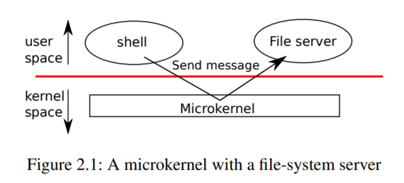
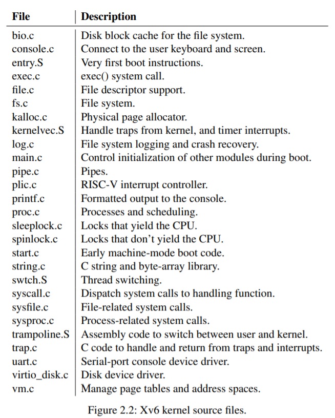

# Chapter 2 -- Operating system organization

一個操作系統的一個關鍵要求是同時支持幾個活動。例如，使用第1章中描述的系統調用接口，一個進程可以用fork啟動新的進程。

操作系統必須在這些進程之間對計算機的資源進行時間分配。例如，即使進程數量多於硬件CPU數量，操作系統也必須確保所有進程都有機會執行。操作系統還必須安排進程之間的隔離。也就是說，如果一個進程出現了bug，发生了故障，不應該影響到不依賴bug進程的進程。然而，完全隔離太強了，因為進程應該有可能有意地進行交互，管道就是一個例子。因此，一個操作系統必須滿足三個要求：覆用、隔離和交互。

本章概述了如何組織操作系統來實現這三個要求。原來有很多方法，但本文主要介紹以單片機內核為中心的主流設計，很多Unix操作系統都采用這種設計。本章還介紹了xv6進程的概述，xv6進程是xv6中的隔離單元，以及xv6啟動時第一個進程的創建。

Xv6運行在多核RISC-V微處理器上，它的許多低級功能（例如，它的進程實現）是RISC-V所特有的。RISC-V是一個64位的CPU，xv6是用 "LP64 "C語言編寫的，這意味著C編程語言中的long(L)和指針(P)是64位的，但int是32位的。本書假設讀者在某種架構上做過一點機器級的編程，會在出現RISC-V特有的思想時介紹。RISC-V的有用參考資料是 "The RISC-V Reader: 開放架構圖集》[12]。用戶級ISA[2]和特權架構[1]是官方規範。

> 1. 本文所說的 "多核 "是指多個CPU共享內存，但並行執行，每個CPU有自己的一套寄存器。本文有時使用多處理器一詞作為多核的同義詞，盡管多處理器也可以更具體地指具有多個不同處理器芯片的計算機。

一台完整的計算機中的CPU周圍都是支持硬件，其中大部分是I/O接口的形式。Xv6是為qemu的"-machine virt "選項模擬的支持硬件編寫的。這包括RAM、包含啟動代碼的ROM、與用戶鍵盤/屏幕的串行連接以及用於存儲的磁盤。

## 2.1 Abstracting physical resources

遇到一個操作系統，人們可能會問的第一個問題是為什麽要有它呢？也就是說，我們可以把圖1.2中的系統調用作為一個庫來實現，應用程序與之鏈接。在這個計劃中，每個應用程序甚至可以根據自己的需要定制自己的庫。應用程序可以直接與硬件資源進行交互，並以最適合應用程序的方式使用這些資源（例如，實現高或可預測的性能）。一些用於嵌入式設備或實時系統的操作系統就是以這種方式組織的。

這種庫方式的缺點是，如果有多個應用程序在運行，這些應用程序必須表現良好。例如，每個應用程序必須定期放棄CPU，以便其他應用程序能夠運行。如果所有的應用程序都相互信任並且沒有bug，這樣的合作分時方案可能是可以的。比較典型的情況是，應用程序之間互不信任，並且有bug，所以人們往往希望比合作方案提供更強的隔離性。

為了實現強隔離，禁止應用程序直接訪問敏感的硬件資源，而將資源抽象為服務是很有幫助的。例如，Unix應用程序只通過文件系統的打開、讀取、寫入和關閉系統調用與存儲進行交互，而不是直接讀寫磁盤。這為應用程序提供了路徑名的便利，而且它允許操作系統（作為接口的實現者）管理磁盤。即使不考慮隔離問題，那些有意交互的程序（或者只是希望互不幹擾）很可能會发現文件系統是一個比直接使用磁盤更方便的抽象。

同樣，Unix在進程之間透明地切換硬件CPU，必要時保存和恢復寄存器狀態，因此應用程序不必意識到時間共享。這種透明度使得操作系統可以共享CPU，即使一些應用程序處於無限循環中。

另一個例子是，Unix進程使用exec來建立它們的內存映像，而不是直接與物理內存交互。這使得操作系統可以決定將進程放在內存的什麽位置；如果內存緊張，操作系統甚至可能將進程的部分數據存儲在磁盤上。Exec還為用戶提供了文件系統存儲可執行程序映像的便利。

Unix進程之間的許多形式的交互都是通過文件描述符進行的。文件描述符不僅可以抽象出許多細節（例如，管道或文件中的數據存儲在哪里），而且它們的定義方式也可以簡化交互。例如，如果管道中的一個應用程序失敗了，內核就會為管道中的下一個進程產生一個文件結束信號。

圖1.2中的系統調用接口經過精心設計，既為程序員提供了方便，又提供了強隔離的可能。Unix接口並不是抽象資源的唯一方式，但事實證明它是一種非常好的方式。

## 2.2 User mode, supervisor mode, and system calls

強隔離要求應用程序和操作系統之間有一個硬邊界。如果應用程序犯了錯誤，我們不希望操作系統失敗，也不希望其他應用程序失敗。相反，操作系統應該能夠清理失敗的應用程序並繼續運行其他應用程序。為了實現強隔離，操作系統必須安排應用程序不能修改（甚至不能讀取）操作系統的數據結構和指令，應用程序不能訪問其他進程的內存。

CPU提供了強隔離的硬件支持。例如，RISC-V有三種模式，CPU可以執行指令：機器模式、監督者模式和用戶模式。在機器模式下執行的指令具有完全的權限，一個CPU在機器模式下啟動。機器模式主要用於配置計算機。Xv6在機器模式下執行幾行指令，然後轉為監督者模式。

在監督者模式下，CPU被允許執行特權指令：例如，啟用和禁用中斷，讀寫保存頁表地址的寄存器等。如果用戶模式下的應用程序試圖執行一條特權指令，那麽CPU不會執行該指令，而是切換到監督者模式，這樣監督者模式的代碼就可以終止應用程序，因為它做了不該做的事情。第1章的圖1.1說明了這種組織方式。一個應用程序只能執行用戶模式的指令（如加數字等），被稱為運行在用戶空間，而處於監督者模式的軟件也可以執行特權指令，被稱為運行在內核空間。運行在內核空間（或主管模式）的軟件稱為內核。

一個應用程序如果要調用內核函數（如xv6中的讀系統調用），必須過渡到內核。CPU提供了一個特殊的指令，可以將CPU從用戶模式切換到監督模式，並在內核指定的入口處進入內核。(RISC-V為此提供了ecall指令。)一旦CPU切換到監督者模式，內核就可以驗證系統調用的參數，決定是否允許應用程序執行請求的操作，然後拒絕或執行。內核控制過渡到監督者模式的入口點是很重要的，如果應用程序可以決定內核的入口點，那麽惡意應用程序就可以，例如，在跳過驗證參數的點進入內核。

## 2.3 Kernel organization

一個關鍵的設計問題是操作系統的哪一部分應該在監督者模式下運行。一種可能是整個操作系統駐留在內核中，這樣所有系統調用的實現都在監督者模式下運行。這種組織方式稱為單片內核。

在這種組織中，整個操作系統以全硬件權限運行。這種組織方式很方便，因為操作系統設計者不必決定操作系統的哪一部分不需要全硬件權限。此外，操作系統的不同部分更容易合作。例如，一個操作系統可能有一個緩沖區緩存，可以由文件系統和虛擬內存系統共享。

單片機組織的一個缺點是操作系統的不同部分之間的接口通常是複雜的（我們將在本文的其余部分看到），因此操作系統開发者很容易犯錯誤。在單片機內核中，一個錯誤是致命的，因為在主管模式下的錯誤往往會導致內核失敗。如果內核失敗，計算機就會停止工作，因此所有的應用程序也會失敗。計算機必須重啟才能再次啟動。

為了降低內核出錯的風險，操作系統設計者可以盡量減少在主管模式下運行的操作系統代碼量，而在用戶模式下執行操作系統的大部分代碼。這種內核組織方式稱為微內核。



圖2.1說明了這種微內核設計。在圖中，文件系統作為一個用戶級進程運行。作為進程運行的操作系統服務稱為服務器。為了讓應用程序與文件服務器進行交互，內核提供了一種進程間通信機制，用於從一個用戶模式進程向另一個進程发送消息。例如，如果一個像shell這樣的應用程序想要讀取或寫入一個文件，它就會向文件服務器发送一個消息並等待響應。

在微內核中，內核接口由一些低級函數組成，用於啟動應用程序、发送消息、訪問設備硬件等。這種組織方式使得內核相對簡單，因為大部分操作系統駐留在用戶級服務器中。

xv6和大多數Unix操作系統一樣，是以單片機內核的形式實現的。因此，xv6內核接口與操作系統接口相對應，內核實現了完整的操作系統。由於xv6不提供很多服務，所以它的內核比一些微內核小，但從概念上講xv6是單片的。

## 2.4 Code: xv6 organization

xv6內核源碼在kernel/子目錄下。按照模塊化的概念，源碼被分成了多個文件，圖2.2列出了這些文件。模塊間的接口在defs.h(kernel/defs.h)中定義。



## 2.5 Process overview

xv6中的隔離單位（和其他Unix操作系統一樣）是一個進程。進程抽象可以防止一個進程破壞或監視另一個進程的內存、CPU、文件描述符等。它還可以防止一個進程破壞內核本身，所以一個進程不能顛覆內核的隔離機制。內核必須小心翼翼地實現進程抽象，因為一個錯誤的或惡意的應用程序可能會欺騙內核或硬件做一些不好的事情（例如，規避隔離）。內核用來實現進程的機制包括用戶/監督模式標志、地址空間和線程的時間分割。

為了幫助實施隔離，進程抽象為程序提供了一種錯覺，即它有自己的私人機器。一個進程為程序提供了一個看似私有的內存系統，或者說是地址空間，其他進程不能對其進行讀寫。一個進程還為程序提供了看似是自己的CPU來執行程序的指令。

Xv6使用頁表（由硬件實現）給每個進程提供自己的地址空間。RISC-V頁表將虛擬地址(RISC-V指令操作的地址)轉換(或 "映射")為物理地址(CPU芯片发送到主存儲器的地址)。

Xv6為每個進程維護一個單獨的頁表，定義該進程的地址空間。如圖2.3所示，一個地址空間包括從虛擬地址0開始的進程的用戶內存。指令排在第一位，其次是全局變量，然後是堆，最後是一個 "堆 "區域（用於malloc），進程可以根據需要擴展。有一些因素限制了進程的地址空間的最大大小：RISC-V上的指針是64位寬；在頁表中查找虛擬地址時，硬件只使用低的39位；xv6只使用這39位中的38位。因此，最大地址是`2^38 - 1 = 0x3fffffffff`，即MAXVA（kernel/riscv.h:348）。在地址空間的頂端，xv6保留了一個頁，用於放置一個蹦床和一個映射進程的trapframe的頁，以便切換到內核，我們將在第4章中解釋。


xv6內核為每個進程維護了許多狀態，它將這些狀態收集到一個proc結構中(kernel/proc.h:86)。一個進程最重要的內核狀態是它的頁表、內核棧和運行狀態。我們用p->xxx來表示proc結構的元素，例如，p->pagetable是指向進程頁表的指針。


```cpp
enum procstate { UNUSED, USED, SLEEPING, RUNNABLE, RUNNING, ZOMBIE };

// Per-process state
struct proc {
  struct spinlock lock;

  // p->lock must be held when using these:
  enum procstate state;        // Process state
  void *chan;                  // If non-zero, sleeping on chan
  int killed;                  // If non-zero, have been killed
  int xstate;                  // Exit status to be returned to parent's wait
  int pid;                     // Process ID

  // proc_tree_lock must be held when using this:
  struct proc *parent;         // Parent process

  // these are private to the process, so p->lock need not be held.
  uint64 kstack;               // Virtual address of kernel stack
  uint64 sz;                   // Size of process memory (bytes)
  pagetable_t pagetable;       // User page table
  struct trapframe *trapframe; // data page for trampoline.S
  struct context context;      // swtch() here to run process
  struct file *ofile[NOFILE];  // Open files
  struct inode *cwd;           // Current directory
  char name[16];               // Process name (debugging)
};
```


每個進程都有一個執行線程（簡稱線程），執行進程的指令。一個線程可以被暫停，然後再恢復。為了在進程之間透明地切換，內核會暫停當前運行的線程，並恢復另一個進程的線程。線程的大部分狀態（局部變量、函數調用返回地址）都存儲在線程的棧上。

每個進程都有兩個棧：用戶棧和內核棧（p->kstack）。當進程在執行用戶指令時，只有它的用戶棧在使用，而它的內核棧是空的。當進程進入內核時（為了系統調用或中斷），內核代碼在進程的內核堆棧上執行；當進程在內核中時，它的用戶堆棧仍然包含保存的數據，但不被主動使用。一個進程的線程在主動使用其用戶棧和內核棧之間交替進行。

內核堆棧是獨立的（避免用戶代碼存取），因此即使一個進程破壞了它的用戶堆棧，內核也可以執行。一個進程可以通過執行RISC-V ecall指令進行系統調用。這條指令會提高硬件權限級別，並將程序計數器改為內核定義的入口點。

入口處的代碼切換到內核棧，執行實現系統調用的內核指令。當系統調用完成後，內核切換回用戶棧，並通過調用sret指令返回用戶空間，降低硬件權限級別，恢復執行系統調用指令後的用戶指令。一個進程的線程可以在內核中 "阻塞 "等待I/O，當I/O完成後，再從原地恢復。

p->state表示進程是被分配、準備運行、運行、等待I/O，還是退出。

p->pagetable以RISC-V硬件所期望的格式保存進程的頁表，xv6使分頁硬件在用戶空間執行進程時使用進程的p->pagetable。進程的頁表還作為分配給存儲進程內存的物理頁的地址記錄。

## 2.6 Code: starting xv6 and the first process

為了使xv6更加具體，我們將概述內核如何啟動和運行第一個進程。後面的章節將更詳細地描述這個概述中出現的機制。

當RISC-V計算機開機時，它會初始化自己，並運行一個存儲在只讀存儲器中的引導加載器。引導加載器將xv6內核加載到內存中。然後，在機器模式下，CPU從_entry（kernel/entry.S:6）開始執行xv6。RISC-V在禁用分頁硬件的情況下啟動：虛擬地址直接映射到物理地址。

entry.S 

```s
	# qemu -kernel loads the kernel at 0x80000000
        # and causes each CPU to jump there.
        # kernel.ld causes the following code to
        # be placed at 0x80000000.
.section .text
_entry:
	# set up a stack for C.
        # stack0 is declared in start.c,
        # with a 4096-byte stack per CPU.
        # sp = stack0 + (hartid * 4096)
        la sp, stack0
        li a0, 1024*4
	csrr a1, mhartid
        addi a1, a1, 1
        mul a0, a0, a1
        add sp, sp, a0
	# jump to start() in start.c
        call start
spin:
        j spin

```

start.c

```cpp
...
// entry.S needs one stack per CPU.
__attribute__ ((aligned (16))) char stack0[4096 * NCPU];
...
```


載入器將xv6內核加載到物理地址0x80000000的內存中。之所以將內核放在0x80000000而不是0x0，是因為地址範圍0x0:0x80000000包含I/O設備。

kernel.ld

```ld
OUTPUT_ARCH( "riscv" )
ENTRY( _entry )

SECTIONS
{
  /*
   * ensure that entry.S / _entry is at 0x80000000,
   * where qemu's -kernel jumps.
   */
  . = 0x80000000;
...
```


_entry處的指令設置了一個棧，這樣xv6就可以運行C代碼。Xv6在文件start.c(kernel/start.c:11)中聲明了初始棧的空間，即stack0。在_entry處的代碼加載堆棧指針寄存器sp，地址為stack0+4096，也就是堆棧的頂部，因為RISC-V的堆棧是向下生長的。現在內核有了棧，_entry在start(kernel/start.c:21)處調用到C代碼。

函數start執行一些只有在機器模式下才允許的配置，然後切換到主管模式。為了進入主管模式，RISC-V提供了指令mret。這個指令最常用來從上一次的調用中返回，從supervisor模式到機器模式，start並不是從這樣的調用中返回，而是把事情設置得像有過這樣的調用一樣：它在寄存器mstatus中把以前的特權模式設置為supervisor，它通過把main的地址寫入寄存器mepc來把返回地址設置為main，通過把0寫入頁表寄存器satp來禁用supervisor模式下的虛擬地址轉換，並把所有的中斷和異常委托給supervisor模式。

start.c

```cpp
// entry.S jumps here in machine mode on stack0.
void
start()
{
  // set M Previous Privilege mode to Supervisor, for mret.
  unsigned long x = r_mstatus();
  x &= ~MSTATUS_MPP_MASK;
  x |= MSTATUS_MPP_S;
  w_mstatus(x);

  // set M Exception Program Counter to main, for mret.
  // requires gcc -mcmodel=medany
  w_mepc((uint64)main);

  // disable paging for now.
  w_satp(0);

  // delegate all interrupts and exceptions to supervisor mode.
  w_medeleg(0xffff);
  w_mideleg(0xffff);
  w_sie(r_sie() | SIE_SEIE | SIE_STIE | SIE_SSIE);

  // ask for clock interrupts.
  timerinit();

  // keep each CPU's hartid in its tp register, for cpuid().
  int id = r_mhartid();
  w_tp(id);

  // switch to supervisor mode and jump to main().
  asm volatile("mret"); // 因為前面的 w_mepc((uint64)main) ，所以會跳到 main
}
```

在跳入主管模式之前，start還要執行一項任務：對時鐘芯片進行編程以產生定時器中斷。在完成了這些內務管理後，start通過調用mret "返回 "到監督模式。這將導致程序計數器變為main（kernel/main.c:11）。

main.c

```cpp
// start() jumps here in supervisor mode on all CPUs.
void
main()
{
  if(cpuid() == 0){
    consoleinit();
    printfinit();
    printf("\n");
    printf("xv6 kernel is booting\n");
    printf("\n");
    kinit();         // physical page allocator
    kvminit();       // create kernel page table
    kvminithart();   // turn on paging
    procinit();      // process table
    trapinit();      // trap vectors
    trapinithart();  // install kernel trap vector
    plicinit();      // set up interrupt controller
    plicinithart();  // ask PLIC for device interrupts
    binit();         // buffer cache
    iinit();         // inode cache
    fileinit();      // file table
    virtio_disk_init(); // emulated hard disk
    userinit();      // first user process
    __sync_synchronize();
    started = 1;
  } else {
    while(started == 0)
      ;
    __sync_synchronize();
    printf("hart %d starting\n", cpuid());
    kvminithart();    // turn on paging
    trapinithart();   // install kernel trap vector
    plicinithart();   // ask PLIC for device interrupts
  }

  scheduler();        
}
```

在main(kernel/main.c:11)初始化幾個設備和子系統後，它通過調用userinit(kernel/proc.c:212)創建第一個進程。第一個進程執行一個用RISC-V匯編編寫的小程序initcode.S（user/initcode.S:1），它通過調用exec系統調用重新進入內核。正如我們在第一章中所看到的，exec用一個新的程序（本例中是/init）替換當前進程的內存和寄存器。一旦內核完成exec，它就會在/init進程中返回到用戶空間。Init (user/init.c:15)在需要時創建一個新的控制台設備文件，然後以文件描述符0、1和2的形式打開它。然後它在控制台上啟動一個shell。系統已經啟動了。


initcode.S

```s
# Initial process that execs /init.
# This code runs in user space.

#include "syscall.h"

# exec(init, argv)
.globl start
start:
        la a0, init
        la a1, argv
        li a7, SYS_exec
        ecall

# for(;;) exit();
exit:
        li a7, SYS_exit
        ecall
        jal exit

# char init[] = "/init\0";
init:
  .string "/init\0"

# char *argv[] = { init, 0 };
.p2align 2
argv:
  .long init
  .long 0
```

init.c

```cpp
// init: The initial user-level program

#include "kernel/types.h"
#include "kernel/stat.h"
#include "kernel/spinlock.h"
#include "kernel/sleeplock.h"
#include "kernel/fs.h"
#include "kernel/file.h"
#include "user/user.h"
#include "kernel/fcntl.h"

char *argv[] = { "sh", 0 };

int
main(void)
{
  int pid, wpid;

  if(open("console", O_RDWR) < 0){
    mknod("console", CONSOLE, 0);
    open("console", O_RDWR);
  }
  dup(0);  // stdout
  dup(0);  // stderr

  for(;;){
    printf("init: starting sh\n");
    pid = fork();
    if(pid < 0){
      printf("init: fork failed\n");
      exit(1);
    }
    if(pid == 0){
      exec("sh", argv);
      printf("init: exec sh failed\n");
      exit(1);
    }

    for(;;){
      // this call to wait() returns if the shell exits,
      // or if a parentless process exits.
      wpid = wait((int *) 0);
      if(wpid == pid){
        // the shell exited; restart it.
        break;
      } else if(wpid < 0){
        printf("init: wait returned an error\n");
        exit(1);
      } else {
        // it was a parentless process; do nothing.
      }
    }
  }
}
```

## 2.7 Real world

在現實世界中，既可以找到單片機內核，也可以找到微內核。許多Unix內核都是單片式的。例如，Linux的內核是單片的，盡管有些操作系統的功能是作為用戶級服務器運行的（如窗口系統）。L4、Minix和QNX等內核是以服務器的形式組織的微內核，並在嵌入式環境中得到廣泛部署。

大多數操作系統都采用了進程概念，大多數進程的外觀與xv6的相似。然而，現代操作系統支持一個進程中的多個線程，以允許一個進程利用多個CPU。在一個進程中支持多個線程涉及到不少xv6沒有的機制，包括潛在的接口變化（如Linux的克隆，fork的變種），以控制進程線程共享哪些方面。

## 2.8 Exercises

1. 你可以使用gdb來觀察內核到用戶的第一次轉換。運行make qemu-gdb。在同一目錄下的另一個窗口中，運行gdb。輸入gdb命令break *0x3ffffff10e，在內核中跳轉到用戶空間的sret指令處設置一個斷點。輸入continue gdb命令，gdb應該在斷點處停止，即將執行sret。gdb現在應該顯示它正在地址0x0處執行，在initcode.S的開始處是在用戶空間。

