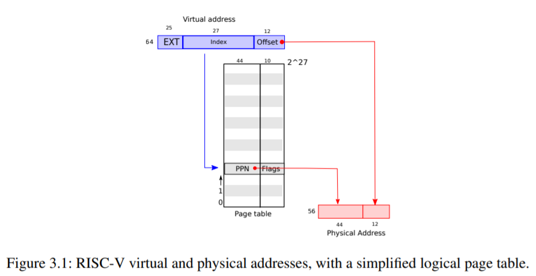
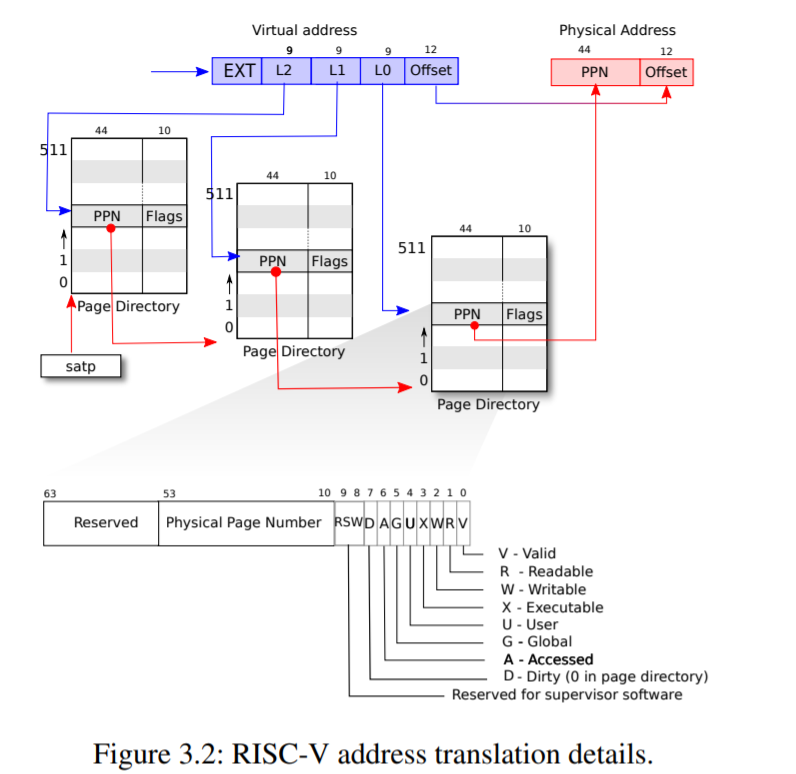
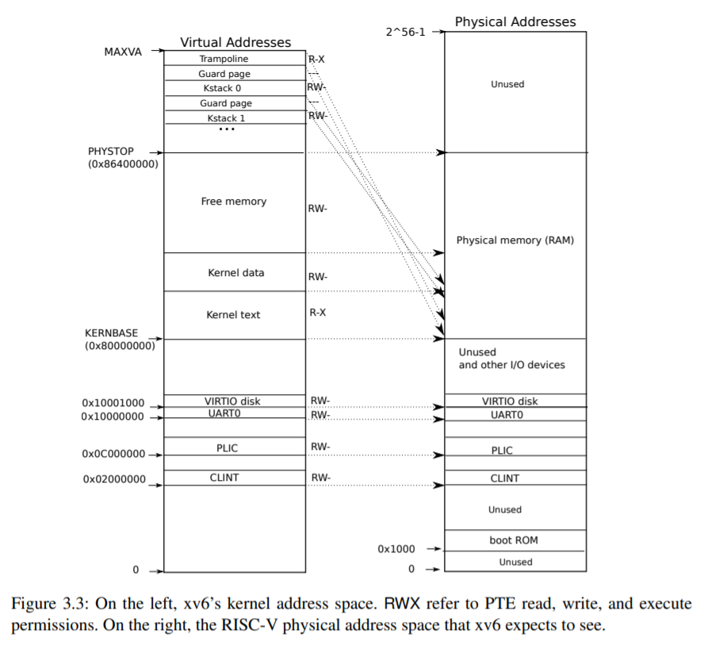
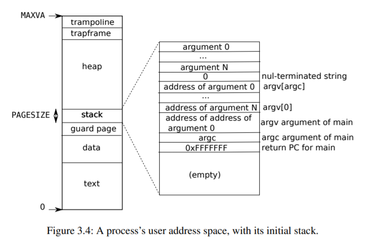

# Chapter 3 -- Page tables

頁表是操作系統為每個進程提供自己私有地址空間和內存的機制。頁表決定了內存地址的含義，以及物理內存的哪些部分可以被訪問。它們允許xv6隔離不同進程的地址空間，並將它們覆用到單個物理內存上。頁表還提供了一個間接層次，允許xv6執行一些技巧：在幾個地址空間中映射同一內存（一個蹦床頁），以及用一個未映射的頁來保護內核和用戶堆棧。本章其余部分將解釋RISC-V硬件提供的頁表以及xv6如何使用它們。

## 3.1 Paging hardware

提醒一下，RISC-V指令(包括用戶和內核)操縱的是虛擬地址。機器的RAM，也就是物理內存，是以物理地址為索引的。RISC-V頁表硬件將這兩種地址連接起來，通過將每個虛擬地址映射到物理地址。

xv6運行在Sv39 RISC-V上，這意味著只使用64位虛擬地址的底部39位，頂部25位沒有使用。在這種Sv39配置中，一個RISC-V頁表在邏輯上是一個`2^27(134,217,728)`頁表項(PTE)的數組。每個PTE包含一個44位的物理頁號（PPN）和一些標志。分頁硬件翻譯虛擬地址時，利用39位中的前27位索引到頁表中找到一個PTE，並做出一個56位的物理地址，其前44位來自於PTE中的PPN，而其後12位則是從原虛擬地址中複製過來的。圖3.1顯示了這個過程，邏輯上把頁表看成是一個簡單的PTE數組（更完整的故事見圖3.2）。頁表讓操作系統控制虛擬地址到物理地址的轉換，其粒度為4096（2^12）字節的對齊塊。這樣的塊稱為頁。



在Sv39 RISC-V中，虛擬地址的前25位不用於翻譯；將來，RISC-V可能會使用這些位來定義更多的翻譯級別。物理地址也有增長的空間：在PTE格式中，物理頁數還有10位的增長空間。

如圖3.2所示，實際翻譯分三步進行。一個頁表以三層樹的形式存儲在物理內存中。樹的根部是一個4096字節的頁表頁，它包含512個PTE，這些PTE包含樹的下一級頁表頁的物理地址。這些頁面中的每一個都包含512個PTE，用於樹的最後一級。分頁硬件用27位中的頂9位選擇根頁表頁中的PTE，用中間9位選擇樹中下一級頁表頁中的PTE，用底9位選擇最後的PTE。

如果翻譯一個地址所需的三個PTE中的任何一個不存在，尋呼硬件就會引发一個頁面錯誤的異常，讓內核來處理這個異常（見第4章）。

這種三級結構允許頁表在常見的大範圍虛擬地址沒有映射的情況下省略整個頁表頁。

每個PTE包含標志位，告訴尋呼硬件如何允許使用相關的虛擬地址。PTE_V表示PTE是否存在：如果沒有設置，對該頁的引用會引起異常（即不允許）。PTE_R控制是否允許指令讀取到頁面。PTE_W控制是否允許指令向頁面寫入。PTE_X控制CPU是否可以將頁面的內容解釋為指令並執行。

PTE_U控制是否允許用戶模式下的指令訪問頁面；如果不設置PTE_U，PTE只能在主管模式下使用。圖3.2顯示了這一切的工作原理。標志和其他所有與頁硬件相關的結構在(kernel/riscv.h)中定義 要告訴硬件使用頁表，內核必須將根頁表頁的物理地址寫入satp寄存器中。每個CPU都有自己的satp。一個CPU將使用自己的satp指向的頁表來翻譯後續指令產生的所有地址。

每個CPU都有自己的satp，這樣不同的CPU可以運行不同的進程，每個進程都有自己的頁表所描述的私有地址空間。



關於術語的一些說明。物理內存指的是DRAM中的存儲單元。物理存儲器的一個字節有一個地址，稱為物理地址。指令只使用虛擬地址，分頁硬件將其翻譯成物理地址，然後发送給DRAM硬件，以讀取或寫入存儲。與物理內存和虛擬地址不同，虛擬內存並不是一個物理對象，而是指內核提供的管理物理內存和虛擬地址的抽象和機制的集合。

## 3.2 Kernel address space

Xv6為每個進程維護一個頁表，描述每個進程的用戶地址空間，另外還有一個描述內核地址空間的單頁表。內核配置其地址空間的布局，使自己能夠在可預測的虛擬地址上訪問物理內存和各種硬件資源。圖3.3顯示了這種布局如何將內核虛擬地址映射到物理地址。文件（kernel/memlayout.h）聲明了xv6的內核內存布局的常量

kernel/memlayout.h

```cpp
// Physical memory layout

// qemu -machine virt is set up like this,
// based on qemu's hw/riscv/virt.c:
//
// 00001000 -- boot ROM, provided by qemu
// 02000000 -- CLINT
// 0C000000 -- PLIC
// 10000000 -- uart0 
// 10001000 -- virtio disk 
// 80000000 -- boot ROM jumps here in machine mode
//             -kernel loads the kernel here
// unused RAM after 80000000.
```

QEMU模擬的計算機包括RAM（物理內存），從物理地址0x80000000開始，一直到至少0x86400000，xv6稱之為PHYSTOP。

QEMU模擬還包括I/O設備，如磁盤接口。QEMU將設備接口作為內存映射的控制寄存器暴露給軟件，這些寄存器位於物理地址空間的0x80000000以下。內核可以通過讀取/寫入這些特殊的物理地址與設備進行交互；這種讀取和寫入與設備硬件而不是與RAM進行通信。第4章解釋了xv6如何與設備交互。



內核通過 "直接映射 "的方式獲取RAM和內存映射的設備寄存器，也就是將資源映射到與物理地址相等的虛擬地址上，例如，內核本身在虛擬地址空間和物理內存中都位於KERNBASE=0x80000000處。例如，內核本身在虛擬地址空間和物理內存中的位置都是KERNBASE=0x80000000。直接映射簡化了讀或寫物理內存的內核代碼。例如,當fork為子進程分配用戶內存時,分配器返回該內存的物理地址;fork在將父進程的用戶內存複製到子進程時,直接將該地址作為虛擬地址。

有幾個內核虛擬地址不是直接映射的。

* 蹦床頁。它被映射在虛擬地址空間的頂端；用戶頁表也有這種映射。第4章討論了蹦床頁的作用，但我們在這里看到了頁表的一個有趣的用例；一個物理頁（存放蹦床代碼）在內核的虛擬地址空間中被映射了兩次：一次是在虛擬地址空間的頂部，一次是直接映射。
* 內核棧頁。每個進程都有自己的內核棧，內核棧被映射得很高，所以在它下面xv6可以留下一個未映射的守衛頁。守護頁的PTE是無效的(即PTE_V沒有設置)，這樣如果內核溢出內核棧，很可能會引起異常，內核會恐慌。如果沒有防護頁，溢出的堆棧會覆蓋其他內核內存，導致不正確的操作。恐慌性崩潰是比較好的。

當內核通過高內存映射使用堆棧時，它們也可以通過直接映射的地址被內核訪問。另一種設計可能只有直接映射，並在直接映射的地址上使用堆棧。然而，在這種安排中，提供保護頁將涉及到取消映射虛擬地址，否則這些地址將指向物理內存，這將很難使用。

內核將蹦床和內核文本的頁面映射為PTE_R和PTE_X權限。內核從這些頁面讀取和執行指令。內核用PTE_R和PTE_W權限映射其他頁面，這樣它就可以讀寫這些頁面的內存。守護頁的映射是無效的。

## 3.3 Code: creating an address space

riscv.h

```cpp
typedef uint64 pte_t;
typedef uint64 *pagetable_t; // 512 PTEs
```

大部分的xv6操作地址空間和頁表的代碼都在vm.c(kernel/vm.c:1)中。中心數據結構是pagetable_t，它實際上是一個指向RISC-V根頁表頁的指針；pagetable_t可以是內核頁表，也可以是每個進程的頁表之一。核心函數是Walk和mappages，前者為虛擬地址尋找PTE，後者為新的映射安裝PTE。以 kvm 開頭的函數操作內核頁表；以 uvm 開頭的函數操作用戶頁表；其他函數同時用於這兩個方面。copyout 和 copyin 將數據複製到作為系統調用參數提供的用戶虛擬地址，並從這些地址複製數據；它們在 vm.c 中，因為它們需要顯式翻譯這些地址，以便找到相應的物理內存。

在啟動序列的早期，main調用kvminit(kernel/vm.c:22)來創建內核的頁表，這個調用发生在xv6在RISC-V上啟用分頁之前，所以地址直接指物理內存。這個調用发生在xv6在RISC-V上啟用分頁之前，所以地址直接指向物理內存。Kvminit首先分配一頁物理內存來存放根頁表頁。然後調用kvmmap來安裝內核需要的翻譯。這些翻譯包括內核的指令和數據，物理內存到PHYSTOP，以及實際上是設備的內存範圍。

```cpp
/*
 * the kernel's page table.
 */
pagetable_t kernel_pagetable;

extern char etext[];  // kernel.ld sets this to end of kernel code.

extern char trampoline[]; // trampoline.S

// Make a direct-map page table for the kernel.
pagetable_t
kvmmake(void)
{
  pagetable_t kpgtbl;

  kpgtbl = (pagetable_t) kalloc();
  memset(kpgtbl, 0, PGSIZE);
  // 1. 輸出入裝置 2. 作業系統 3. 跳轉頁 的記憶體區塊為直接映射 (id mapping)
  // uart registers.
  kvmmap(kpgtbl, UART0, UART0, PGSIZE, PTE_R | PTE_W);

  // virtio mmio disk interface.
  kvmmap(kpgtbl, VIRTIO0, VIRTIO0, PGSIZE, PTE_R | PTE_W);

  // PLIC
  kvmmap(kpgtbl, PLIC, PLIC, 0x400000, PTE_R | PTE_W);

  // map kernel text executable and read-only.
  kvmmap(kpgtbl, KERNBASE, KERNBASE, (uint64)etext-KERNBASE, PTE_R | PTE_X);

  // map kernel data and the physical RAM we'll make use of.
  kvmmap(kpgtbl, (uint64)etext, (uint64)etext, PHYSTOP-(uint64)etext, PTE_R | PTE_W);

  // map the trampoline for trap entry/exit to
  // the highest virtual address in the kernel.
  kvmmap(kpgtbl, TRAMPOLINE, (uint64)trampoline, PGSIZE, PTE_R | PTE_X);

  // map kernel stacks
  proc_mapstacks(kpgtbl);
  
  return kpgtbl;
}

// Initialize the one kernel_pagetable
void
kvminit(void)
{
  kernel_pagetable = kvmmake();
}

// Switch h/w page table register to the kernel's page table,
// and enable paging.
void
kvminithart()
{
  w_satp(MAKE_SATP(kernel_pagetable)); // 註：riscv.h => #define MAKE_SATP(pagetable) (SATP_SV39 | (((uint64)pagetable) >> 12))

  sfence_vma();
}
// ...
// add a mapping to the kernel page table.
// only used when booting.
// does not flush TLB or enable paging.
void
kvmmap(pagetable_t kpgtbl, uint64 va, uint64 pa, uint64 sz, int perm)
{
  if(mappages(kpgtbl, va, sz, pa, perm) != 0)
    panic("kvmmap");
}

//...
// Create PTEs for virtual addresses starting at va that refer to
// physical addresses starting at pa. va and size might not
// be page-aligned. Returns 0 on success, -1 if walk() couldn't
// allocate a needed page-table page.
int
mappages(pagetable_t pagetable, uint64 va, uint64 size, uint64 pa, int perm)
{
  uint64 a, last;
  pte_t *pte;
  // 映射範圍：從 va 到 va+size
  a = PGROUNDDOWN(va); // 第一頁的頁號
  last = PGROUNDDOWN(va + size - 1); // 最後一頁的頁號
  for(;;){
    if((pte = walk(pagetable, a, 1)) == 0) // 找出頁 a 對應的 pte，若不存在則創造一個可用空頁 (因 alloc=1)
      return -1;
    if(*pte & PTE_V)
      panic("remap");
    *pte = PA2PTE(pa) | perm | PTE_V;
    if(a == last) // 如果已經到了最後一頁，則完成並離開
      break;
    a += PGSIZE;
    pa += PGSIZE;
  }
  return 0;
}

```

riscv.h

```cpp
//...
#define PGROUNDUP(sz)  (((sz)+PGSIZE-1) & ~(PGSIZE-1))
#define PGROUNDDOWN(a) (((a)) & ~(PGSIZE-1)) // 只保留最後 12 位元的 offset 部分
//...
// shift a physical address to the right place for a PTE.
#define PA2PTE(pa) ((((uint64)pa) >> 12) << 10)

#define PTE2PA(pte) (((pte) >> 10) << 12)

#define PTE_FLAGS(pte) ((pte) & 0x3FF)
```

kvmmap (kernel/vm.c:118) 調用 mappages (kernel/vm.c:149)，它將一個虛擬地址範圍的映射安裝到頁表中，並將其映射到相應的物理地址範圍。它對範圍內的每一個虛擬地址按頁間隔分別進行安裝。對於每個要映射的虛擬地址，mapages調用walk找到該地址的PTE的地址。然後，它初始化PTE，使其持有相關的物理頁號、所需的權限(PTE_W、PTE_X和/或PTE_R)，以及PTE_V來標記PTE為有效(kernel/vm.c:161)。

walk (kernel/vm.c:72)模仿RISC-V分頁硬件查找虛擬地址的PTE(見圖3.2).walk每次下降3級頁表的9位。它利用每一級的9位虛擬地址來查找下一級頁表或最後一頁（kernel/vm.c:78）的PTE。如果PTE無效，則說明所需的頁還沒有被分配；如果設置了alloc參數，walk會分配一個新的頁表頁，並把它的物理地址放在PTE中。它返回樹中最低層的PTE的地址(kernel/vm.c:88)。


vm.c

```cpp
// Return the address of the PTE in page table pagetable
// that corresponds to virtual address va.  If alloc!=0,
// create any required page-table pages.
//
// The risc-v Sv39 scheme has three levels of page-table
// pages. A page-table page contains 512 64-bit PTEs.
// A 64-bit virtual address is split into five fields:
//   39..63 -- must be zero.
//   30..38 -- 9 bits of level-2 index.
//   21..29 -- 9 bits of level-1 index.
//   12..20 -- 9 bits of level-0 index.
//    0..11 -- 12 bits of byte offset within the page.
pte_t *
walk(pagetable_t pagetable, uint64 va, int alloc)
{
  if(va >= MAXVA)
    panic("walk");

  for(int level = 2; level > 0; level--) { // 逐級下降頁表 (共三級)
    pte_t *pte = &pagetable[PX(level, va)]; // 看看虛擬位址 va 的是否在頁表裏
    if(*pte & PTE_V) { // 若是，則取得頁表。
      pagetable = (pagetable_t)PTE2PA(*pte);
    } else { // 否則，分配新頁表
      if(!alloc || (pagetable = (pde_t*)kalloc()) == 0) // 不分配或分配失敗
        return 0;
      memset(pagetable, 0, PGSIZE); // 將頁表清為 0
      *pte = PA2PTE(pagetable) | PTE_V; // 取得頁表項 PTE
    }
  }
  return &pagetable[PX(0, va)]; // 傳回 0 級頁表
}
```

上述代碼依賴於物理內存直接映射到內核虛擬地址空間。例如，當 walk 下降頁表的級別時，它從 PTE 中提取下一級頁表的（物理）地址（kernel/vm.c:80），然後使用該地址作為虛擬地址來獲取下一級的 PTE（kernel/vm.c:78）。

main 調用 kvminithart (kernel/vm.c:53) 來安裝內核頁表。它將根頁表頁的物理地址寫入寄存器satp中。在這之後，CPU將使用內核頁表翻譯地址。由於內核使用單元映射 (identity mapping)，所以下一條指令的虛擬地址將映射到正確的物理內存地址。

```cpp
// start() jumps here in supervisor mode on all CPUs.
void
main()
{
  if(cpuid() == 0){
    consoleinit();
    printfinit();
    printf("\n");
    printf("xv6 kernel is booting\n");
    printf("\n");
    kinit();         // physical page allocator
    kvminit();       // create kernel page table
    kvminithart();   // turn on paging
    procinit();      // process table
    trapinit();      // trap vectors
    trapinithart();  // install kernel trap vector
    plicinit();      // set up interrupt controller
    plicinithart();  // ask PLIC for device interrupts
    binit();         // buffer cache
    iinit();         // inode cache
    fileinit();      // file table
    virtio_disk_init(); // emulated hard disk
    userinit();      // first user process
    __sync_synchronize();
    started = 1;
  } else {
    while(started == 0)
      ;
    __sync_synchronize();
    printf("hart %d starting\n", cpuid());
    kvminithart();    // turn on paging
    trapinithart();   // install kernel trap vector
    plicinithart();   // ask PLIC for device interrupts
  }

  scheduler();        
}

```

procinit (kernel/proc.c:26)，它由main調用，為每個進程分配一個內核棧。kvmmap將映射的PTE添加到內核頁表中，調用kvminithart將內核頁表重新加載到satp中，這樣硬件就知道新的PTE了。

每個RISC-V CPU都會在Translation Look-aside Buffer(TLB)中緩存頁表項，當xv6改變頁表時，必須告訴CPU使相應的緩存TLB項無效。如果它沒有這樣做，那麽在以後的某個時刻，TLB可能會使用一個舊的緩存映射，指向一個物理頁，而這個物理頁在此期間已經分配給了另一個進程，結果，一個進程可能會在其他進程的內存上亂寫亂畫。RISC-V有一條指令sfence.vma，可以刷新當前CPU的TLB。xv6在重新加載satp寄存器後，在kvminithart中執行sfence.vma，在返回用戶空間前切換到用戶頁表的trampoline代碼中執行sfence.vma（kernel/trampoline.S:79）。

## 3.4 Physical memory allocation

內核必須在運行時為頁表、用戶內存、內核堆棧和管道緩沖區分配和釋放物理內存。

xv6使用內核結束和PHYSTOP之間的物理內存進行運行時分配。它每次分配和釋放整個4096字節的頁面。它通過對頁面本身的鏈接列表進行線程化，來跟蹤哪些頁面是空閑的。分配包括從鏈接列表中刪除一個頁面；釋放包括將釋放的頁面添加到列表中。

## 3.5 Code: Physical memory allocator

分配器駐留在kalloc.c（kernel/kalloc.c:1）中。分配器的數據結構是一個可供分配的物理內存頁的空閑列表，每個空閑頁的列表元素是一個結構run（kernel/kalloc.c:17）。每個空閑頁的列表元素是一個結構run(kernel/kalloc.c:17)。分配器從哪里獲得內存來存放這個數據結構呢？它把每個空閑頁的run結構存儲在空閑頁本身，因為那里沒有其他東西存儲。空閑列表由一個自旋鎖保護(kernel/kalloc.c:21-24)。列表和鎖被包裹在一個結構中，以明確鎖保護的是結構中的字段。現在，忽略鎖以及獲取和釋放的調用；第6章將詳細研究鎖。

```cpp
// Physical memory allocator, for user processes,
// kernel stacks, page-table pages,
// and pipe buffers. Allocates whole 4096-byte pages.

#include "types.h"
#include "param.h"
#include "memlayout.h"
#include "spinlock.h"
#include "riscv.h"
#include "defs.h"

void freerange(void *pa_start, void *pa_end);

extern char end[]; // first address after kernel.
                   // defined by kernel.ld.

struct run {
  struct run *next;
};

struct {
  struct spinlock lock;
  struct run *freelist;
} kmem;

void
kinit()
{
  initlock(&kmem.lock, "kmem");
  freerange(end, (void*)PHYSTOP);
}

void
freerange(void *pa_start, void *pa_end)
{
  char *p;
  p = (char*)PGROUNDUP((uint64)pa_start);
  for(; p + PGSIZE <= (char*)pa_end; p += PGSIZE)
    kfree(p);
}

// Free the page of physical memory pointed at by v,
// which normally should have been returned by a
// call to kalloc().  (The exception is when
// initializing the allocator; see kinit above.)
void
kfree(void *pa)
{
  struct run *r;

  if(((uint64)pa % PGSIZE) != 0 || (char*)pa < end || (uint64)pa >= PHYSTOP)
    panic("kfree");

  // Fill with junk to catch dangling refs.
  memset(pa, 1, PGSIZE);

  r = (struct run*)pa;

  acquire(&kmem.lock);
  r->next = kmem.freelist;
  kmem.freelist = r;
  release(&kmem.lock);
}

// Allocate one 4096-byte page of physical memory.
// Returns a pointer that the kernel can use.
// Returns 0 if the memory cannot be allocated.
void *
kalloc(void)
{
  struct run *r;

  acquire(&kmem.lock);
  r = kmem.freelist;
  if(r)
    kmem.freelist = r->next;
  release(&kmem.lock);

  if(r)
    memset((char*)r, 5, PGSIZE); // fill with junk
  return (void*)r;
}

```

函數main調用kinit來初始化分配器(kernel/kalloc.c:27)。kinit初始化自由列表，以保持內核結束和PHYSTOP之間的每一頁。 xv6應該通過解析硬件提供的配置信息來確定有多少物理內存可用。kinit調用freerange通過每頁調用kfree來增加內存到空閑列表中。一個PTE只能引用一個在4096字節邊界上對齊的物理地址（是4096的倍數），所以freerange使用PGROUNDUP來確保它只釋放對齊的物理地址。分配器開始時沒有內存，這些對kfree的調用給了它一些管理內存的機會。

分配器有時把地址當作整數來處理，以便對其進行運算（如遍歷自由區的所有頁），有時把地址當作指針來讀寫內存（如操作存儲在每頁中的運行結構）；這種對地址的雙重使用是分配器代碼中充滿C類型投的主要原因。另一個原因是，釋放和分配本質上改變了內存的類型。

函數kfree (kernel/kalloc.c:47)首先將被釋放的內存中的每一個字節都設置為1。這將導致在釋放內存後使用內存的代碼(使用 "dangling references")讀取垃圾而不是舊的有效內容；希望這將導致這類代碼更快地崩潰。

然後，kfree將頁面預先添加到自由列表中：它將pa轉換為指向struct run的指針，在r->next中記錄自由列表的舊起點，並將自由列表設為r。kalloc刪除並返回自由列表中的第一個元素。

## 3.6 Process address space

每個進程都有一個獨立的頁表，當xv6在進程間切換時，也會改變頁表。如圖2.3所示，一個進程的用戶內存從虛擬地址0開始，可以增長到MAXVA(kernel/riscv.h:348)，原則上允許一個進程尋址256GB的內存。

當一個進程要求xv6提供更多的用戶內存時，xv6首先使用kalloc來分配物理頁。然後它將指向新物理頁的PTE添加到進程的頁表中。Xv6在這些PTE中設置PTE_W、PTE_X、PTE_R、PTE_U和PTE_V標志。大多數進程不會使用整個用戶地址空間，xv6在未使用的PTE中讓PTE_V保持清除。

我們在這里看到了幾個很好的頁表使用實例。首先，不同進程的頁表將用戶地址轉化為物理內存的不同頁，因此每個進程都有私有的用戶內存。第二，每個進程都認為自己的內存具有從零開始的連續的虛擬地址，而進程的物理內存可以是非連續的。第三，內核在用戶地址空間的頂端映射出一個帶有蹦床代碼的頁面，因此，在所有的地址空間中，都會出現一個物理內存的頁面。



圖3.4更詳細地顯示了xv6中執行進程的用戶內存布局。棧是一個單頁，圖中顯示的是由exec創建的初始內容。包含命令行參數的字符串，以及指向它們的指針數組，位於堆棧的最頂端。在其下面是允許程序從main開始的值，就像函數main(argc, argv)剛剛被調用一樣。

為了檢測用戶堆棧溢出分配的堆棧內存，xv6會在堆棧的正下方放置一個無效的保護頁。如果用戶堆棧溢出，而進程試圖使用堆棧下面的地址，硬件會因為映射無效而產生一個頁錯誤異常。現實世界中的操作系統可能會在用戶堆棧溢出時自動為其分配更多的內存。

## 3.7 Code: sbrk

Sbrk是一個進程收縮或增長內存的系統調用，系統調用由函數growproc(kernel/proc.c:239)實現。該系統調用由函數growproc(kernel/proc.c:239)實現，growproc調用uvmalloc或uvmdealloc，這取決於n是正數還是負數。 uvmdealloc 調用 uvmunmap (kernel/vm.c:174)，它使用 walk 來查找 PTEs，使用 kfree 來釋放它們所引用的物理內存。

proc.c

```cpp
// Grow or shrink user memory by n bytes.
// Return 0 on success, -1 on failure.
int
growproc(int n)
{
  uint sz;
  struct proc *p = myproc();

  sz = p->sz;
  if(n > 0){
    if((sz = uvmalloc(p->pagetable, sz, sz + n)) == 0) {
      return -1;
    }
  } else if(n < 0){
    sz = uvmdealloc(p->pagetable, sz, sz + n);
  }
  p->sz = sz;
  return 0;
}
```

xv6使用進程的頁表不僅是為了告訴硬件如何映射用戶虛擬地址，也是作為分配給該進程哪些物理內存頁的唯一記錄。這就是為什麽釋放用戶內存（在uvmunmap中）需要檢查用戶頁表的原因。

## 3.8 Code: exec

Exec是創建地址空間用戶部分的系統調用。它從文件系統中存儲的文件初始化地址空間的用戶部分。Exec (kernel/exec.c:13)使用namei (kernel/exec.c:26)打開命名的二進制路徑，這在第8章中有解釋。然後，它讀取ELF頭。Xv6應用程序用廣泛使用的ELF格式來描述，定義在(kernel/elf.h)。一個ELF二進制文件包括一個ELF頭，elfhdr結構(kernel/elf.h:6)，後面是一個程序節頭序列，proghdr結構(kernel/elf.h:25)。每一個proghdr描述了一個必須加載到內存中的程序部分；xv6程序只有一個程序部分頭，但其他系統可能有單獨的指令和數據部分。

exec.c

```cpp
// ...
static int loadseg(pde_t *pgdir, uint64 addr, struct inode *ip, uint offset, uint sz);

int
exec(char *path, char **argv)
{
  char *s, *last;
  int i, off;
  uint64 argc, sz = 0, sp, ustack[MAXARG+1], stackbase;
  struct elfhdr elf;
  struct inode *ip;
  struct proghdr ph;
  pagetable_t pagetable = 0, oldpagetable;
  struct proc *p = myproc();

  begin_op();

  if((ip = namei(path)) == 0){ // 取得 path ELF 檔對應的 inode ptr (ip)
    end_op();
    return -1;
  }
  ilock(ip);

  // Check ELF header
  if(readi(ip, 0, (uint64)&elf, 0, sizeof(elf)) != sizeof(elf)) // 讀取該 inode
    goto bad;
  if(elf.magic != ELF_MAGIC) // 若不是 ELF 則失敗
    goto bad;

  if((pagetable = proc_pagetable(p)) == 0) // 分配頁表
    goto bad;

  // Load program into memory.
  for(i=0, off=elf.phoff; i<elf.phnum; i++, off+=sizeof(ph)){
    if(readi(ip, 0, (uint64)&ph, off, sizeof(ph)) != sizeof(ph))
      goto bad;
    if(ph.type != ELF_PROG_LOAD)
      continue;
    if(ph.memsz < ph.filesz)
      goto bad;
    if(ph.vaddr + ph.memsz < ph.vaddr)
      goto bad;
    uint64 sz1;
    if((sz1 = uvmalloc(pagetable, sz, ph.vaddr + ph.memsz)) == 0) // 為每個ELF段分配內存
      goto bad;
    sz = sz1;
    if(ph.vaddr % PGSIZE != 0)
      goto bad;
    if(loadseg(pagetable, ph.vaddr, ip, ph.off, ph.filesz) < 0) // 把每個段加載到內存中 (loadseg用walkaddr找到分配的內存的物理地址，在這個地址上寫入ELF段的每一頁，用readi從文件中讀取)
      goto bad; 
  }
  iunlockput(ip);
  end_op();
  ip = 0;

  p = myproc();
  uint64 oldsz = p->sz;

  // Allocate two pages at the next page boundary. 為何分配兩頁？第二個是堆疊，那第一個幹嘛用？
  // Use the second as the user stack.  答：第一個是不可訪問頁，當堆疊溢位時會觸發錯誤中斷。
  sz = PGROUNDUP(sz);
  uint64 sz1;
  if((sz1 = uvmalloc(pagetable, sz, sz + 2*PGSIZE)) == 0)
    goto bad;
  sz = sz1;
  uvmclear(pagetable, sz-2*PGSIZE);
  sp = sz;
  stackbase = sp - PGSIZE;

  // Push argument strings, prepare rest of stack in ustack. 在堆疊中推入 argv 字串
  for(argc = 0; argv[argc]; argc++) {
    if(argc >= MAXARG)
      goto bad;
    sp -= strlen(argv[argc]) + 1;
    sp -= sp % 16; // riscv sp must be 16-byte aligned
    if(sp < stackbase)
      goto bad;
    if(copyout(pagetable, sp, argv[argc], strlen(argv[argc]) + 1) < 0) // 複製失敗就離開
      goto bad;
    ustack[argc] = sp;
  }
  ustack[argc] = 0;

  // push the array of argv[] pointers. 推入 argv 的指標
  sp -= (argc+1) * sizeof(uint64);
  sp -= sp % 16;
  if(sp < stackbase)
    goto bad;
  if(copyout(pagetable, sp, (char *)ustack, (argc+1)*sizeof(uint64)) < 0)
    goto bad;

  // arguments to user main(argc, argv)
  // argc is returned via the system call return
  // value, which goes in a0.
  p->trapframe->a1 = sp; // 設定 a1=argv

  // Save program name for debugging.
  for(last=s=path; *s; s++)
    if(*s == '/')
      last = s+1;
  safestrcpy(p->name, last, sizeof(p->name));
    
  // Commit to the user image.
  oldpagetable = p->pagetable; // 註：oldpagetable 指向 fork 時的 process，現在已經換成新 process 了。
  p->pagetable = pagetable;
  p->sz = sz;
  p->trapframe->epc = elf.entry;  // initial program counter = main (進入點為 main)
  p->trapframe->sp = sp; // initial stack pointer
  proc_freepagetable(oldpagetable, oldsz);

  return argc; // this ends up in a0, the first argument to main(argc, argv)

 bad:
  if(pagetable)
    proc_freepagetable(pagetable, sz);
  if(ip){
    iunlockput(ip);
    end_op();
  }
  return -1;
}
```

第一步是快速檢查文件是否包含一個ELF二進制文件。一個ELF二進制文件以四個字節的 "魔數 "0x7F、"E"、"L"、"F "或ELF_MAGIC(kernel/elf.h:3)開頭。如果ELF頭有正確的魔數，exec就會認為二進制格式良好。

Exec用proc_pagetable(kernel/exec.c:38)分配一個沒有用戶映射的新頁表，用uvmalloc(kernel/exec.c:52)為每個ELF段分配內存，用loadseg(kernel/exec.c:10)把每個段加載到內存中。loadseg用walkaddr找到分配的內存的物理地址，在這個地址上寫入ELF段的每一頁，用readi從文件中讀取。

用exec創建的第一個用戶程序/init的程序段頭是這樣的。

```sh
# objdump -p _init

user/_init: file format elf64-littleriscv
Program Header:
LOAD off 0x00000000000000b0 vaddr 0x0000000000000000 paddr 0x0000000000000000 align 2**3 filesz 0x0000000000000840 memsz 0x0000000000000858 flags rwx
STACK off 0x0000000000000000 vaddr 0x0000000000000000 paddr 0x0000000000000000 align 2**4 filesz 0x0000000000000000 memsz 0x0000000000000000 flags rw
```

程序節頭的filesz可能小於memsz，說明它們之間的空隙應該用零來填充（對於C語言全局變量），而不是從文件中讀取。

對於/init來說，filesz是2112字節，memsz是2136字節，因此uvmalloc分配了足夠的物理內存來容納2136字節，但只從文件/init中讀取了2112字節。

現在exec分配並初始化用戶棧。它只分配一個棧頁。Exec每次將參數字符串複製到堆棧的頂部，在ustack中記錄它們的指針。

它將一個空指針放在傳遞給main的argv列表的最後。ustack中的前三個條目是假返回程序計數器、argc和argv指針。

exec在堆棧頁的下方放置了一個不可訪問頁，這樣程序如果試圖使用多個頁面，就會出現故障。這個不可訪問的頁面也允許exec處理過大的參數；在這種情況下，exec用來複製參數到堆棧的copyout(kernel/vm.c:355)函數會注意到目標頁不可訪問，並返回-1。

在準備新的內存映像的過程中，如果exec檢測到一個錯誤，比如一個無效的程序段，它就會跳轉到標簽bad，釋放新的映像，並返回-1。exec必須等待釋放舊映像，直到它確定系統調用會成功：如果舊映像消失了，系統調用就不能向它返回-1。exec中唯一的錯誤情況发生在創建映像的過程中。一旦鏡像完成，exec就可以提交到新的頁表(kernel/exec.c:113)並釋放舊的頁表(kernel/exec.c:117)

Exec將ELF文件中的字節按ELF文件指定的地址加載到內存中。用戶或進程可以將任何他們想要的地址放入ELF文件中。因此，Exec是有風險的，因為ELF文件中的地址可能會意外地或故意地指向內核。對於不小心的內核來說，後果可能從崩潰到惡意顛覆內核的隔離機制(即安全漏洞)不等。xv6執行了一些檢查來避免這些風險。例如if(ph.vaddr + ph.memsz < ph.vaddr)檢查和是否溢出64位整數。危險的是，用戶可以用指向用戶選擇的地址的 ph.vaddr 和足夠大的 ph.memsz 來構造一個 ELF 二進制，使總和溢出到 0x1000，這看起來像是一個有效值。在舊版本的xv6中，用戶地址空間也包含了內核（但在用戶模式下不可讀/寫），用戶可以選擇一個對應內核內存的地址，從而將ELF二進制中的數據複製到內核中。在RISC-V版本的xv6中，這是不可能发生的，因為內核有自己獨立的頁表；loadseg加載到進程的頁表中，而不是內核的頁表中。

內核開发者很容易遺漏一個關鍵的檢查，現實世界的內核有很長的歷史遺漏檢查，其缺失可以被用戶程序利用來獲取內核權限。很可能xv6並沒有對提供給內核的用戶級數據進行完整的驗證，惡意的用戶程序可能會利用這一點來規避xv6的隔離。

## 3.9 Real world

像大多數操作系統一樣，xv6使用分頁硬件進行內存保護和映射。大多數操作系統對分頁的使用要比xv6複雜得多，它將分頁和分頁錯誤異常結合起來，我們將在第4章中討論。

Xv6通過內核使用虛擬地址和物理地址之間的直接映射來簡化，並假設在地址0x8000000處有物理RAM，即內核期望加載的地方。這在QEMU上是可行的，但在真實的硬件上，它被證明是一個糟糕的想法；真實的硬件將RAM和設備放置在不可預測的物理地址上，所以（例如）在0x8000000處可能沒有RAM，xv6期望能夠在那里存儲內核。更嚴重的內核設計利用頁表將任意的硬件物理內存布局變成可預測的內核虛擬地址布局。

RISC-V支持物理地址級別的保護，但xv6沒有使用這個功能。

在內存很大的機器上，使用RISC-V對 "超級頁 "的支持可能是有意義的。當物理內存很小的時候，小頁是有意義的，可以細粒度地分配和分頁到磁盤。例如，如果一個程序只使用8千字節的內存，給它整整4兆字節的超級物理內存頁是浪費的。更大的頁面在有大量內存的機器上是有意義的，並且可以減少頁表操作的開銷。

xv6內核缺乏一個類似malloc的分配器，可以為小對象提供內存，這使得內核無法使用需要動態分配的複雜數據結構。

內存分配是一個常年的熱門話題，基本問題是有效利用有限的內存和為未來未知的請求做準備[7]。如今人們更關心的是速度而不是空間效率。此外，一個更複雜的內核可能會分配許多不同大小的小塊，而不是（在xv6中）只分配4096字節的塊；一個真正的內核分配器需要處理小塊分配以及大塊分配。

## 3.10 Exercises

1. 解析RISC-V的設備樹，找出計算機的物理內存量。

2. 編寫一個用戶程序，通過調用sbrk(1)使其地址空間增長一個字節。運行該程序，調查調用sbrk之前和調用sbrk之後的程序頁表。內核分配了多少空間？新的PTE是多少？
內存包含哪些內容？

3. 修改xv6，使內核使用超級頁。

4. 修改xv6，使用戶程序取消引用一個空指針時，會收到一個異常。也就是修改xv6，使虛擬地址0不被映射給用戶程序。

5. Unix實現的exec傳統上包含了對shell腳本的特殊處理。如果要執行的文件以文本#！開頭，那麽第一行就會被認為是要運行解釋文件的程序。例如，如果調用exec運行myprog arg1，而myprog的第一行是#！/interp，那麽exec運行/interp，命令行為/interp myprog arg1。在xv6中實現對這個約定的支持。

6. 實現內核的地址空間隨機化。

