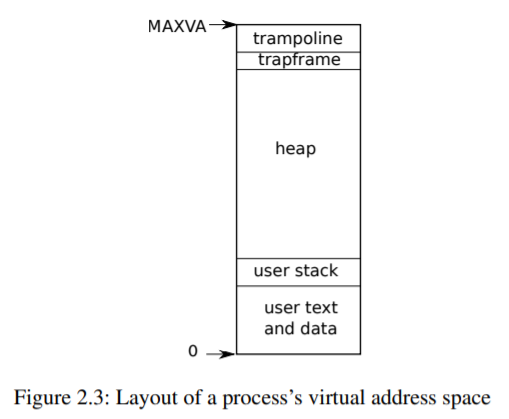

# Chapter 4 -- Traps and system calls

有三種事件會導致CPU擱置普通指令的執行，強制將控制權轉移給處理該事件的特殊代碼。一種情況是系統調用，當用戶程序執行ecall指令要求內核為其做某事時。另一種情況是異常：一條指令（用戶或內核）做了一些非法的事情，如除以零或使用無效的虛擬地址。第三種情況是設備中斷，當一個設備发出需要注意的信號時，例如當磁盤硬件完成一個讀寫請求時。

本書使用陷阱作為這些情況的通用術語。通常不管在陷阱发生時正在執行的代碼以後都需要恢復，不應該需要意識到发生了什麽特別的事情。也就是說，我們通常希望陷阱是透明的；這一點對於中斷來說尤其重要，被中斷的代碼通常不會想到會发生這種情況。通常的順序是：陷阱迫使控制權轉移到內核；內核保存寄存器和其他狀態，以便恢復執行；內核執行適當的處理程序代碼（例如，系統調用實現或設備驅動程序）；內核恢復保存的狀態，並從陷阱中返回；原始代碼從原來的地方恢復。

xv6內核會處理所有的陷阱。這對於系統調用來說是很自然的。這對中斷是有意義的，因為隔離要求用戶進程不能直接使用設備，而且只有內核才有設備處理所需的狀態。這對異常也是有意義的，因為xv6對所有來自用戶空間的異常的響應是殺死違規程序。

Xv6的陷阱處理分為四個階段：RISC-V CPU的硬件操作，為內核C代碼準備的匯編 "向量"，決定如何處理陷阱的C陷阱處理程序，以及系統調用或設備驅動服務例程。雖然這三種陷阱類型的共性表明，內核可以用一個單一的代碼路徑來處理所有的陷阱，但事實證明，為三種不同的情況，即來自用戶空間的陷阱、來自內核空間的陷阱和定時器中斷，分別設置不同的匯編向量和C陷阱處理程序是很方便的。

## 4.1 RISC-V trap machinery

每個RISC-V CPU都有一組控制寄存器，內核寫入這些寄存器來告訴CPU如何處理陷阱，內核可以通過讀取這些寄存器來发現已經发生的陷阱。RISC-V文檔包含了完整的故事[1]。riscv.h（kernel/riscv.h:1）包含了xv6使用的定義。這里是最重要的寄存器的概要。

* stvec。內核在這里寫下陷阱處理程序的地址；RISC -V在這里跳轉來處理陷阱。
* sepc: 當一個陷阱发生時，RISC-V將程序計數器保存在這里（因為pc會被stvec覆蓋）。sret (ret from trap)指令將sepc複製到pc中。內核可以寫入sepc來控制sret的去向。
* sscratch: 内核在这里放置了一个值，在陷阱处理程序开始的时候很方便。
* scause: RISC-V在這里放一個數字來描述陷阱的原因。內核在這里放了一個值，在陷阱處理程序開始的時候很方便。
* sstatus: sstatus中的SIE位用來描述陷阱的原因。sstatus: sstatus中的SIE位控制設備中斷是否被激活. 如果內核清除SIE，RISC-V將推遲設備中斷，直到內核設置SIE。SPP位表示一個陷阱是來自用戶模式還是上級模式，並控制sret返回到什麽模式

riscv.h

```cpp
// Supervisor Trap-Vector Base Address
// low two bits are mode.
static inline void 
w_stvec(uint64 x)
{
  asm volatile("csrw stvec, %0" : : "r" (x));
}

static inline uint64
r_stvec()
{
  uint64 x;
  asm volatile("csrr %0, stvec" : "=r" (x) );
  return x;
}

// Machine-mode interrupt vector
static inline void 
w_mtvec(uint64 x)
{
  asm volatile("csrw mtvec, %0" : : "r" (x));
}
```

上述寄存器與在主管模式下處理的陷阱有關，在用戶模式下不能讀或寫。對於機器模式下處理的陷阱，有一組等效的控制寄存器，xv6只在定時器中斷的特殊情況下使用它們。

多核芯片上的每個CPU都有自己的一組這些寄存器，而且任何時候都可能有多個CPU在處理一個陷阱。

當需要強制陷阱時，RISC-V硬件對所有的陷阱類型（除定時器中斷外）都會進行以下操作。

1. 如果陷阱是設備中斷，且sstatus SIE位為 0，不要做以下任何操作。
2. 通過清除SIE禁用中斷。
3. 將pc複製到sepc。
4. 在sstatus的SPP位中保存當前模式（用戶或主管）。
5. 設置scause來反映陷阱的原因。
6. 將模式設置為supervisor。
7. 將stvec複製到pc上。

注意，CPU不會切換到內核頁表，不會切換到內核中的堆棧，也不會保存pc以外的任何寄存器。內核軟件必須執行這些任務。

CPU在陷阱期間做最少的工作的原因之一是為了給軟件提供靈活性；例如，一些操作系統在某些情況下不需要切換頁表，這可以提高性能。

你可能會想，CPU硬件的陷阱處理順序是否可以進一步簡化。例如，假設CPU沒有切換程序計數器。那麽陷阱可能會切換到主管模式 (supervisor mode)，同時還在運行用戶指令。這些用戶指令可以打破《用戶/內核》的隔離，例如通過修改satp寄存器指向一個允許訪問所有物理內存的頁表。因此，CPU必須切換到內核指定的指令地址，即stvec。

## 4.2 Traps from user space

在用戶空間執行時，如果用戶程序進行了系統調用(ecall指令)，或者做了一些非法的事情，或者設備中斷，都可能发生陷阱。從用戶空間发出陷阱的順序是uservec(kernel/trampoline.S:16)，然後是usertrap(kernel/trap.c:37)；返回時是usertrapret(kernel/trap.c:90)，然後是userret(kernel/trampoline.S:16)。

trap.c

```cpp
//
// handle an interrupt, exception, or system call from user space.
// called from trampoline.S
//
void
usertrap(void)
{
  int which_dev = 0;

  if((r_sstatus() & SSTATUS_SPP) != 0)
    panic("usertrap: not from user mode");

  // send interrupts and exceptions to kerneltrap(),
  // since we're now in the kernel.
  w_stvec((uint64)kernelvec);

  struct proc *p = myproc();
  
  // save user program counter.
  p->trapframe->epc = r_sepc();
  
  if(r_scause() == 8){
    // system call

    if(p->killed)
      exit(-1);

    // sepc points to the ecall instruction,
    // but we want to return to the next instruction.
    p->trapframe->epc += 4;

    // an interrupt will change sstatus &c registers,
    // so don't enable until done with those registers.
    intr_on();

    syscall();
  } else if((which_dev = devintr()) != 0){
    // ok
  } else {
    printf("usertrap(): unexpected scause %p pid=%d\n", r_scause(), p->pid);
    printf("            sepc=%p stval=%p\n", r_sepc(), r_stval());
    p->killed = 1;
  }

  if(p->killed)
    exit(-1);

  // give up the CPU if this is a timer interrupt.
  if(which_dev == 2)
    yield();

  usertrapret();
}
```

來自用戶代碼的陷阱比來自內核的陷阱更具挑戰性，因為satp指向的用戶頁表並不映射內核，而且堆棧指針可能包含一個無效甚至惡意的值。

由於RISC-V硬件在陷阱過程中不會切換頁表，所以用戶頁表必須包含uservec的映射，即stvec指向的陷阱向量指令，uservec必須切換satp指向內核頁表；為了在切換後繼續執行指令，uservec必須在內核頁表中映射到與用戶頁表相同的地址。

Xv6用一個包含uservec的trampoline頁來滿足這些約束。Xv6在內核頁表和每個用戶頁表中的同一個虛擬地址上映射了trampoline頁。 (註：這點很重要，可以從 kernel.ld 看出 trampline 被映射到 0x80001000)

kernel.ld

```s
OUTPUT_ARCH( "riscv" )
ENTRY( _entry )

SECTIONS
{
  /*
   * ensure that entry.S / _entry is at 0x80000000,
   * where qemu's -kernel jumps.
   */
  . = 0x80000000;

  .text : {
    *(.text .text.*)
    . = ALIGN(0x1000);
    _trampoline = .;
    *(trampsec)
    . = ALIGN(0x1000);
    ASSERT(. - _trampoline == 0x1000, "error: trampoline larger than one page");
    PROVIDE(etext = .);
  }

  .rodata : {
    . = ALIGN(16);
    *(.srodata .srodata.*) /* do not need to distinguish this from .rodata */
    . = ALIGN(16);
    *(.rodata .rodata.*)
  }

  .data : {
    . = ALIGN(16);
    *(.sdata .sdata.*) /* do not need to distinguish this from .data */
    . = ALIGN(16);
    *(.data .data.*)
  }

  .bss : {
    . = ALIGN(16);
    *(.sbss .sbss.*) /* do not need to distinguish this from .bss */
    . = ALIGN(16);
    *(.bss .bss.*)
  }

  PROVIDE(end = .);
}

```

這個虛擬地址就是trampoline（如我們在圖2.3和圖3.3中看到的）。trampoline內容設置在trampoline.S中，（執行用戶代碼時）stvec設置為uservec（kernel/trampoline.S:16）。



當uservec啟動時，所有32個寄存器都包含被中斷的代碼所擁有的值。但是uservec需要能夠修改一些寄存器，以便設置satp和生成保存寄存器的地址。RISC-V以sscratch寄存器的形式提供了幫助。(註：以 sscratch 暫存 a0, 使得 a0 可以作為其他用途)

uservec開頭的csrrw指令將a0和sscratch的內容互換。現在用戶代碼的a0被保存了；uservec有一個寄存器（a0）可以玩；a0包含了內核之前放在sscratch中的值。

trampoline.S

```s
	.section trampsec
.globl trampoline
trampoline:
.align 4
.globl uservec
uservec:    
	#
        # trap.c sets stvec to point here, so
        # traps from user space start here,
        # in supervisor mode, but with a
        # user page table.
        #
        # sscratch points to where the process's p->trapframe is
        # mapped into user space, at TRAPFRAME.
        #
        
	# swap a0 and sscratch
        # so that a0 is TRAPFRAME
        csrrw a0, sscratch, a0

        # save the user registers in TRAPFRAME
        sd ra, 40(a0)
        sd sp, 48(a0)
        sd gp, 56(a0)
        sd tp, 64(a0)
        sd t0, 72(a0)
        sd t1, 80(a0)
        sd t2, 88(a0)
        sd s0, 96(a0)
        sd s1, 104(a0)
        sd a1, 120(a0)
        sd a2, 128(a0)
        sd a3, 136(a0)
        sd a4, 144(a0)
        sd a5, 152(a0)
        sd a6, 160(a0)
        sd a7, 168(a0)
        sd s2, 176(a0)
        sd s3, 184(a0)
        sd s4, 192(a0)
        sd s5, 200(a0)
        sd s6, 208(a0)
        sd s7, 216(a0)
        sd s8, 224(a0)
        sd s9, 232(a0)
        sd s10, 240(a0)
        sd s11, 248(a0)
        sd t3, 256(a0)
        sd t4, 264(a0)
        sd t5, 272(a0)
        sd t6, 280(a0)

	# save the user a0 in p->trapframe->a0
        csrr t0, sscratch
        sd t0, 112(a0)

        # restore kernel stack pointer from p->trapframe->kernel_sp
        ld sp, 8(a0)

        # make tp hold the current hartid, from p->trapframe->kernel_hartid
        ld tp, 32(a0)

        # load the address of usertrap(), p->trapframe->kernel_trap
        ld t0, 16(a0)

        # restore kernel page table from p->trapframe->kernel_satp
        ld t1, 0(a0)
        csrw satp, t1
        sfence.vma zero, zero

        # a0 is no longer valid, since the kernel page
        # table does not specially map p->tf.

        # jump to usertrap(), which does not return
        jr t0
```

uservec的下一個任務是保存用戶寄存器。在進入用戶空間之前，內核先前設置sscratch指向一個每進程的trapframe，這個trapframe（除其他外）有保存所有用戶寄存器的空間（kernel/proc.h:44）。因為satp仍然是指用戶頁表，所以uservec需要將trapframe映射到用戶地址空間中。在創建每個進程時，xv6為進程的trapframe分配一個頁面，並安排它始終映射在用戶虛擬地址TRAPFRAME，也就是TRAMPOLINE的下方。進程的p->trapframe也指向trapframe，不過是在它的物理地址，這樣內核就可以通過內核頁表來使用它。

因此在交換a0和sscratch後，a0持有指向當前進程的trapframe的指針。

uservec現在將所有用戶寄存器保存在那里，包括從sscratch讀取的用戶a0。

trapframe包含指向當前進程的內核棧、當前CPU的hartid、usertrap的地址和內核頁表的地址的指針，uservec檢索這些值，將satp切換到內核頁表，然後調用usertrap。

usertrap的工作是確定陷阱的原因，處理它，然後返回(kernel/trap.c:37)。如上所述，它首先改變stvec，這樣在內核中的陷阱將由kernelvec處理。它保存了sepc(保存的用戶程序計數器)，這也是因為usertrap中可能會有一個進程切換，導致sepc被覆蓋。如果陷阱是系統調用，則syscall處理；如果是設備中斷，則devintr處理；否則就是異常，內核會殺死故障進程。系統調用路徑在保存的用戶 pc+4，這是因為 ecall 時保存的 pc 指向 ecall 指令， +4 後才會是下一個指令。

```cpp
//
// handle an interrupt, exception, or system call from user space.
// called from trampoline.S
//
void
usertrap(void)
{
  int which_dev = 0;

  if((r_sstatus() & SSTATUS_SPP) != 0) // 是否來自 user mode ?
    panic("usertrap: not from user mode");

  // send interrupts and exceptions to kerneltrap(),
  // since we're now in the kernel.
  w_stvec((uint64)kernelvec); // 設定中斷向量為 kernelvec ?

  struct proc *p = myproc(); // 取得目前 process
  
  // save user program counter.
  p->trapframe->epc = r_sepc(); // 儲存程式計數器 sepc
  
  if(r_scause() == 8){ // 1.系統呼叫
    // system call

    if(p->killed) // 如果行程已經被殺死
      exit(-1);

    // sepc points to the ecall instruction,
    // but we want to return to the next instruction.
    p->trapframe->epc += 4; // 得儲存 ecall 的下一個指令

    // an interrupt will change sstatus &c registers,
    // so don't enable until done with those registers.
    intr_on(); // 允許裝置中斷

    syscall(); // 執行系統呼叫
  } else if((which_dev = devintr()) != 0){ // 2.裝置中斷，呼叫 devintr() 處理之。
    // ok
  } else { // 否則，錯誤處理
    printf("usertrap(): unexpected scause %p pid=%d\n", r_scause(), p->pid);
    printf("            sepc=%p stval=%p\n", r_sepc(), r_stval());
    p->killed = 1;
  }

  if(p->killed)
    exit(-1);

  // give up the CPU if this is a timer interrupt.
  if(which_dev == 2) // 3. 時間中斷，禮讓給其他 process
    yield();

  usertrapret(); // 從 usertrap 返回
}
```

在退出時，usertrap檢查進程是否已經被殺死或應該讓出CPU（如果這個陷阱是一個定時器中斷）。

回到用戶空間的第一步是調用usertrapret(kernel/trap.c:90)。這個函數設置RISC-V控制寄存器，為將來從用戶空間的陷阱做準備。這包括改變stvec來引用uservec，準備uservec所依賴的trapframe字段，並將sepc設置為先前保存的用戶程序計數器。最後，usertrapret在用戶頁表和內核頁表中映射的trampoline頁上調用userret，原因是userret中的匯編代碼會切換頁表。

```cpp
//
// return to user space
//
void
usertrapret(void)
{
  struct proc *p = myproc();

  // we're about to switch the destination of traps from
  // kerneltrap() to usertrap(), so turn off interrupts until
  // we're back in user space, where usertrap() is correct.
  intr_off();

  // send syscalls, interrupts, and exceptions to trampoline.S
  w_stvec(TRAMPOLINE + (uservec - trampoline));
  // 保存 kernel 的相關暫存器
  // set up trapframe values that uservec will need when
  // the process next re-enters the kernel.
  p->trapframe->kernel_satp = r_satp();         // kernel page table
  p->trapframe->kernel_sp = p->kstack + PGSIZE; // process's kernel stack
  p->trapframe->kernel_trap = (uint64)usertrap;
  p->trapframe->kernel_hartid = r_tp();         // hartid for cpuid()

  // set up the registers that trampoline.S's sret will use
  // to get to user space.
  
  // set S Previous Privilege mode to User.
  unsigned long x = r_sstatus();
  x &= ~SSTATUS_SPP; // clear SPP to 0 for user mode
  x |= SSTATUS_SPIE; // enable interrupts in user mode
  w_sstatus(x);

  // set S Exception Program Counter to the saved user pc.
  w_sepc(p->trapframe->epc);

  // tell trampoline.S the user page table to switch to.
  uint64 satp = MAKE_SATP(p->pagetable);

  // jump to trampoline.S at the top of memory, which 
  // switches to the user page table, restores user registers,
  // and switches to user mode with sret.
  uint64 fn = TRAMPOLINE + (userret - trampoline);
  ((void (*)(uint64,uint64))fn)(TRAPFRAME, satp);
}
```

proc.c

```cpp
...
extern char trampoline[]; // trampoline.S
...
// Return the current struct proc *, or zero if none.
struct proc*
myproc(void) {
  push_off();
  struct cpu *c = mycpu();
  struct proc *p = c->proc;
  pop_off();
  return p;
}
...
```

proc.h

```cpp
...
// Per-CPU state.
struct cpu {
  struct proc *proc;          // The process running on this cpu, or null.
  struct context context;     // swtch() here to enter scheduler().
  int noff;                   // Depth of push_off() nesting.
  int intena;                 // Were interrupts enabled before push_off()?
};
...
```

memlayout.h

```cpp
...
// map the trampoline page to the highest address,
// in both user and kernel space.
#define TRAMPOLINE (MAXVA - PGSIZE)
...
```

usertrapret對userret的調用在a0中傳遞一個指向進程用戶頁表的指針，在a1中傳遞一個指向TRAPFRAME的指針(kernel/trampoline.S:88)，userret將satp切換到進程的用戶頁表。回顧一下，用戶頁表同時映射了trampoline頁和TRAPFRAME，但沒有映射內核的其他內容。同樣，事實上，trampoline頁在用戶頁表和內核頁表中映射在同一個虛擬地址上，這也是允許uservec在改變satp後繼續執行的原因。

```s
.globl userret
userret:
        # userret(TRAPFRAME, pagetable)
        # switch from kernel to user.
        # usertrapret() calls here.
        # a0: TRAPFRAME, in user page table.
        # a1: user page table, for satp.

        # switch to the user page table.
        csrw satp, a1
        sfence.vma zero, zero

        # put the saved user a0 in sscratch, so we
        # can swap it with our a0 (TRAPFRAME) in the last step.
        ld t0, 112(a0)
        csrw sscratch, t0

        # restore all but a0 from TRAPFRAME
        ld ra, 40(a0)
        ld sp, 48(a0)
        ld gp, 56(a0)
        ld tp, 64(a0)
        ld t0, 72(a0)
        ld t1, 80(a0)
        ld t2, 88(a0)
        ld s0, 96(a0)
        ld s1, 104(a0)
        ld a1, 120(a0)
        ld a2, 128(a0)
        ld a3, 136(a0)
        ld a4, 144(a0)
        ld a5, 152(a0)
        ld a6, 160(a0)
        ld a7, 168(a0)
        ld s2, 176(a0)
        ld s3, 184(a0)
        ld s4, 192(a0)
        ld s5, 200(a0)
        ld s6, 208(a0)
        ld s7, 216(a0)
        ld s8, 224(a0)
        ld s9, 232(a0)
        ld s10, 240(a0)
        ld s11, 248(a0)
        ld t3, 256(a0)
        ld t4, 264(a0)
        ld t5, 272(a0)
        ld t6, 280(a0)

	# restore user a0, and save TRAPFRAME in sscratch
        csrrw a0, sscratch, a0
        
        # return to user mode and user pc.
        # usertrapret() set up sstatus and sepc.
        sret
```

userret將trapframe保存的用戶a0複製到sscratch中，為以後與TRAPFRAME交換做準備。從這時開始，userret能使用的數據只有寄存器內容和trapframe的內容。接下來userret從trapframe中恢復保存的用戶寄存器，對a0和sscratch做最後的交換，恢復用戶a0並保存TRAPFRAME，為下一次的陷阱做準備，並使用sret返回用戶空間。

## 4.3 Code: Calling system calls

第2章以initcode.S調用exec系統調用結束（user/initcode.S:11）。我們來看看用戶調用是如何在內核中實現exec系統調用的。

用戶代碼將exec的參數放在寄存器a0和a1中，並將系統調用號放在a7中。系統調用號與函數指針表syscalls數組（kernel/syscall.c:108）中的條目相匹配。ecall指令陷阱進入內核，並執行uservec、usertrap，然後執行syscall，就像我們上面看到的那樣。

initcode.S

```s
# Initial process that execs /init.
# This code runs in user space.

#include "syscall.h"

# exec(init, argv)
.globl start
start:
        la a0, init
        la a1, argv
        li a7, SYS_exec
        ecall

# for(;;) exit();
exit:
        li a7, SYS_exit
        ecall
        jal exit

# char init[] = "/init\0";
init:
  .string "/init\0"

# char *argv[] = { init, 0 };
.p2align 2
argv:
  .long init
  .long 0

```

syscall (kernel/syscall.c:133)從trapframe中保存的a7中檢索系統調用號，並將其用於索引到syscalls中。對於第一次系統調用，a7包含SYS_exec（kernel/syscall.h:8），結果調用系統調用實現函數sys_exec。

syscall.c

```cpp
// ...
void
syscall(void)
{
  int num;
  struct proc *p = myproc();

  num = p->trapframe->a7;
  if(num > 0 && num < NELEM(syscalls) && syscalls[num]) {
    p->trapframe->a0 = syscalls[num]();
  } else {
    printf("%d %s: unknown sys call %d\n",
            p->pid, p->name, num);
    p->trapframe->a0 = -1;
  }
}

```

當系統調用實現函數返回時，syscall將其返回值記錄在p->trapframe->a0中。這將使原來的用戶空間調用exec()返回該值，因為RISC-V上的C調用慣例將返回值放在a0中。系統調用慣例返回負數表示錯誤，0或正數表示成功。如果系統調用號無效，syscall會打印一個錯誤並返回-1。

## 4.4 Code: System call arguments

內核中的系統調用實現需要找到用戶代碼傳遞的參數。因為用戶代碼調用系統調用封裝函數，所以參數最初在RISC-V C調用慣例放置的地方：寄存器中。內核陷阱代碼將用戶寄存器保存到當前進程的陷阱幀中，內核代碼可以在那里找到它們。函數argint、argaddr和argfd從陷阱幀中以整數、指針或文件描述符的形式檢索第n個系統調用參數。它們都調用argraw來檢索保存的用戶寄存器(kernel/syscall.c:35)。

(kernel/syscall.c:35)

```cpp
static uint64
argraw(int n)
{
  struct proc *p = myproc();
  switch (n) {
  case 0:
    return p->trapframe->a0;
  case 1:
    return p->trapframe->a1;
  case 2:
    return p->trapframe->a2;
  case 3:
    return p->trapframe->a3;
  case 4:
    return p->trapframe->a4;
  case 5:
    return p->trapframe->a5;
  }
  panic("argraw");
  return -1;
}
```

一些系統調用傳遞指針作為參數，而內核必須使用這些指針來讀取或寫入用戶內存。例如，exec系統調用會向內核傳遞一個指向用戶空間中的字符串參數的指針數組。這些指針帶來了兩個挑戰。首先，用戶程序可能是錯誤的或惡意的，可能會傳遞給內核一個無效的指針或一個旨在欺騙內核訪問內核內存而不是用戶內存的指針。第二，xv6內核頁表映射與用戶頁表映射不一樣，所以內核不能使用普通指令從用戶提供的地址加載或存儲。

內核實現了一些函數，可以安全地將數據傳輸到用戶提供的地址，或者從用戶提供的地址傳輸數據。

fetchstr是一個例子(kernel/syscall.c:25)。文件系統調用，如exec，使用fetchstr從用戶空間中獲取字符串文件名參數，fetchstr調用copyinstr來完成這項艱難的工作。

(kernel/syscall.c:25)

```cpp
// Fetch the nul-terminated string at addr from the current process.
// Returns length of string, not including nul, or -1 for error.
int
fetchstr(uint64 addr, char *buf, int max)
{
  struct proc *p = myproc();
  int err = copyinstr(p->pagetable, buf, addr, max);
  if(err < 0)
    return err;
  return strlen(buf);
}
```

copyinstr (kernel/vm.c:406) 將用戶頁表 pagetable 中的虛擬地址 srcva 複製到 dst，最多可複製最大字節。它使用 walkaddr (調用 walk) 在軟件中走頁表來確定 srcva 的物理地址 pa0。由於內核將所有的物理地址
walkaddr(kernel/vm.c:95)檢查用戶提供的虛擬地址是否是進程的用戶地址空間的一部分，所以程序不能欺騙內核讀取其他內存。

(kernel/vm.c)

```cpp
// Copy a null-terminated string from user to kernel. 
// Copy bytes to dst from virtual address srcva in a given page table,
// until a '\0', or max.
// Return 0 on success, -1 on error.
int
copyinstr(pagetable_t pagetable, char *dst, uint64 srcva, uint64 max)
{
  uint64 n, va0, pa0;
  int got_null = 0;

  while(got_null == 0 && max > 0){
    va0 = PGROUNDDOWN(srcva);
    pa0 = walkaddr(pagetable, va0);
    if(pa0 == 0)
      return -1;
    n = PGSIZE - (srcva - va0);
    if(n > max)
      n = max;

    char *p = (char *) (pa0 + (srcva - va0));
    while(n > 0){
      if(*p == '\0'){
        *dst = '\0';
        got_null = 1;
        break;
      } else {
        *dst = *p;
      }
      --n;
      --max;
      p++;
      dst++;
    }

    srcva = va0 + PGSIZE;
  }
  if(got_null){
    return 0;
  } else {
    return -1;
  }
}
```

類似的函數copyout，可以將數據從內核複製到用戶提供的地址。

## 4.5 Traps from kernel space

Xv6根據用戶代碼還是內核代碼在執行，對CPU陷阱寄存器的配置有些不同。當內核在CPU上執行時，內核將stvec指向kernelvec處的匯編代碼（kernel/kernelvec.S:10）。由於xv6已經在內核中，kernelvec可以依靠satp被設置為內核頁表，以及堆棧指針指向一個有效的內核堆棧，kernelvec保存了所有的寄存器，這樣被中斷的代碼最終可以不受幹擾地恢復。

kernelvec將寄存器保存在被中斷的內核線程的棧上，這很有意義，因為寄存器的值屬於那個線程。如果陷阱導致切換到不同的線程，這一點尤其重要--在這種情況下，陷阱實際上會在新線程的堆棧上返回，將被中斷線程保存的寄存器安全地留在其堆棧上。

```s
	#
        # interrupts and exceptions while in supervisor
        # mode come here.
        #
        # push all registers, call kerneltrap(), restore, return.
        #
.globl kerneltrap
.globl kernelvec
.align 4
kernelvec:
        // make room to save registers.
        addi sp, sp, -256

        // save the registers.
        sd ra, 0(sp)
        sd sp, 8(sp)
        sd gp, 16(sp)
        sd tp, 24(sp)
        sd t0, 32(sp)
        sd t1, 40(sp)
        sd t2, 48(sp)
        sd s0, 56(sp)
        sd s1, 64(sp)
        sd a0, 72(sp)
        sd a1, 80(sp)
        sd a2, 88(sp)
        sd a3, 96(sp)
        sd a4, 104(sp)
        sd a5, 112(sp)
        sd a6, 120(sp)
        sd a7, 128(sp)
        sd s2, 136(sp)
        sd s3, 144(sp)
        sd s4, 152(sp)
        sd s5, 160(sp)
        sd s6, 168(sp)
        sd s7, 176(sp)
        sd s8, 184(sp)
        sd s9, 192(sp)
        sd s10, 200(sp)
        sd s11, 208(sp)
        sd t3, 216(sp)
        sd t4, 224(sp)
        sd t5, 232(sp)
        sd t6, 240(sp)

	// call the C trap handler in trap.c
        call kerneltrap

        // restore registers.
        ld ra, 0(sp)
        ld sp, 8(sp)
        ld gp, 16(sp)
        // not this, in case we moved CPUs: ld tp, 24(sp)
        ld t0, 32(sp)
        ld t1, 40(sp)
        ld t2, 48(sp)
        ld s0, 56(sp)
        ld s1, 64(sp)
        ld a0, 72(sp)
        ld a1, 80(sp)
        ld a2, 88(sp)
        ld a3, 96(sp)
        ld a4, 104(sp)
        ld a5, 112(sp)
        ld a6, 120(sp)
        ld a7, 128(sp)
        ld s2, 136(sp)
        ld s3, 144(sp)
        ld s4, 152(sp)
        ld s5, 160(sp)
        ld s6, 168(sp)
        ld s7, 176(sp)
        ld s8, 184(sp)
        ld s9, 192(sp)
        ld s10, 200(sp)
        ld s11, 208(sp)
        ld t3, 216(sp)
        ld t4, 224(sp)
        ld t5, 232(sp)
        ld t6, 240(sp)

        addi sp, sp, 256

        // return to whatever we were doing in the kernel.
        sret
```

如果kerneltrap是由於定時器中斷而被調用的，並且一個進程的內核線程正在運行（而不是調度器線程），kerneltrap調用屈服來給其他線程一個運行的機會。

在某些時候，這些線程中的一個線程會屈服，讓我們的線程和它的kerneltrap再次恢復。第7章解釋了yield中发生的事情。

當kerneltrap的工作完成後，它需要返回到被陷阱打斷的任何代碼。因為yield可能會幹擾sstatus中保存的sepc和保存的前一個模式，所以kerneltrap在啟動時保存了它們。kernelvec從堆棧中彈出保存的寄存器並執行sret，sret將sepc複製到pc中並恢復被中斷的內核代碼。

值得思考的是，如果kerneltrap由於定時器中斷而調用yield，陷阱返回是如何发生的。

當一個CPU從用戶空間進入內核時，Xv6會將該CPU的stvec設置為kernelvec；你可以在usertrap（kernel/trap.c:29）中看到這一點。有一個時間窗口，當內核在執行時，stvec被設置為uservec，在這個窗口中禁用設備中斷是非常重要的。幸運的是RISC-V在開始采取陷阱時總是禁用中斷，xv6在設置stvec之後才會再次啟用中斷。

（kernel/trap.c:29）

```cpp
// set up to take exceptions and traps while in the kernel.
void
trapinithart(void)
{
  w_stvec((uint64)kernelvec);
}

```

## 4.6 Page-fault exceptions

Xv6對異常的響應相當無聊：如果異常发生在用戶空間，內核就會殺死故障進程。如果一個異常发生在內核中，內核就會恐慌。真正的操作系統通常會以更有趣的方式進行響應。

舉個例子，許多內核使用頁面故障來實現寫後複製（COW）fork。要解釋copy-on-write fork，可以考慮xv6的fork，在第3章中介紹過。fork通過調用uvmcopy(kernel/vm.c:309)為子程序分配物理內存，並將父程序的內存複製到子程序中，使子程序擁有與父程序相同的內存內容。如果子代和父代能夠共享父代的物理內存，效率會更高。然而，直接實現這個方法是行不通的，因為這會導致父代和子代對共享棧和堆的寫入，從而擾亂對方的執行。

uvmcopy(kernel/vm.c:309)

```cpp
// Given a parent process's page table, copy
// its memory into a child's page table.
// Copies both the page table and the
// physical memory.
// returns 0 on success, -1 on failure.
// frees any allocated pages on failure.
int
uvmcopy(pagetable_t old, pagetable_t new, uint64 sz)
{
  pte_t *pte;
  uint64 pa, i;
  uint flags;
  char *mem;

  for(i = 0; i < sz; i += PGSIZE){
    if((pte = walk(old, i, 0)) == 0)
      panic("uvmcopy: pte should exist");
    if((*pte & PTE_V) == 0)
      panic("uvmcopy: page not present");
    pa = PTE2PA(*pte);
    flags = PTE_FLAGS(*pte);
    if((mem = kalloc()) == 0)
      goto err;
    memmove(mem, (char*)pa, PGSIZE);
    if(mappages(new, i, PGSIZE, (uint64)mem, flags) != 0){
      kfree(mem);
      goto err;
    }
  }
  return 0;

 err:
  uvmunmap(new, 0, i / PGSIZE, 1);
  return -1;
}

```

父母和子女可以安全地共享物理內存，使用copy-on-write fork，由page faults驅動。當CPU不能將虛擬地址翻譯成物理地址時，CPU會產生一個頁故障異常。RISC-V有三種不同的頁故障：加載頁故障（當加載指令不能翻譯其虛擬地址時）、存儲頁故障（當存儲指令不能翻譯其虛擬地址時）和指令頁故障（當指令的地址不能翻譯時）。scause寄存器中的值表示頁面故障的類型，stval寄存器中包含無法翻譯的地址。

COW fork中的基本計劃是父級和子級最初共享所有的物理頁面，但將它們映射為只讀。因此，當子代或父代執行存儲指令時，RISC-V CPU會引发一個頁面故障異常。作為對這個異常的響應，內核會對包含故障地址的頁面做一個拷貝。它將一個副本讀/寫映射在子地址空間，另一個副本讀/寫映射在父地址空間。更新頁表後，內核在引起故障的指令處恢復故障處理。因為內核已經更新了相關的PTE，允許寫入，所以現在故障指令將無故障執行。

這個COW計劃對fork很有效，因為往往子程序在fork後立即調用exec，用新的地址空間替換其地址空間。在這種常見的情況下，子程序只會遇到一些頁面故障，而內核可以避免進行完整的複製。此外，COW fork是透明的：不需要對應用程序進行修改，應用程序就能受益。

頁表和頁故障的結合，開啟了除COW fork之外的多種有趣的可能性。另一個被廣泛使用的特性叫做懶惰分配，它有兩個部分。首先，當一個應用程序調用sbrk時，內核會增長地址空間，但在頁表中把新的地址標記為無效。第二，當這些新地址中的一個出現頁面故障時，內核分配物理內存並將其映射到頁表中。由於應用程序經常要求獲得比他們需要的更多的內存，所以懶惰分配是一個勝利：內核只在應用程序實際使用時才分配內存。像COW fork一樣，內核可以對應用程序透明地實現這個功能。

然而，另一個被廣泛使用的利用頁面故障的功能是從磁盤上分頁。如果應用程序需要的內存超過了可用的物理RAM，內核可以驅逐一些頁面：將它們寫入一個存儲設備，比如磁盤，並將其PTE標記為無效。如果一個應用程序讀取或寫入一個被驅逐的頁面，CPU將遇到一個頁面故障。內核就可以檢查故障地址。如果該地址屬於磁盤上的頁面，內核就會分配一個物理內存的頁面，從磁盤上讀取頁面到該內存，更新PTE為有效並引用該內存，然後恢復應用程序。為了給該頁騰出空間，內核可能要驅逐另一個頁。這個特性不需要對應用程序進行任何修改，如果應用程序具有引用的位置性（即它們在任何時候都只使用其內存的一個子集），這個特性就能很好地发揮作用。

其他結合分頁和分頁錯誤異常的功能包括自動擴展堆棧和內存映射文件。

## 4.7 Real world

如果將內核內存映射到每個進程的用戶頁表中（使用適當的PTE權限標志），就可以消除對特殊的蹦床頁的需求。這也將消除從用戶空間捕捉到內核時對頁表切換的需求。這又可以讓內核中的系統調用實現利用當前進程的用戶內存被映射的優勢，讓內核代碼直接去引用用戶指針。很多操作系統都采用了這些思路來提高效率。Xv6避免了這些想法，一是為了減少內核中因無意中使用用戶指針而出現安全漏洞的幾率，二是為了減少一些複雜性，以保證用戶和內核虛擬地址不重疊。

## 4.8 Exercises

1- 函數copyin和copyinstr在軟件中走用戶頁表。設置內核頁表，使內核有用戶程序映射，copyin和copyinstr可以使用memcpy將系統調用參數複製到內核空間，依靠硬件來完成頁表的行走。
2- 實現懶惰的內存分配
3- 實施COW分叉