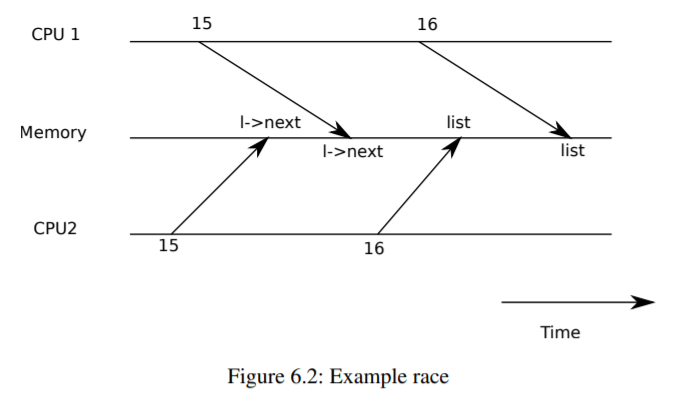

# Chapter 6 -- Locking

大多數內核，包括xv6，都會交錯執行多個活動。交錯執行的一個來源是多處理器硬件：具有多個CPU獨立執行的計算機，如xv6的RISC-V。這些多個CPU共享物理RAM，xv6利用共享來維護所有CPU讀寫的數據結構。這種共享帶來了一種可能性，即一個CPU在讀取數據結構的同時，另一個CPU正在中途更新數據結構，甚至多個CPU同時更新相同的數據；如果不仔細設計，這種並行訪問很可能產生錯誤的結果或數據結構被破壞。即使在單處理器上，內核也可能在多個線程之間切換CPU，導致它們的執行交錯。最後，如果中斷发生的時間不對，一個設備中斷處理程序可能會修改與一些可中斷代碼相同的數據，從而破壞數據。並发一詞指的是由於多處理器並行、線程切換或中斷而導致多個指令流交錯的情況。

內核中充滿了並发訪問的數據。例如，兩個CPU可以同時調用kalloc，從而並发地從自由列表的頭部彈出。內核設計者喜歡允許大量的並发，因為它可以通過並行來提高性能，提高響應速度。然而，結果是內核設計者花了很多精力說服自己，盡管有這樣的並发性，但仍然是正確的。有很多方法可以得出正確的代碼，有些方法比其他方法更容易推理。以並发下的正確性為目標的策略，以及支持這些策略的抽象，被稱為並发控制技術。

Xv6根據不同的情況，使用了很多並发控制技術，還有更多的可能。本章重點介紹一種廣泛使用的技術：鎖。鎖提供了相互排斥的功能，確保一次只有一個CPU可以持有鎖。如果程序員為每個共享數據項關聯一個鎖，並且代碼在使用某項時總是持有關聯的鎖，那麽該項每次只能由一個CPU使用。在這種情況下，我們說鎖保護了數據項。雖然鎖是一種易於理解的並发控制機制，但鎖的缺點是它們會扼殺性能，因為它們將並发操作序列化。

本章的其余部分將解釋為什麽xv6需要鎖，xv6如何實現鎖，以及如何使用鎖。


## 6.1 Race conditions

作為我們為什麽需要鎖的一個例子，考慮兩個進程在兩個不同的CPU上調用wait，wait釋放子內存。因此，在每個CPU上，內核都會調用kfree來釋放子進程的頁面。內核分配器維護了一個鏈接列表：kalloc() (kernel/kalloc.c:69)從空閑頁列表中彈出一個內存頁，kfree() (kernel/kalloc.c:47)將一個頁推到空閑列表中。為了達到最好的性能，我們可能希望兩個父進程的kfrees能夠並行執行，而不需要任何一個進程等待另一個進程，但考慮到xv6的kfree實現，這是不正確的。

圖6.1更詳細地說明了這種設置：鏈接列表在內存中，由兩個CPU共享，它們使用加載和存儲指令操作鏈接列表。(在現實中，處理器有緩存，但在概念上，多處理器系統的行為就像有一個單一的共享內存一樣)。如果沒有並发請求，你可能會實現如下的列表推送操作。

```cpp
1 struct element {
2 int data;
3 struct element *next;
4 };
5
6 struct element *list = 0;
7
8 void
9 push(int data)
10 {
11   struct element *l;
12
13   l = malloc(sizeof *l);
14   l->data = data;
15   l->next = list;
16   list = l;
17 }
```



如果單獨執行，這個實現是正確的。但是，如果多個副本同時執行，代碼就不正確。如果兩個CPU同時執行push，那麽兩個CPU可能都會執行圖6.1所示的第15行，然後其中一個才執行第16行，這就會產生一個不正確的結果，如圖6.2所示。這樣就會出現兩個list元素，next設為list的前值。當對list的兩次賦值发生在第16行時，第二次賦值將覆蓋第一次賦值；第一次賦值中涉及的元素將丟失。

第16行的更新丟失是一個競賽條件的例子。賽跑條件是指同時訪問一個內存位置，並且至少有一次訪問是寫的情況。賽跑通常是一個錯誤的標志，要麽是丟失的更新（如果訪問是寫），要麽是讀取一個不完全更新的數據結構。賽跑的結果取決於所涉及的兩個CPU的確切時間，以及它們的內存操作如何被內存系統排序，這可能會使賽跑引起的錯誤難以重現和調試。例如，在調試push時加入print語句可能會改變執行的時機，足以使競賽消失。

避免競賽的通常方法是使用鎖。鎖可以確保相互排斥，這樣一次只能有一個CPU執行push的敏感行；這就使得上面的情況不可能发生。上述代碼的正確鎖定版本只增加了幾行代碼（用黃色高亮顯示）。

```cpp
6 struct element *list = 0;
7 struct lock listlock;
8
9 void
10 push(int data)
11 {
12   struct element *l;
13   l = malloc(sizeof *l);
14   l->data = data;
15
16   acquire(&listlock);
17   l->next = list;
18   list = l;
19   release(&listlock);
20 }
```

獲取和釋放之間的指令序列通常被稱為關鍵部分。

鎖通常被說成是保護列表。

當我們說鎖保護數據的時候，其實是指鎖保護了一些適用於數據的不變量的集合。不變量是數據結構的屬性，這些屬性在不同的操作中被維護。通常情況下，一個操作的正確行為取決於操作開始時的不變量是否為真。操作可能會暫時違反不變量，但必須在結束前重新建立不變量。例如，在鏈接列表的情況下，不變性是list指向列表中的第一個元素，並且每個元素的下一個字段指向下一個元素。push的實現暫時違反了這個不變性：在第17行，l指向下一個list元素，但list還沒有指向l（在第18行重新建立）。我們上面所研究的競賽條件之所以发生，是因為第二個CPU執行了依賴於列表不變式的代碼，而它們被（暫時）違反了。正確使用鎖可以確保一次只能有一個CPU對關鍵部分的數據結構進行操作，因此當數據結構的不變式不成立時，沒有CPU會執行數據結構操作。

你可以把鎖看成是把並发的關鍵部分序列化，使它們一次只運行一個，從而保存不變性（假設關鍵部分是孤立的）。你也可以認為由同一個鎖所保護的關鍵部分是相互原子的，所以每個關鍵部分只看到早期關鍵部分的完整變化，而永遠不會看到部分完成的更新。

雖然正確使用鎖可以使不正確的代碼變得正確，但鎖限制了性能。例如，如果兩個進程同時調用kfree，鎖會將兩個調用序列化，我們在不同的CPU上運行它們不會獲得任何好處。我們說，如果多個進程同時想要同一個鎖，就會发生沖突，或者說鎖經歷了爭奪。內核設計的一個主要挑戰是避免鎖的爭用。Xv6在這方面做得很少，但是複雜的內核會專門組織數據結構和算法來避免鎖爭用。在列表的例子中，一個內核可能會維護每個CPU的空閑列表，只有當CPU的列表是空的，並且它必須從另一個CPU偷取內存時，才會接觸另一個CPU的空閑列表。其他用例可能需要更複雜的設計。

鎖的位置對性能也很重要。例如，在push中較早地移動acquisition是正確的：將acquisition的調用移動到第13行之前是可以的。這可能會降低性能，因為這樣的話，對malloc的調用也會被序列化。下面的 "使用鎖 "一節提供了一些關於在哪里插入獲取和釋放調用的指南。

## 6.2 Code: Locks

Xv6有兩種鎖：自旋鎖和睡眠鎖。我們先說說自旋鎖。Xv6將自旋鎖表示為一個結構spinlock（kernel/spinlock.h:2）。該結構中重要的字段是鎖，當鎖可用時，這個字為零，當鎖被持有時，這個字為非零。從邏輯上講，xv6應該通過執行類似這樣的代碼來獲取鎖。

```cpp
21 void
22 acquire(struct spinlock *lk) // does not work!
23 {
24   for(;;) {
25     if(lk->locked == 0) {
26       lk->locked = 1;
27       break;
28     }
29   }
30 }
```

不幸的是，這種實現並不能保證多處理器上的相互排斥。可能會出現這樣的情況：兩個CPU同時到達第25行，看到lk->locked為零，然後都通過執行第26行來搶奪鎖。此時，兩個不同的CPU持有鎖，這就違反了互斥屬性。我們需要的是讓第25行和第26行作為一個原子（即不可分割）步驟執行的方法。

由於鎖被廣泛使用，多核處理器通常提供了實現第25和26行原子版的指令。在RISC-V上，這條指令是amoswap r，a.amoswap讀取內存地址a處的值，將寄存器r的內容寫入該地址，並將其讀取的值放入r中，也就是說，它將寄存器的內容和內存地址進行交換。它原子地執行這個序列，使用特殊的硬件來防止任何其他CPU使用讀和寫之間的內存地址。

Xv6的acquisition(kernel/spinlock.c:22)使用了可移植的C庫調用__sync_lock_test_and_set，它歸結為amoswap指令；返回值是lk->locked的舊（交換）內容。獲取函數在循環中包裹交換，重試（旋轉）直到獲取了鎖。每一次叠代都會將1交換到lk->locked中，並檢查之前的值；如果之前的值是0，那麽我們已經獲得了鎖，交換將把lk->locked設置為1。如果之前的值是1，那麽其他的CPU持有該鎖，我們原子地將1換成lk->locked並沒有改變它的值。

一旦鎖被獲取，就獲取記錄，用於調試，獲取鎖的CPU。

lk->cpu字段受到鎖的保護，只有在持有鎖的時候才能改變。

函數release(kernel/spinlock.c:47)與acquire相反：它清除lk->cpu字段，然後釋放鎖。從概念上講，釋放只需要給lk->locked賦零。

C標準允許編譯器用多條存儲指令來實現賦值，所以C賦值對於並发代碼來說可能是非原子性的。相反，release使用C庫函數__sync_lock_release執行原子賦值。這個函數也歸結為RISC-V的amoswap指令。

## 6.3 Code: Using locks

Xv6在很多地方使用鎖來避免競賽條件。如上所述，kalloc (kernel/kalloc.c:69) 和 kfree (kernel/kalloc.c:47) 就是一個很好的例子。試試練習1和2，看看如果省略這些函數的鎖會发生什麽。你很可能會发現，很難觸发不正確的行為，這說明很難可靠地測試代碼是否沒有鎖定錯誤和競賽。xv6有一些競賽也不是不可能的。

使用鎖的一個難點是決定使用多少個鎖，以及每個鎖應該保護哪些數據和不變量。有幾個基本原則。首先，任何時候，當一個CPU可以在另一個CPU讀或寫變量的同時寫入變量時，都應該使用鎖來防止這兩個操作重疊。第二，記住鎖保護不變式：如果一個不變式涉及多個內存位置，通常需要用一個鎖保護所有的位置，以確保不變式得到維護。

上面的規則說了什麽時候需要鎖，但沒有說什麽時候不需要鎖，為了效率，不要鎖太多，因為鎖會降低並行性。

如果並行性並不重要，那麽我們可以安排只有一個線程，而不用擔心鎖的問題。一個簡單的內核可以在多處理器上做到這一點，它有一個單一的鎖，這個鎖必須在進入內核時獲得，並在退出內核時釋放（盡管諸如管道讀取或等待等系統調用會帶來問題）。許多單處理器操作系統已經被改造成使用這種方法在多處理器上運行，有時被稱為 "大內核鎖"，但這種方法犧牲了並行性：內核中一次只能執行一個CPU。如果內核做任何繁重的計算，那麽使用一組更大的更細粒度的鎖，這樣內核可以同時在多個CPU上執行，效率會更高。

作為粗粒度鎖的一個例子，xv6的kalloc.c分配器有一個單一的自由列表，由一個鎖保護。如果不同CPU上的多個進程試圖同時分配頁面，每個進程將不得不通過在acquire中旋轉來等待輪到自己。旋轉會降低性能，因為這不是有用的工作。如果爭奪鎖浪費了很大一部分CPU時間，也許可以通過改變分配器的設計來提高性能，擁有多個空閑列表，每個列表都有自己的鎖，從而實現真正的並行分配。

作為細粒度鎖的一個例子，xv6對每個文件都有一個單獨的鎖，這樣操作不同文件的進程往往可以不等待對方的鎖而繼續進行。如果想讓進程同時寫入同一文件的不同區域，文件鎖方案可以做得更細。最終，鎖的粒度決定需要由性能測量以及複雜性考慮來驅動。

在後續的章節解釋xv6的每個部分時，會提到xv6使用鎖來處理並发性的例子。作為預覽，圖6.3列出了xv6中所有的鎖

## 6.4 Deadlock and lock ordering


如果一個通過內核的代碼路徑必須同時持有幾個鎖，那麽所有的代碼路徑以同樣的順序獲取這些鎖是很重要的。如果它們不這樣做，就會有死鎖的風險。假設線程T1執行代碼路徑1並獲取鎖A，線程T2執行代碼路徑2並獲取鎖B，接下來T1會嘗試獲取鎖B，T2會嘗試獲取鎖A，這兩次獲取都會無限期阻塞，因為在這兩種情況下，另一個線程都持有所需的鎖，直到其獲取返回時才會釋放。為了避免這種死鎖，所有的代碼路徑必須以相同的順序獲取鎖。對全局鎖獲取順序的需求意味著鎖實際上是每個函數規範的一部分：調用者必須以導致按約定順序獲取鎖的方式調用函數。

由於睡眠的工作方式，Xv6有許多長度為2的鎖序鏈，涉及到每個進程的鎖（每個struct proc中的鎖）（見第7章）。例如，consoleintr(kernel/console.c:138)是處理類型化字符的中斷例程。當一個新行到達時，任何正在等待控制台輸入的進程都應該被喚醒。要做到這一點，consoleintr在調用wakeup時持有cons.lock，wakeup獲取等待進程的鎖以喚醒它。因此，全局避免死鎖的鎖順序包括了cons.鎖必須在任何進程鎖之前獲取的規則。文件系統代碼包含xv6最長的鎖鏈。

例如，創建一個文件需要同時持有目錄上的鎖、新文件的inode上的鎖、磁盤塊緩沖區上的鎖、磁盤驅動器的vdisk_lock和調用進程的p->lock。為了避免死鎖，文件系統代碼總是按照上一句提到的順序獲取鎖。

遵守全局避免死鎖的順序可能會出乎意料的困難。有時鎖順序與邏輯程序結構发生沖突，例如，也許代碼模塊M1調用模塊M2，但鎖順序要求在M1的鎖之前獲得M2的鎖。有時鎖的身份並不是事先知道的，也許是因為必須持有一個鎖才能发現接下來要獲取的鎖的身份。這種情況出現在文件系統中，因為它在路徑名中查找連續的組件，也出現在wait和exit的代碼中，因為它們搜索進程表尋找子進程。最後，死鎖的危險往往制約著人們對鎖方案的細化程度，因為更多的鎖往往意味著更多的死鎖機會。避免死鎖的需求往往是內核實現的一個主要因素。

## 6.5 Locks and interrupt handlers

一些xv6自旋鎖保護線程和中斷處理程序同時使用的數據。例如，clockintr定時器中斷處理程序可能會在內核線程讀取sys_sleep (kernel/sysproc.c:64)中的ticks的同時，遞增ticks (kernel/trap.c:163)。鎖tickslock將這兩次訪問序列化。

自旋鎖和中斷的相互作用帶來了一個潛在的危險。假設sys_sleep持有tickslock，而它的CPU被一個定時器中斷打斷，clockintr將嘗試獲取tickslock，看到它被持有，並等待它被釋放。在這種情況下，tickslock永遠不會被釋放：只有sys_sleep可以釋放它，但sys_sleep不會繼續運行，直到clockintr返回。所以CPU會死鎖，任何需要任一鎖的代碼也會凍結。

為了避免這種情況，如果一個中斷處理程序使用了自旋鎖，CPU決不能在啟用中斷的情況下持有該鎖。Xv6比較保守：當一個CPU獲取任何鎖時，xv6總是禁用該CPU上的中斷。中斷仍然可能发生在其他CPU上，所以一個中斷的獲取可以等待一個線程釋放自旋鎖；只是不在同一個CPU上。

當一個CPU沒有持有自旋鎖時，xv6會重新啟用中斷；它必須做一些記賬工作來應對嵌套的關鍵部分。acquire調用push_off(kernel/spinlock.c:89)和release調用pop_off(kernel/spinlock.c:100)來跟蹤當前CPU上鎖的嵌套級別。當該計數達到零時，pop_off會恢復最外層關鍵部分開始時存在的中斷啟用狀態。intr_off和intr_on函數分別執行RISC-V指令來禁用和啟用中斷。

重要的是，獲取嚴格地在設置lk->locked之前調用push_off（kernel/spinlock.c:28）。如果二者反過來，那麽在啟用中斷的情況下，會有一個短暫的鎖保持窗口，不幸的是，一個定時的中斷會使系統死鎖。同樣，釋放鎖後才調用pop_off也很重要(kernel/spinlock.c:66)

## 6.6 Instruction and memory ordering

人們很自然地認為程序是按照源代碼語句出現的順序來執行的。

然而，許多編譯器和CPU為了獲得更高的性能，會不按順序執行代碼。如果一條指令需要很多周期才能完成，CPU可能會提前发出該指令，以便與其他指令重疊，避免CPU停頓。例如，CPU可能會注意到在一個串行序列中，指令A和B互不依賴。CPU可能會先啟動指令B，這是因為它的輸入比A的輸入先準備好，或者是為了使A和B的執行重疊。 編譯器可能會執行類似的重新排序，在源碼中先於前面的一條語句的指令发出一條語句的指令。

編譯器和CPU在重新排序時遵循規則，以確保不會改變正確編寫的串行代碼的結果。然而，規則確實允許改變並发代碼的結果的重新排序，並且很容易導致多處理器上的錯誤行為[2，3]。CPU的排序規則稱為內存模型。

例如，在這段推送的代碼中，如果編譯器或CPU將第4行對應的存儲移到第6行釋放後的點上，那將是一場災難

```cpp
1 l = malloc(sizeof *l);
2 l->data = data;
3 acquire(&listlock);
4 l->next = list;
5 list = l;
6 release(&listlock);
```

如果发生這樣的重新排序，就會有一個窗口，在這個窗口中，另一個CPU可以獲取鎖並觀察更新後的列表，但看到的是一個未初始化的list->next。

為了告訴硬件和編譯器不要執行這樣的重新排序，xv6在獲取(kernel/spinlock.c:22)和釋放(kernel/spinlock.c:47)中都使用了__sync_synchronize()。__sync_synchronize()是一個內存屏障：它告訴編譯器和CPU不要在屏障上重新排序加載或存儲。

xv6的獲取和釋放障礙幾乎在所有重要的情況下都會強制排序，因為xv6在訪問共享數據的周圍使用鎖。第9章討論了一些例外情況。

## 6.7 Sleep locks

有時xv6需要長時間保持一個鎖。例如，文件系統（第8章）在磁盤上讀寫文件內容時，會保持一個文件的鎖定，這些磁盤操作可能需要幾十毫秒。如果另一個進程想獲取一個自旋鎖，那麽保持那麽長的時間會導致浪費，因為獲取進程在旋轉的同時會浪費CPU很長時間。自旋鎖的另一個缺點是，一個進程在保留自旋鎖的同時不能屈服CPU；我們希望做到這一點，以便在擁有自旋鎖的進程等待磁盤時，其他進程可以使用CPU。

在持有自旋鎖時讓步是非法的，因為如果第二個線程再試圖獲取自旋鎖，可能會導致死鎖；由於獲取並不能讓步CPU，第二個線程的旋轉可能會阻止第一個線程運行和釋放鎖。在持有鎖的同時屈服也會違反在持有自旋鎖時中斷必須關閉的要求。因此，我們希望有一種鎖，在等待獲取時讓步CPU，在鎖被持有時允許讓步（和中斷）。

Xv6以睡眠鎖的形式提供了這樣的鎖。 acquiresleep (kernel/sleeplock.c:22)在等待的過程中產生CPU，使用的技術將在第7章解釋。在高層次上，sleep-lock有一個由spinlock保護的鎖定字段，acquiresleep's調用sleep原子性地讓渡CPU並釋放spinlock。結果就是在acquireleep等待的時候，其他線程可以執行。

因為睡眠鎖使中斷處於啟用狀態，所以不能在中斷處理程序中使用。因為acquiresleep可能會讓出CPU，所以睡眠鎖不能在spinlock關鍵部分內使用（盡管spinlocks可以在睡眠鎖關鍵部分內使用）。

自旋鎖最適合於短的關鍵部分，因為等待它們會浪費CPU時間；睡眠鎖對長的操作很有效。

## 6.8 Real world

盡管對並发基元和並行進行了多年的研究，但使用鎖進行編程仍然具有挑戰性。通常最好是將鎖隱藏在更高級別的構造中，比如同步隊列，盡管xv6沒有這樣做。如果您使用鎖編程，明智的做法是使用一個試圖識別競賽條件的工具，因為很容易錯過一個需要鎖的不變式。

大多數操作系統都支持POSIX線程（Pthreads），它允許一個用戶進程在不同的CPU上有多個線程同時運行。Pthreads對用戶級鎖、障礙等都有支持。支持Pthreads需要操作系統的支持。例如，應該是如果一個pthread在系統調用中阻塞，同一進程的另一個pthread應該可以在該CPU上運行。又比如，如果一個pthread改變了它的進程的地址空間（比如映射或取消映射內存），內核必須安排運行同一進程線程的其他CPU更新它們的硬件頁表以反映地址空間的變化。

可以在沒有原子指令的情況下實現鎖[8]，但成本很高，大多數操作系統都使用原子指令。

如果許多CPU試圖在同一時間獲取同一個鎖，那麽鎖的成本會很高。如果一個CPU的本地緩存中有一個鎖，而另一個CPU必須獲取該鎖，那麽更新持有該鎖的緩存行的原子指令必須將該行從一個CPU的緩存中移到另一個CPU的緩存中，並且可能使緩存行的任何其他副本無效。從另一個CPU的緩存中獲取緩存行的費用可能比從本地緩存中獲取行的費用高一個數量級。

為了避免與鎖相關的費用，許多操作系統使用無鎖數據結構和算法[5，10]。例如，可以實現像本章開頭的鏈接列表，在列表搜索過程中不需要鎖，只需要一條原子指令就可以在列表中插入一個項目。不過，無鎖編程比有鎖編程更複雜，例如，必須擔心指令和內存的重新排序問題。用鎖編程已經很難了，所以xv6避免了無鎖編程的額外複雜性。

## 6.9 Exercises

1- 注釋掉kalloc中的獲取和釋放調用(kernel/kalloc.c:69)。這似乎會給調用kalloc的內核代碼帶來問題；你希望看到什麽癥狀？當你運行xv6時，你會看到這些癥狀嗎？運行usertests的時候呢？如果你沒有看到問題，為什麽不呢？看看你是否可以通過在kalloc的關鍵部分插入虛擬循環來引发問題。

2- 假設你把kfree中的鎖定注釋掉了（在恢復kalloc中的鎖定後）。現在可能出了什麽問題？kfree中缺少鎖是否比kalloc中的危害小？

3- 如果兩個CPU同時調用kalloc，其中一個CPU必須等待另一個CPU，這對性能不利。修改kalloc.c，使其具有更多的並行性，這樣不同CPU對kalloc的同時調用就可以進行，而不需要等待對方。

4-使用POSIX線程編寫並行程序，大多數操作系統都支持POSIX線程。例如，實現一個並行哈希表，並測量put/get的數量是否隨著核數的增加而縮放。

5- 在xv6中實現Pthreads的一個子集。即實現用戶級線程庫，使一個用戶進程可以有1個以上的線程，並安排這些線程可以在不同的CPU上並行運行。提出一個設計，正確處理線程進行阻塞系統調用和改變其共享地址空間的問題。