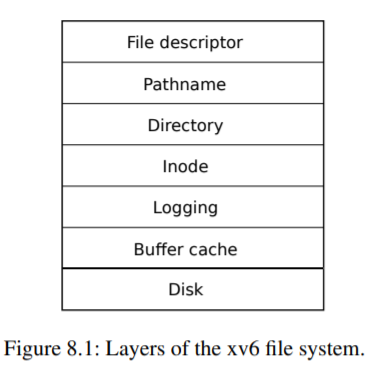
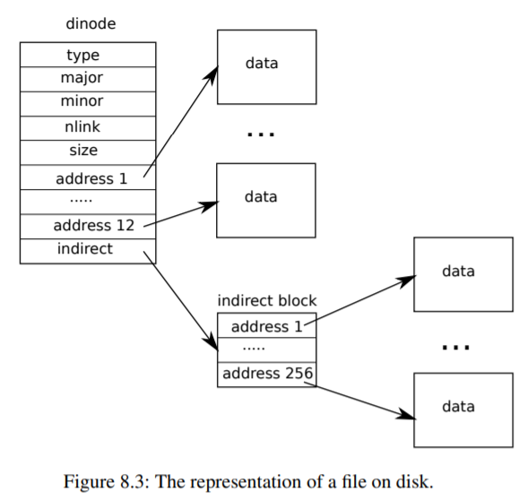

# Chapter 8 -- File system

文件系統的目的是組織和存儲數據。文件系統通常支持用戶和應用程序之間的數據共享，以及持久性，以便數據在重啟後仍然可用。

xv6文件系統提供了類似Unix的文件、目錄和路徑名（見第1章），並將其數據存儲在virtio磁盤上以實現持久性（見第4章）。該文件系統解決了幾個挑戰。

* 文件系統需要磁盤上的數據結構來表示命名的目錄和文件樹，記錄保存每個文件內容的塊的身份，並記錄磁盤上哪些區域是空閑的。
* 文件系統必須支持崩潰恢復。也就是說，如果发生崩潰（如斷電），文件系統必須在重新啟動後仍能正常工作。風險是崩潰可能會中斷更新序列，並在磁盤上留下不一致的數據結構（例如，一個塊既在文件中使用，又被標記為空閑）。
* 不同的進程可能同時在文件系統上操作，因此文件系統代碼必須協調以保持不變性。
* 訪問磁盤的速度比訪問內存的速度慢幾個數量級，所以文件系統必須維護一個常用塊的內存緩存。

本章其余部分將解釋xv6如何應對這些挑戰。

## 8.1 Overview



xv6文件系統的實現分為七層，如圖8.1所示。磁盤層在virtio硬盤上讀寫塊。緩沖區緩存層緩存磁盤塊，並同步訪問它們，確保一次只有一個內核進程可以修改存儲在任何特定塊中的數據。日志層允許上層在一個事務中包攬幾個塊的更新，並確保在面對崩潰時，塊的更新是原子性的（即全部更新或不更新）。inode層提供了各個文件，每個文件都表示為一個inode，有一個唯一的i號和一些存放文件數據的塊。目錄層將每個目錄實現為一種特殊的inode，其內容是一個目錄項的序列，每個目錄項包含一個文件的名稱和i-number。路徑名層提供了層次化的路徑名，如/usr/rtm/xv6/fs.c，並通過遞歸查找進行解析。文件描述符層使用文件系統接口抽象了許多Unix資源（如管道、設備、文件等），簡化了應用程序員的生活。

文件系統必須對它在磁盤上存儲inodes和內容塊的位置有一個計劃。為此，xv6將磁盤分為幾個部分，如圖8.2所示。文件系統不使用塊0（它存放引導扇區）。第1塊稱為超級塊；它包含了文件系統的元數據（以塊為單位的文件系統大小、數據塊的數量、inodes的數量和日志中的塊數）。從2開始的塊存放著日志。日志之後是inodes，每個塊有多個inodes。在這些之後是位圖塊，跟蹤哪些數據塊在使用。其余的塊是數據塊，每個數據塊要麽在位圖塊中標記為空閑，要麽持有文件或目錄的內容。超級塊由一個單獨的程序填充，稱為mkfs，它建立了一個初始文件系統。

本章的其余部分將討論每一層，從緩沖區緩存開始。注意在低層的抽象選擇得當的情況下，會使更高層的設計變得容易。

## 8.2 Buffer cache layer

緩沖區緩存有兩項工作。(1) 同步訪問磁盤塊，以確保內存中只有一個塊的副本，並且一次只有一個內核線程使用該副本；(2) 緩存流行的塊，這樣它們就不需要從慢速磁盤中重新讀取。代碼在bio.c中。


緩沖區緩存輸出的主要接口包括bread和bwrite，前者獲取一個包含內存中可以讀取或修改的塊的副本的buf，後者將修改後的緩沖區寫入磁盤上相應的塊。內核線程在處理完一個緩沖區後，必須通過調用brelse釋放它。緩沖區緩存使用每個緩沖區的睡眠鎖來保證每次只有一個線程使用每個緩沖區（從而使用每個磁盤塊）；bread返回一個鎖定的緩沖區，而brelse釋放鎖。

我們再來看看緩沖區緩存。緩沖區緩存有固定數量的緩沖區來存放磁盤塊，這意味著如果文件系統要求使用一個尚未在緩存中的塊，緩沖區緩存必須回收一個當前存放其他塊的緩沖區。緩沖區緩存為新塊回收最近使用最少的緩沖區。假設最近使用最少的緩沖區是最不可能很快被再次使用的緩沖區。

## 8.3 Code: Buffer cache

緩沖區緩存是一個雙鏈路的緩沖區列表。由main(kernel/main.c:27)調用的函數binit用靜態數組buf(kernel/bio.c:43-52)中的NBUF緩沖區來初始化這個列表。其他所有對緩沖區緩存的訪問都是通過bcache.head引用鏈接列表，而不是buf數組。

一個緩沖區有兩個與之相關的狀態字段。字段valid表示緩沖區包含塊的副本。字段disk表示緩沖區的內容已經交給了磁盤，磁盤可能會改變緩沖區的內容（例如，將數據從磁盤寫入數據）。
面包（kernel/bio.c:93）調用bget來獲取給定扇區（kernel/bio.c:97）的緩沖區。如果緩沖區需要從磁盤上讀取，bread會在返回緩沖區之前調用virtio_disk_rw進行讀取。

Bget (kernel/bio.c:59)掃描緩沖區列表，尋找帶有給定設備和扇區號的緩沖區(kernel/bio.c:65-73)。如果有這樣一個緩沖區，bget就會獲取該緩沖區的睡眠鎖。然後Bget返回被鎖定的緩沖區。

如果給定扇區沒有緩存的緩沖區，bget必須制作一個，可能會重覆使用一個存放不同扇區的緩沖區，它第二次掃描緩沖區列表，尋找沒有使用的緩沖區(b->refcnt = 0)；任何這樣的緩沖區都可以使用。它第二次掃描緩沖區列表，尋找一個沒有使用的緩沖區（b->refcnt = 0）；任何這樣的緩沖區都可以使用。Bget編輯緩沖區元數據，記錄新的設備和扇區號，並獲得其睡眠鎖。請注意，賦值b->valid = 0確保面包將從磁盤讀取塊數據，而不是錯誤地使用緩沖區以前的內容。

每個磁盤扇區最多只有一個緩存緩沖區，這一點很重要，以確保讀者看到寫，而且因為文件系統使用緩沖區上的鎖進行同步。Bget通過從第一個循環檢查塊是否被緩存到第二個循環聲明塊已經被緩存（通過設置dev、blockno和refcnt）的過程中持續保持bache.lock來保證這個不變性。這將導致塊的存在檢查和（如果不存在）指定一個緩沖區來保存塊是原子的。

bget在bcache.lock關鍵部分之外獲取緩沖區的sleep-lock是安全的，因為非零的b->refcnt可以防止緩沖區被重新用於不同的磁盤塊。睡眠鎖保護塊的緩沖內容的讀寫，而bcache.lock則保護哪些塊被緩存的信息。

如果所有的緩沖區都很忙，那麽太多的進程同時在執行文件系統調用；bget就會慌亂。更優雅的響應可能是睡眠，直到緩沖區變得空閑為止，不過這樣就有可能出現死鎖。

一旦面包讀取了磁盤（如果需要的話）並將緩沖區返回給調用者，調用者就擁有了對緩沖區的獨占使用權，可以讀取或寫入數據字節。如果調用者確實修改了緩沖區，它必須在釋放緩沖區之前調用bwrite將修改後的數據寫入磁盤。Bwrite (kernel/bio.c:107)調用virtio_disk_rw與磁盤硬件對話。

當調用者處理完一個緩沖區後，必須調用brelse來釋放它。(brelse這個名字是b-release的縮寫，很神秘，但值得學習：它起源於Unix，在BSD、Linux和Solaris中也有使用。) Brelse (kernel/bio.c:117)釋放睡眠鎖，並將緩沖區移動到鏈接列表的前面(kernel/bio.c:128-133)。移動緩沖區會導致列表按照緩沖區最近使用的時間（意味著釋放）排序：列表中第一個緩沖區是最近使用的，最後一個是最近使用的。bget中的兩個循環利用了這一點：在最壞的情況下，對現有緩沖區的掃描必須處理整個列表，但當有良好的引用位置性時，先檢查最近使用的緩沖區（從bcache.head開始，跟隨next指針）將減少掃描時間。掃描選取緩沖區重用的方法是通過向後掃描（跟隨prev指針）選取最近使用最少的緩沖區。

## 8.4 Logging layer

文件系統設計中最有趣的問題之一是崩潰恢復。這個問題的出現是因為許多文件系統操作涉及到對磁盤的多次寫入，而在寫入的子集之後发生崩潰可能會使磁盤上的文件系統處於不一致的狀態。例如，假設在文件截斷（將文件的長度設置為零並釋放其內容塊）時发生崩潰。根據磁盤寫入的順序，崩潰可能會留下一個對內容塊有引用的inode，該內容塊被標記為空閑，也可能會留下一個已分配但未引用的內容塊。

後者相對來說是良性的，但是一個引用了釋放塊的inode很可能在重啟後造成嚴重的問題。重啟後，內核可能會將該塊分配給另一個文件，現在我們有兩個不同的文件無意中指向了同一個塊。如果xv6支持多個用戶，這種情況可能是一個安全問題，因為舊文件的所有者將能夠在新文件中讀寫由不同用戶擁有的塊。

Xv6用一種簡單的日志形式解決了文件系統操作過程中的崩潰問題。

xv6系統調用不直接寫入磁盤上的文件系統數據結構。相反，它將它希望進行的所有磁盤寫入的描述放在磁盤上的日志中。一旦系統調用記錄了它的所有寫法，它就會向磁盤寫入一個特殊的提交記錄，表明該日志包含一個完整的操作。這時，系統調用就會把這些寫法複製到磁盤上的文件系統數據結構中。在這些寫入完成後，系統調用將磁盤上的日志清除。

如果系統應該崩潰並重啟，在運行任何進程之前，文件系統代碼從崩潰中恢復如下。如果日志被標記為包含一個完整的操作，那麽恢復代碼就會將寫入的內容複製到它們在磁盤文件系統中的所屬位置。如果日志未被標記為包含完整的操作，則恢復代碼將忽略該日志。恢復代碼通過擦除日志來完成。

為什麽xv6的日志可以解決文件系統操作過程中的崩潰問題？如果崩潰发生在操作提交之前，那麽磁盤上的日志將不會被標記為完整的操作，恢復代碼會忽略它，磁盤的狀態就像操作還沒有開始一樣。如果崩潰发生在操作提交之後，那麽恢復將重放操作的所有寫法，如果操作已經開始將它們寫到磁盤數據結構中，也許會重覆這些寫法。不管是哪種情況，日志都會使操作與崩潰成為原子性的：恢復後，要麽所有操作的寫都出現在磁盤上，要麽都不出現。

## 8.5 Log design

日志駐留在一個已知的固定位置，由超級塊指定。它由一個頭塊和一系列更新的塊副本（"記錄塊"）組成。頭塊包含一個扇區號數組，每個日志塊都有一個扇區號，以及日志塊的計數。磁盤上頭塊中的計數要麽為零，表示日志中沒有事務，要麽為非零，表示日志中包含一個完整的提交事務，並有指定數量的日志塊。Xv6在事務提交時寫入頭塊，但不在提交前寫入，將日志塊複製到文件系統後，將計數設為零。因此，一個事務中途的崩潰將導致日志頭塊的計數為零；提交後的崩潰將導致計數非零。

每個系統調用的代碼都會指明寫入序列的開始和結束，這些寫入序列對於崩潰必須是原子性的。為了允許不同進程並发執行文件系統操作，日志系統可以將多個系統調用的寫入累積到一個事務中。

因此，一次提交可能涉及多個完整系統調用的寫入。為了避免一個系統調用在不同的事務中分裂，日志系統只有在沒有文件系統系統調用正在進行時才會提交。

將幾個事務一起提交的想法被稱為組提交。組提交減少了磁盤操作的數量，因為它將提交的固定成本攤在了多個操作上。組提交還可以在同一時間交給磁盤系統更多的並发寫入，或許可以讓磁盤在一次磁盤輪轉中把它們全部寫入。Xv6的virtio驅動並不支持這種批處理，但xv6的文件系統設計允許這樣做。

Xv6在磁盤上劃出固定的空間來存放日志。一個事務中系統調用所寫的塊總數必須適合這個空間。這有兩個後果。

任何一個系統調用都不能允許寫入超過日志空間的不同塊。

這對大多數系統調用來說都不是問題，但其中有兩個系統調用可能會寫很多塊：寫和解除鏈接。一個大文件的寫可能會寫很多數據塊和很多位圖塊以及一個inode塊；解鏈接一個大文件可能會寫很多位圖塊和一個inode。Xv6的寫系統調用將大的寫分解成多個適合在日志中的小寫，解鏈接不會引起問題，因為實際上xv6文件系統只使用一個位圖塊。日志空間有限的另一個後果是，日志系統不能允許系統調用啟動，除非確定系統調用的寫能適合日志中剩余的空間。

## 8.6 Code: logging

一個典型的系統調用中的日志使用是這樣的。

```cpp
begin_op();
...
bp = bread(...);
bp->data[...] = ...;
log_write(bp);
...
end_op();
```

begin_op(kernel/log.c:126)會一直等到日志系統當前沒有提交，並且有足夠的未保留的日志空間來容納這次調用的寫入。log.outstanding會統計有保留的日志空間的系統調用次數，總的保留空間是log.outstanding乘以MAXOPBLOCKS。增加log.outstanding既能保留空間，又能防止該系統調用期間发生提交。該代碼保守地假設每次系統調用最多可以寫入MAXOPBLOCKS不同的塊。

log_write (kernel/log.c:214) 是bwrite的代理。它將塊的扇區號記錄在內存中，在磁盤上的日志中保留一個槽，並將緩沖區釘在塊緩存中以防止塊緩存將其驅逐。在提交之前，塊必須留在緩存中：在這之前，緩存的副本是修改的唯一記錄；在提交之後才能將其寫入磁盤上的位置；同一事務中的其他讀必須看到修改的內容。 log_write會注意到當一個塊在一個事務中被多次寫入時，並在日志中為該塊分配相同的槽位。這種優化通常被稱為吸收。例如，在一個事務中，包含多個文件的inodes的磁盤塊被寫入多次，這是常見的情況。通過將幾次磁盤寫入吸收為一次，文件系統可以節省日志空間，並且可以獲得更好的性能，因為只有一份磁盤塊的副本必須寫入磁盤。

end_op (kernel/log.c:146)首先遞減未完成的系統調用次數。如果計數為零，則通過調用commit()來提交當前事務。write_log()(kernel/log.c:178)將事務中修改的每個塊從緩沖區緩存中複製到磁盤上的日志槽中。 write_head()(kernel/log.c:102)將頭塊寫到磁盤上：這是提交點，寫完後的崩潰將導致恢復從日志中重放事務的寫法。 install_trans(kernel/log.c:69)從日志中讀取每個塊，並將其寫到文件系統中的適當位置。最後 end_op 寫入計數為零的日志頭；這必須在下一個事務開始寫日志塊之前发生，這樣就不會因為崩潰而導致使用一個事務的頭和後續事務的日志塊進行恢復。

recover_from_log (kernel/log.c:116) 是在 initlog (kernel/log.c:55) 中調用的，而 initlog 是在啟動過程中，在第一個用戶進程運行 (kernel/proc.c:539) 之前，由 fsinit(kernel/fs.c:42) 調用的。它讀取日志頭，如果日志頭顯示日志中包含一個已提交的事務，它就會模仿end_op的操作。這個事務看起來像這樣。

```cpp
begin_op();
ilock(f->ip);
r = writei(f->ip, ...);
iunlock(f->ip);
end_op();
```

這段代碼被包裹在一個循環中，它將大的寫入分解成每次只有幾個扇區的單獨事務，以避免溢出日志。調用 writei 寫入許多塊作為這個事務的一部分：文件的 inode，一個或多個位圖塊，以及一些數據塊。

## 8.7 Code: Block allocator

文件和目錄內容存儲在磁盤塊中，必須從空閑池中分配。xv6的塊分配器在磁盤上維護一個空閑的位圖，每個塊有一個位。0位表示對應的塊是空閑的，1位表示正在使用中。程序mkfs設置引導扇區、超級塊、日志塊、inode塊和位圖塊對應的位。

塊分配器提供了兩個函數：balloc分配一個新的磁盤塊，bfree釋放一個塊。balloc 位於(kernel/fs.c:71)的 balloc 循環會考慮每一個塊，從塊0開始，直到文件系統中的塊數sb.size。它尋找一個位圖位為0的塊，表示它是空閑的。如果 balloc 找到了這樣一個塊，它就會更新位圖並返回該塊。為了提高效率，這個循環被分成兩部分。外循環讀取每個位圖位塊。內循環檢查單個位圖塊中的所有BPB位。由於緩沖區緩存只允許一個進程同時使用一個位圖塊，因此避免了兩個進程同時分配一個位圖塊時可能发生的競賽。

Bfree (kernel/fs.c:90) 找到正確的位圖塊並清除正確的位。同樣，面包和brelse所暗示的獨占使用避免了顯式鎖定的需要。

就像本章其余部分描述的大部分代碼一樣，balloc和bfree必須在事務中調用。

## 8.8 Inode layer

術語inode可以有兩種相關含義之一。它可能指的是磁盤上的數據結構，其中包含了文件的大小和數據塊號的列表。或者 "inode "可能指的是內存中的inode，它包含了磁盤上inode的副本以及內核中需要的額外信息。

磁盤上的inode被打包成一個連續的區域，稱為inode塊。每一個inode的大小都是一樣的，所以給定一個數字n，很容易找到磁盤上的第n個inode。事實上，這個數字n，被稱為inode號或i-number，在實現中就是這樣識別inode的。

磁盤上的inode是由一個結構dinode（kernel/fs.h:32）定義的。類型字段區分了文件、目錄和特殊文件（設備）。類型為0表示一個磁盤上的inode是空閑的。nlink字段計算引用這個inode的目錄條目的數量，以便識別何時應該釋放磁盤上的inode和它的數據塊。size字段記錄了文件中內容的字節數。addrs數組記錄了存放文件內容的磁盤塊的塊號。

內核將活動的inode集保存在內存中；struct inode (kernel/file.h:17)是磁盤上一個struct dinode的內存拷貝。內核只在有C指針指向一個inode的時候才會在內存中存儲這個inode。ref字段計算引用內存中inode的C指針的數量，如果引用數量降到零，內核就會從內存中丟棄這個inode。iget和iput函數獲取和釋放指向inode的指針，修改引用計數。指向inode的指針可以來自文件描述符、當前工作目錄和瞬時內核代碼，如exec。

在xv6的inode代碼中，有四種鎖或類似鎖的機制。icache.lock保護了一個inode在緩存中最多存在一次的不變性，以及一個緩存inode的ref字段計算緩存inode的內存指針數的不變性。每個內存中的inode都有一個包含睡眠鎖的鎖字段，它保證了對inode的字段（如文件長度）以及inode的文件或目錄內容塊的獨占訪問。一個inode的ref如果大於0，則會導致系統將該inode保留在緩存中，而不會為不同的inode重新使用緩存條目。最後，每個inode都包含一個nlink字段(在磁盤上，如果是緩存，則複製在內存中)，用來統計引用文件的目錄項的數量；如果一個inode的鏈接數大於零，xv6不會釋放它。

iget()返回的inode結構指針保證有效，直到相應的調用iput()為止；inode不會被刪除，指針引用的內存也不會被另一個inode重新使用。iget()提供了對inode的非獨占性訪問，因此可以有許多指針指向同一個inode。文件系統代碼的許多部分都依賴於iget()的這種行為，既是為了保持對inode的長期引用(如打開的文件和當前的目錄)，也是為了在操作多個inode的代碼(如路徑名查找)中避免死鎖的同時防止比賽。

iget返回的inode結構可能沒有任何有用的內容。為了確保它擁有磁盤上inode的副本，代碼必須調用ilock。這將鎖住inode(這樣其他進程就不能將其鎖住)，並從磁盤上讀取inode(如果它還沒有被讀取)。將獲取inode指針和鎖定分開，有助於在某些情況下避免死鎖，例如在目錄查找時。多個進程可以持有一個由iget返回的inode的C指針，但每次只有一個進程可以鎖定inode。

inode緩存只緩存內核代碼或數據結構持有C指針的inode。它的主要工作其實是同步多個進程的訪問，緩存是次要的。如果一個inode被頻繁使用，如果不被inode緩存保存，緩沖區緩存可能會把它保存在內存中。inode緩存是穿透式的，這意味著修改緩存的inode的代碼必須立即用iupdate把它寫入磁盤。

## 8.9 Code: Inodes

要分配一個新的inode(例如，當創建一個文件時)，xv6調用ialloc(kernel/fs.c:196)。

Ialloc 類似於 balloc：它循環瀏覽磁盤上的 inode 結構，一次一個塊，尋找一個標記為空閑的。當它找到一個時，它會通過向磁盤寫入新的類型來聲明它，然後用尾部調用 iget (kernel/fs.c:210) 從 inode 緩存中返回一個條目。ialloc的正確操作依賴於這樣一個事實，即一次只能有一個進程持有對bp的引用：ialloc可以確保其他進程不會同時看到這個inode是可用的，並試圖聲稱它。

Iget (kernel/fs.c:243)在inode緩存中尋找具有所需設備和inode號的活動條目(ip->ref > 0)。如果它找到了，它就返回一個新的對該inode的引用(kernel/fs.c:252-256)。當iget掃描時，它會記錄第一個空槽的位置(kernel/fs.c:257-258)，如果它需要分配一個緩存條目，就會使用它。

在讀寫inode的元數據或內容之前，代碼必須使用ilock鎖定它。Ilock(kernel/fs.c:289)使用睡眠鎖來實現這一目的。一旦ilock擁有對inode的獨占訪問權，如果需要的話，它就會從磁盤（更有可能是緩沖區緩存）讀取inode。函數iunlock (kernel/fs.c:317)釋放睡眠鎖，這可能會導致任何正在睡眠的進程被喚醒。

Iput (kernel/fs.c:333) 通過遞減引用次數 (kernel/fs.c:356) 來釋放一個指向 inode 的 C 指針。如果這是最後一次引用，那麽inode緩存中的inode插槽現在是空閑的，可以重新用於其他inode。

如果iput看到沒有對inode的C指針引用，而且inode沒有鏈接到它（不在任何目錄中出現），那麽必須釋放inode和它的數據塊。Iput調用itrunc將文件截斷為零字節，釋放數據塊；將inode類型設置為0（未分配）；並將inode寫入磁盤（kernel/fs.c:338）。

iput在釋放inode的情況下，其鎖定協議值得仔細研究。一個危險是，一個並发線程可能會在ilock中等待使用這個inode（例如，讀取一個文件或列出一個目錄），而不會準備好发現這個inode不再被分配。這是不可能发生的，因為如果一個系統調用沒有鏈接到一個緩存的inode，而ip->ref是一個指針，那麽系統調用就沒有辦法得到這個指針。這一個引用就是調用iput的線程所擁有的引用。的確，iput會在其icache.lock臨界部分之外檢查引用數是否為1，但此時已知鏈接數為0，所以沒有線程會嘗試獲取新的引用。

另一個主要的危險是，對ialloc的並发調用可能會選擇iput正在釋放的同一個inode。這種情況只有在iupdate寫入磁盤，使inode的類型為零之後才能发生。

這種競賽是良性的，分配線程會禮貌地等待獲取inode的sleep-lock，然後再讀寫inode，這時iput就結束了。

iput()可以對磁盤進行寫入。這意味著任何使用文件系統的系統調用都可能會寫入磁盤，因為系統調用可能是最後一個對文件有引用的調用。甚至像read()這樣看似只讀的調用，最終也可能會調用iput()。這又意味著，即使是只讀的系統調用，如果使用了文件系統，也必須用事務來包裝。



iput()和崩潰之間有一個具有挑戰性的交互作用。當文件的鏈接數降到零時，iput()不會立即截斷一個文件，因為一些進程可能仍然在內存中持有對inode的引用：一個進程可能仍然在對文件進行讀寫，因為它成功地打開了它。但是，如果在最後一個進程關閉該文件的文件描述符之前发生了崩潰，那麽該文件將在磁盤上被標記為已分配，但沒有目錄條目指向它。

文件系統對這種情況的處理方式有兩種。簡單的解決辦法是，在恢復時，重啟後，文件系統會掃描整個文件系統，尋找那些被標記為已分配，但沒有目錄條目指向的文件。如果有這樣的文件存在，那麽就可以釋放這些文件。

第二種解決方案不需要掃描文件系統。在這種解決方案中，文件系統在磁盤上記錄（例如在超級塊中）鏈接數降為零但引用數不為零的文件的inode inumber。如果文件系統在其引用計數達到0時刪除文件，那麽它就會更新磁盤上的列表，從列表中刪除該inode。在恢復時，文件系統會釋放列表中的任何文件。

Xv6實現了這兩種解決方案，這意味著inode可能被標記為在磁盤上分配，即使它們不再使用。這意味著隨著時間的推移，xv6會面臨磁盤空間耗盡的風險。

## 8.10 Code: Inode content

磁盤上的inode結構，即dinode結構，包含一個大小和一個塊號數組（見圖8.3）。在dinode's addrs數組中列出的塊中可以找到inode數據。第一個NDIRECT數據塊列在數組中的第一個NDIRECT條目中，這些塊稱為直接塊。接下來的NINDIRECT數據塊不是列在inode中，而是列在稱為間接塊的數據塊中。addrs數組中的最後一個條目給出了間接塊的地址。

因此，一個文件的前12 kB ( NDIRECT x BSIZE)字節可以從inode中列出的塊中加載，而接下來的256 kB ( NINDIRECT x BSIZE)字節只能在查閱間接塊後才能加載。這是一種很好的磁盤上的表示方式，但對客戶機來說是一種複雜的表示方式。函數bmap管理了這種表示方式，所以更高級別的例程，如readi和writei，我們將很快看到。Bmap返回inode ip的第bn'th個數據塊的磁盤塊號。如果ip還沒有這樣的數據塊，bmap會分配一個。

函數bmap(kernel/fs.c:378)首先挑出簡單的情況：第一個NDIRECT塊列在inode本身(kernel/fs.c:383-387)中，接下來的NINDIRECT塊列在ip->addrs[NDIRECT]的間接塊中。接下來的NINDIRECT塊被列在ip->addrs[NDIRECT]的間接塊中。Bmap讀取間接塊(kernel/fs.c:394)，然後從塊內的右邊位置讀取一個塊號(kernel/fs.c:395)。如果塊號超過NDIRECT+NINDIRECT，bmap就會慌亂；writei包含防止這種情況发生的檢查(kernel/fs.c:490)。

Bmap根據需要分配塊。ip->addrs[]或間接條目為0表示沒有分配塊。當bmap遇到零的時候，它會用按需分配的新塊的數量來替換它們(kernel/fs.c:384-385) (kernel/fs.c:392-393)。

itrunc 釋放一個文件的塊，將inode的大小重置為零。Itrunc (kernel/fs.c:410) 首先釋放直接塊(kernel/fs.c:416-421)，然後釋放間接塊中列出的塊(kernel/fs.c:426-429)，最後釋放間接塊本身(kernel/fs.c:431-432)。

Bmap 使得 readi 和 writei 可以很容易地獲取一個 inode 的數據。Readi (kernel/fs.c:456)首先要確定偏移量和計數沒有超過文件的末端。從文件末尾開始的讀取會返回一個錯誤(kernel/fs.c:461-462)，而從文件末尾開始或越過文件末尾的讀取會返回比請求的字節數更少的數據(kernel/fs.c:463-464)。writei (kernel/fs.c:483)與readi相同，但有三個例外：從文件末尾開始或越過文件末尾的寫入會使文件增長，最大文件大小不超過(kernel/fs.c:490-491)。 c:490-491）；循環將數據複製到緩沖區而不是輸出（kernel/fs.c:36）；如果寫擴展了文件，writei必須更新它的大小（kernel/fs.c:504-511）。

readi 和 writei 都是通過檢查 ip->type == T_DEV 開始的。這種情況處理的是數據不在文件系統中的特殊設備；我們將在文件描述符層中返回這種情況。

函數stati(kernel/fs.c:442)將inode元數據複製到stat結構中，該結構通過stat系統調用暴露給用戶程序。

## 8.11 Code: directory layer

目錄的內部實現很像文件。它的inode類型是T_DIR，它的數據是一個目錄項的序列。每個條目是一個結構dirent(kernel/fs.h:56)，它包含一個名稱和一個inode號。名稱最多包含DIRSIZ(14)個字符，如果較短，則以NUL(0)字節結束。索引碼號為0的目錄條目是空閑的。

函數dirlookup (kernel/fs.c:527)在目錄中搜索給定名稱的條目。如果找到了，它返回一個指向對應的inode的指針，解鎖，並將*poff設置為目錄內條目的字節偏移量，以備調用者想編輯它。如果dirlookup找到一個名字正確的條目，則更新*poff，並返回一個通過iget獲得的解鎖的inode。Dirlookup是iget返回未鎖定的inode的原因。調用者已經鎖定了dp，所以如果查找的是.，是當前目錄的別名，在返回之前試圖鎖定inode，就會試圖重新鎖定dp而死鎖。(還有更複雜的死鎖情況，涉及到多個進程和.，一個父目錄的別名；.不是唯一的問題。) 調用者可以先解鎖dp，然後再鎖定ip，保證一次只持有一個鎖。

函數dirlink(kernel/fs.c:554)用給定的名稱和inode號向目錄dp中寫入一個新的目錄條目。如果名字已經存在，dirlink 返回一個錯誤(kernel/fs.c:560-564)。主循環讀取目錄條目，尋找一個未分配的條目。當它找到一個時，它會提前停止循環(kernel/fs.c:538-539)，並將off set設置為可用條目的偏移量。否則，循環結束時，off設置為dp->size。不管是哪種方式，dirlink都會在偏移量off的位置添加一個新的條目到目錄中(kernel/fs.c:574-577)。

## 8.12 Code: Path names

路徑名查找涉及到對dirlookup的一系列調用，每個路徑組件調用一次。

Namei (kernel/fs.c:661) 評估路徑並返回相應的inode。函數nameiparent是一個變體：它在最後一個元素之前停止，返回父目錄的inode，並將最後一個元素複製到name中。兩者都調用通用函數namex來完成真正的工作。

Namex (kernel/fs.c:626)首先決定路徑評估從哪里開始。如果路徑以斜線開頭，則從根目錄開始計算；否則，從當前目錄開始計算(kernel/fs.c:630-633)。

然後它使用 skipelem 依次考慮路徑中的每個元素(kernel/fs.c:635)。循環的每次叠代都必須在當前inode ip中查找name。叠代的開始是鎖定ip並檢查它是否是一個目錄。如果不是，查找就會失敗(kernel/fs.c:636-640)。(鎖定ip是必要的，並不是因為ip->type可以在腳下改變--它不能--而是因為在ilock運行之前，不能保證ip->type已經從磁盤上加載了。) 如果調用的是nameiparent，並且這是最後一個路徑元素，那麽按照nameiparent的定義，循環會提前停止；最後一個路徑元素已經被複製到name中，所以namex只需要返回解鎖的ip（kernel/fs.c:641-645）。

最後，循環使用dirlookup查找路徑元素，並通過設置ip = next為下一次叠代做準備(kernel/fs.c:646-651)。當循環用完路徑元素時，它返回ip。

存儲過程namex可能需要很長的時間來完成：它可能涉及幾個磁盤操作來讀取路徑名中遍歷的目錄的inodes和目錄塊（如果它們不在緩沖區緩存中）。Xv6經過精心設計，如果一個內核線程對namex的調用在磁盤I/O上受阻，另一個內核線程查找不同的路徑名可以同時進行。Namex分別鎖定了路徑中的每個目錄，因此不同目錄中的查找可以並行進行。

這種並发性帶來了一些挑戰。例如，當一個內核線程正在查找一個路徑名時，另一個內核線程可能會通過取消一個目錄的鏈接來改變目錄樹。

一個潛在的風險是，一個查找可能正在搜索一個已經被另一個內核線程刪除的目錄，而它的塊已經被另一個目錄或文件重新使用。

Xv6避免了這種競賽。例如，當在namex中執行dirlookup時，查找線程持有目錄的鎖，dirlookup返回一個使用iget獲得的inode。

Iget會增加inode的引用次數。只有從dirlookup接收到inode後，namex才會釋放目錄上的鎖。現在另一個線程可能會從目錄中解開inode的鏈接，但xv6還不會刪除inode，因為inode的引用數仍然大於零。

另一個風險是死鎖。例如，在查找". "時，next與ip指向同一個inode。在釋放對ip的鎖之前鎖定next會導致死鎖。為了避免這種死鎖，namex會在取得對next的鎖之前解鎖目錄。這里我們再次看到為什麽 iget和ilock之間的分離很重要。

## 8.13 File descriptor layer

Unix界面的一個很酷的方面是，Unix中的大部分資源都是以文件的形式來表示的，包括控制台、管道等設備，當然還有真實的文件。文件描述符層就是實現這種統一性的一層。

Xv6給每個進程提供了自己的打開文件表，或者說文件描述符，就像我們在第1章看到的那樣。

每個打開的文件由一個結構文件（kernel/file.h:1）來表示，它是一個inode或管道的包裝器，加上一個I/O偏移。每次調用open都會創建一個新的打開文件（一個新的結構文件）：如果多個進程獨立打開同一個文件，那麽不同的實例會有不同的I/O偏移量。另一方面，一個打開的文件（同一個結構文件）可以多次出現在一個進程的文件表中，也可以出現在多個進程的文件表中。如果一個進程使用open打開文件，然後使用dup創建別名，或者使用fork與子進程共享文件，就會出現這種情況。引用計數跟蹤特定打開文件的引用數量。一個文件可以為讀或寫或兩者都打開。可讀和可寫字段跟蹤這一點。

系統中所有打開的文件都保存在一個全局文件表中，即ftable。文件表有分配文件(filealloc)、創建重覆引用(fileup)、釋放引用(fileclose)、讀寫數據(fileeread和filewrite)等功能。

前三個遵循現在熟悉的形式。Filealloc(kernel/file.c:30)掃描文件表，尋找一個未引用的文件(f->ref == 0)，並返回一個新的引用；fileup(kernel/file.c:48)遞增引用計數；fileclose(kernel/file.c:60)遞減引用計數。當一個文件的引用數為零時，fileclose會根據類型釋放底層管道或inode。

函數filestat、fileread和filewrite實現了對文件的統計、讀和寫操作。Filestat(kernel/file.c:88)只允許在inode上調用stati。Fileread和filewrite檢查操作是否被打開模式允許，然後通過調用
通過管道或inode實現。如果文件代表一個inode，fileread和filewrite使用I/O偏移量作為操作的偏移量，然後將其推進(kernel/file.c:122-123)(kernel/file.c:153-154)。Pipes沒有偏移量的概念。記得inode函數要求調用者處理鎖定（kernel/file.c:94-96）（kernel/file.c:121-124）（kernel/file.c:163-166）。inode鎖定有一個很方便的副作用，那就是讀寫偏移量是原子式更新的，這樣多個同時向同一個文件寫入的數據就不能覆蓋對方的數據，雖然他們的寫入最終可能會交錯進行。

## 8.14 Code: System calls

有了下層提供的函數，大多數系統調用的實現都是微不足道的（見(kernel/sysfile.c)）。有一些調用值得仔細研究。

函數 sys_link 和 sys_unlink 編輯目錄，創建或刪除對 inodes 的引用。它們是使用事務的另一個很好的例子。Sys_link (kernel/sysfile.c:120) 首先獲取它的參數，兩個字符串 old 和 new (kernel/sysfile.c:125) 。假設 old 存在並且不是一個目錄 (kernel/sysfile.c:129-132)，sys_link 會遞增它的 ip->nlink 計數。然後 sys_link 調用 nameiparent 找到 new 的父目錄和最終路徑元素 (kernel/sysfile.c:145) 並創建一個指向 old 的 inode 的新目錄 (kernel/sysfile.c:148)。新的父目錄必須存在，並且和現有的inode在同一個設備上：inode號在一個磁盤上只有唯一的意義。如果出現這樣的錯誤，sys_link必須返回並遞減ip->nlink。

事務簡化了實現，因為它需要更新多個磁盤塊，但我們不必擔心做這些事情的順序。它們要麽全部成功，要麽都不成功。例如，如果沒有事務，在創建鏈接之前更新ip->nlink，會使文件系統暫時處於不安全的狀態，中間的崩潰可能會造成破壞。有了事務，我們就不用擔心這個問題了。

Sys_link為一個現有的inode創建一個新的名字。函數create (kernel/sysfile.c:242)為一個新的inode創建一個新的名字。它是三個文件創建系統調用的概括：使用O_CREATE標志的open創建一個新的普通文件，mkdir創建一個新的目錄，以及mkdev創建一個新的設備文件。和sys_link一樣，create也是通過調用nameiparent來獲取父目錄的inode。然後調用 dirlookup 來檢查名稱是否已經存在 (kernel/sysfile.c:252)。如果名稱確實存在，create的行為取決於它被用於哪個系統調用：open與mkdir和mkdev的語義不同。如果create被用於
(type == T_FILE)，並且存在的文件名本身就是一個普通的文件，那麽open將其視為成功，所以create也會成功(kernel/sysfile.c:256)。否則，就是一個錯誤（kernel/sysfile.c:257-258）。如果這個名字還不存在，create就會用ialloc分配一個新的inode(kernel/sysfile.c:261)。如果新的inode是一個目錄，create會用.和.條目初始化它。最後，現在數據已經被正確地初始化了，create可以把它鏈接到父目錄中(kernel/sysfile.c:274)。和sys_link一樣，create同時擁有兩個inode鎖：ip和dp。沒有死鎖的可能性，因為inode ip是新分配的：系統中沒有其他進程會持有ip的鎖，然後試圖鎖定dp。

使用create，很容易實現sys_open，sys_mkdir和sys_mknod。Sys_open (kernel/sysfile.c:287)是最複雜的，因為創建一個新文件只是它能做的一小部分。如果open被傳遞了O_CREATE標志，它就會調用create (kernel/sysfile.c:301)。否則，它會調用 namei (kernel/sysfile.c:307)。Create會返回一個鎖定的inode，但namei不會，所以sys_open必須鎖定inode本身。這提供了一個方便的地方來檢查目錄是否只被打開用於讀，而不是寫。假設inode是通過某種方式獲得的，sys_open會分配一個文件和一個文件描述符(kernel/sysfile.c:325)，然後填入文件(kernel/sysfile.c:337-342)。注意，沒有其他進程可以訪問部分初始化的文件，因為它只在當前進程的表中。

第7章在我們還沒有文件系統的時候就研究了管道的實現。函數sys_pipe通過提供一種創建管道對的方法將該實現與文件系統連接起來。

它的參數是一個指向兩個整數空間的指針，它將在這里記錄兩個新的文件描述符。然後它分配管道並安裝文件描述符。

## 8.15 Real world

實際操作系統中的緩沖區緩存比xv6的要複雜得多，但它有同樣的兩個目的：緩存和同步訪問磁盤。xv6的緩沖區緩存和V6的一樣，使用簡單的最近使用（LRU）驅逐策略；可以實現許多更複雜的策略，每種策略都對某些工作負載有好處，而對其他工作負載沒有好處。更高效的LRU緩存將取消鏈接列表，而使用哈希表進行查找，使用堆進行LRU驅逐。現代的緩沖區緩存一般都是和虛擬內存系統集成在一起，支持內存映射文件。

Xv6的日志系統效率很低。一個提交不能與文件系統系統調用同時发生。系統會記錄整個塊，即使一個塊中只有幾個字節被改變。它執行同步的日志寫入，一次寫一個塊，每一個塊都可能需要整個磁盤旋轉時間。真正的日志系統可以解決所有這些問題。

日志不是提供崩潰恢復的唯一方法。早期的文件系統在重啟期間使用清道夫（例如UNIX fsck程序）來檢查每個文件和目錄以及塊和inode空閑列表，尋找並解決不一致的問題。對於大型文件系統來說，清掃可能需要幾個小時的時間，而且在某些情況下，不可能以導致原始系統調用原子化的方式來解決不一致的問題。從日志中恢復要快得多，並且在面對崩潰的情況下，會導致系統調用是原子的。

Xv6使用了與早期UNIX相同的inodes和目錄的基本磁盤布局；這個方案多年來一直非常持久。BSD的UFS/FFS和Linux的ext2/ext3使用基本相同的數據結構。文件系統布局中最低效的部分是目錄，在每次查找的過程中需要對所有的磁盤塊進行線性掃描。當目錄只有幾個磁盤塊時，這樣做是合理的，但對於存放許多文件的目錄來說，這樣做是昂貴的。微軟Windows的NTFS，Mac OS X的HFS，以及Solaris的ZFS等等，都是將目錄實現為磁盤上平衡的塊樹。這很複雜，但可以保證對數時間的目錄查找。

Xv6對磁盤故障很天真：如果磁盤操作失敗，xv6就會驚慌失措。這是否合理取決於硬件：如果一個操作系統位於特殊的硬件之上，使用冗余來掩蓋磁盤故障，也許操作系統看到故障的頻率很低，以至於恐慌是可以的。另一方面，使用普通磁盤的操作系統應該期待故障，並更優雅地處理故障，這樣一個文件中一個塊的丟失就不會影響文件系統其他部分的使用。

Xv6要求文件系統要適合在一個磁盤設備上，並且大小不能改變。隨著大型數據庫和多媒體文件對存儲的要求越來越高，操作系統正在開发消除 "一個文件系統一個磁盤 "瓶頸的方法。基本方法是將許多磁盤組合成一個邏輯磁盤。硬件解決方案（如RAID）仍然是最流行的，但目前的趨勢是盡可能地在軟件中實現這種邏輯。這些軟件實現通常允許豐富的功能，如通過快速添加或刪除磁盤來增長或縮小邏輯設備。當然，一個能夠快速增長或收縮的存儲層需要一個能夠做到同樣的文件系統：xv6使用的固定大小的inode塊陣列在這樣的環境中不能很好地工作。將磁盤管理與文件系統分離可能是最簡潔的設計，但兩者之間複雜的接口導致一些系統，如Sun的ZFS，將兩者結合起來。

Xv6的文件系統缺乏現代文件系統的許多其他功能，例如，它缺乏對快照和增量備份的支持。

現代Unix系統允許用與磁盤存儲相同的系統調用來訪問許多種類的資源：命名管道、網絡連接、遠程訪問的網絡文件系統，以及監視和控制接口，如/proc。這些系統沒有xv6在fileread和filewrite中的if語句，而是通常給每個打開的文件一個函數指針表，每個操作一個，調用函數指針來調用該inode的實現調用。網絡文件系統和用戶級文件系統提供了將這些調用變成網絡RPC的函數，並等待響應後再返回。

## 8.16 Exercises

1-為什麽在balloc中恐慌？xv6 能否恢復？

2- 為什麽在ialloc中出現恐慌？xv6 可以恢復嗎？

3- 為什麽filealloc用完文件時不慌？為什麽這種情況比較常見，因此值得處理？

4- 假設ip對應的文件在sys_link調用iunlock(ip)和dirlink之間被另一個進程解除了鏈接。鏈接會被正確創建嗎？為什麽會或為什麽不會？

5- create調用了四個函數（一個調用ialloc，三個調用dirlink），它需要這些函數才能成功。如果任何一個不成功，create調用就會恐慌。為什麽這可以接受？為什麽這四個調用不能有一個失敗？

6- sys_chdir在iput(cp->cwd)之前調用iunlock(ip)，可能會嘗試鎖定cp->cwd，然而將iunlock(ip)推遲到iput之後就不會造成死鎖。為什麽不這樣做呢？

7-實現lseek系統調用。支持lseek還需要你修改filewrite，如果lseek設置超過f->ip->size，就用零來填補文件中的漏洞。

8-增加O_TRUNC和O_APPEND打開，使>和>>操作符在shell中工作。

9- 修改文件系統以支持符號鏈接。

10-修改文件系統，支持命名管道。

11-修改文件和虛擬機系統，以支持內存映射文件。