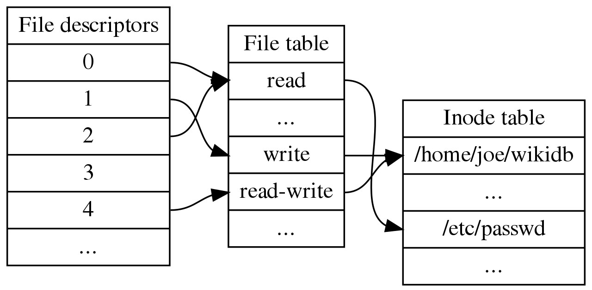

# xv6 作業系統閱讀筆記 (1) 理解檔案表 -- 從 cat.c 的 write() 指令開始追蹤

xv6 作業系統雖然 kernel 只有八千行，但是要理解其運作原理，需要一些背景知識。

為了串起這些背景知識，我們從一個 cat.c 的檔案顯示範例開始講起，並追蹤其運作原理。

透過這個案例，您將會理解 xv6 作業系統的《檔案系統 / 系統呼叫 / 中斷 / 鎖》 等機制。

現在就讓我們從 cat.c 開始出發。

## cat 指令

在安裝好 RISC-V 工具鏈之後，您可以用 make qemu 開始執行 xv6。

```
user@DESKTOP-96FRN6B MINGW64 /d/pmedia/陳鍾誠/課程/系統程式/10-riscv/04-xv6os/xv6
$ make qemu
gcc -Werror -Wall -I. -o mkfs/mkfs mkfs/mkfs.c
mkfs/mkfs fs.img README user/_cat user/_echo user/_forktest user/_grep user/_init user/_kill user/_ln user/_ls user/_mkdir user/_rm user/_sh user/_stressfs user/_usertests user/_grind user/_wc user/_zombie
nmeta 46 (boot, super, log blocks 30 inode blocks 13, bitmap blocks 1) blocks 954 total 1000
balloc: first 593 blocks have been allocated
balloc: write bitmap block at sector 45
qemu-system-riscv64 -machine virt -bios none -kernel kernel/kernel -m 256M -smp 3 -nographic -drive file=fs.img,if=none,format=raw,id=x0 -device virtio-blk-device,drive=x0,bus=virtio-mmio-bus.0  

xv6 kernel is booting

hart 2 starting
hart 1 starting
init: starting sh

$ ls
.              1 1 1024
..             1 1 1024
README         2 2 2102
cat            2 3 23960
echo           2 4 22792
forktest       2 5 13128
grep           2 6 27280
init           2 7 23928
kill           2 8 22760
ln             2 9 22752
ls             2 10 26168
mkdir          2 11 22888
rm             2 12 22872
sh             2 13 41824
stressfs       2 14 23792
usertests      2 15 151208
grind          2 16 38024
wc             2 17 25056
zombie         2 18 22288
console        3 19 0
```

接著讓我們用 cat README 將該檔案顯示在畫面上。

```
$ cat README
xv6 is a re-implementation of Dennis Ritchie's and Ken Thompson's Unix
Version 6 (v6).  xv6 loosely follows the structure and style of v6,
but is implemented for a modern RISC-V multiprocessor using ANSI C.

ACKNOWLEDGMENTS

xv6 is inspired by John Lions's Commentary on UNIX 6th Edition (Peer
to Peer Communications; ISBN: 1-57398-013-7; 1st edition (June 14,
2000)). See also https://pdos.csail.mit.edu/6.828/, which
provides pointers to on-line resources for v6.

The following people have made contributions: Russ Cox (context switching,
locking), Cliff Frey (MP), Xiao Yu (MP), Nickolai Zeldovich, and Austin
Clements.

We are also grateful for the bug reports and patches contributed by
Silas Boyd-Wickizer, Anton Burtsev, Dan Cross, Cody Cutler, Mike CAT,
Tej Chajed, Asami Doi, eyalz800, , Nelson Elhage, Saar Ettinger, Alice
Ferrazzi, Nathaniel Filardo, Peter Froehlich, Yakir Goaron,Shivam
Handa, Bryan Henry, jaichenhengjie, Jim Huang, Alexander Kapshuk,
Anders Kaseorg, kehao95, Wolfgang Keller, Jonathan Kimmitt, Eddie
Kohler, Austin Liew, Imbar Marinescu, Yandong Mao, Matan Shabtay,
Hitoshi Mitake, Carmi Merimovich, Mark Morrissey, mtasm, Joel Nider,
Greg Price, Ayan Shafqat, Eldar Sehayek, Yongming Shen, Fumiya
Shigemitsu, Takahiro, Cam Tenny, tyfkda, Rafael Ubal, Warren Toomey,
Stephen Tu, Pablo Ventura, Xi Wang, Keiichi Watanabe, Nicolas
Wolovick, wxdao, Grant Wu, Jindong Zhang, Icenowy Zheng, and Zou Chang
Wei.

The code in the files that constitute xv6 is
Copyright 2006-2020 Frans Kaashoek, Robert Morris, and Russ Cox.

ERROR REPORTS

Please send errors and suggestions to Frans Kaashoek and Robert Morris
(kaashoek,rtm@mit.edu). The main purpose of xv6 is as a teaching
operating system for MIT's 6.S081, so we are more interested in
simplifications and clarifications than new features.

BUILDING AND RUNNING XV6

You will need a RISC-V "newlib" tool chain from
https://github.com/riscv/riscv-gnu-toolchain, and qemu compiled for
riscv64-softmmu. Once they are installed, and in your shell
search path, you can run "make qemu".
```

## cat.c

對於已經熟悉 linux 系統程式設計的人，應該很容易看懂以下的 cat.c 原始碼！

user/cat.c

```cpp
#include "kernel/types.h"
#include "kernel/stat.h"
#include "user/user.h"

char buf[512];

void
cat(int fd)
{
  int n;

  while((n = read(fd, buf, sizeof(buf))) > 0) {
    if (write(1, buf, n) != n) {
      fprintf(2, "cat: write error\n");
      exit(1);
    }
  }
  if(n < 0){
    fprintf(2, "cat: read error\n");
    exit(1);
  }
}

int
main(int argc, char *argv[])
{
  int fd, i;

  if(argc <= 1){
    cat(0);
    exit(0);
  }

  for(i = 1; i < argc; i++){
    if((fd = open(argv[i], 0)) < 0){
      fprintf(2, "cat: cannot open %s\n", argv[i]);
      exit(1);
    }
    cat(fd);
    close(fd);
  }
  exit(0);
}

```

UNIX 設計的一個核心理念是，一切皆檔案，所以《由鍵盤和螢幕所組成的終端機 terminal 也是檔案》。

對於 xv6 而言，由於沒有掛上螢幕，所以採用 uart 和《宿主機》溝通，因此其終端機介面為《宿主機的終端機》。

UNIX 的檔案系統有個《檔案表》，其中標準輸入 stdin 被放在第 0 格，標準輸出 stdout 被放在第 1 格，標準錯誤 stderr 被放在第 2 格。

下圖顯示了《檔案表》的結構。



於是當我們用 `write(1, buf, n)` 輸出到 1 (stdout) 時，buf 內容會顯示在終端機上。

xv6 的檔案相關結構定義在 file.h 當中，讓我們追蹤一下原始碼。

kernel/file.h

```cpp
struct file {
  enum { FD_NONE, FD_PIPE, FD_INODE, FD_DEVICE } type;
  int ref; // reference count
  char readable;
  char writable;
  struct pipe *pipe; // FD_PIPE
  struct inode *ip;  // FD_INODE and FD_DEVICE
  uint off;          // FD_INODE
  short major;       // FD_DEVICE
};

#define major(dev)  ((dev) >> 16 & 0xFFFF)
#define minor(dev)  ((dev) & 0xFFFF)
#define	mkdev(m,n)  ((uint)((m)<<16| (n)))

// in-memory copy of an inode
struct inode {
  uint dev;           // Device number
  uint inum;          // Inode number
  int ref;            // Reference count
  struct sleeplock lock; // protects everything below here
  int valid;          // inode has been read from disk?

  short type;         // copy of disk inode
  short major;
  short minor;
  short nlink;
  uint size;
  uint addrs[NDIRECT+1];
};

// map major device number to device functions.
struct devsw {
  int (*read)(int, uint64, int);
  int (*write)(int, uint64, int);
};

extern struct devsw devsw[];

#define CONSOLE 1

```

xv6 的檔案表則是宣告在 file.c 當中，以下是其中的部分原始碼。

kernel/file.c

```cpp
struct devsw devsw[NDEV];
struct {
  struct spinlock lock;
  struct file file[NFILE];
} ftable;

void
fileinit(void)
{
  initlock(&ftable.lock, "ftable");
}

// Allocate a file structure.
struct file*
filealloc(void)
{
  struct file *f;

  acquire(&ftable.lock);
  for(f = ftable.file; f < ftable.file + NFILE; f++){
    if(f->ref == 0){
      f->ref = 1;
      release(&ftable.lock);
      return f;
    }
  }
  release(&ftable.lock);
  return 0;
}
```

而 open, read, write, close 這些函數，是定義在 user/usys.S 中的系統呼叫，會透過 ecall 去呼叫對應的系統函數。

user/usys.S

```s
# generated by usys.pl - do not edit
#include "kernel/syscall.h"
.global fork
fork:
 li a7, SYS_fork
 ecall
 ret
.global exit
exit:
 li a7, SYS_exit
 ecall
 ret
.global wait
wait:
 li a7, SYS_wait
 ecall
 ret
.global pipe
pipe:
 li a7, SYS_pipe
 ecall
 ret
.global read
read:
 li a7, SYS_read
 ecall
 ret
.global write
write:
 li a7, SYS_write
 ecall
 ret
.global close
close:
 li a7, SYS_close
 ecall
 ret
.global kill
kill:
 li a7, SYS_kill
 ecall
 ret
.global exec
exec:
 li a7, SYS_exec
 ecall
 ret
.global open
open:
 li a7, SYS_open
 ecall
 ret
.global mknod
mknod:
 li a7, SYS_mknod
 ecall
 ret
.global unlink
unlink:
 li a7, SYS_unlink
 ecall
 ret
.global fstat
fstat:
 li a7, SYS_fstat
 ecall
 ret
.global link
link:
 li a7, SYS_link
 ecall
 ret
.global mkdir
mkdir:
 li a7, SYS_mkdir
 ecall
 ret
.global chdir
chdir:
 li a7, SYS_chdir
 ecall
 ret
.global dup
dup:
 li a7, SYS_dup
 ecall
 ret
.global getpid
getpid:
 li a7, SYS_getpid
 ecall
 ret
.global sbrk
sbrk:
 li a7, SYS_sbrk
 ecall
 ret
.global sleep
sleep:
 li a7, SYS_sleep
 ecall
 ret
.global uptime
uptime:
 li a7, SYS_uptime
 ecall
 ret

```

當我們呼叫 `write(1, buf, n)` 時，會執行下列組合語言指令

```s
write:
 li a7, SYS_write
 ecall
 ret
```

其中的 ecall 會產生《軟體中斷》，然後透過下列的中斷表，會跳到 sys_write 去執行。

```cpp
static uint64 (*syscalls[])(void) = {
[SYS_fork]    sys_fork,
[SYS_exit]    sys_exit,
[SYS_wait]    sys_wait,
[SYS_pipe]    sys_pipe,
[SYS_read]    sys_read,
[SYS_kill]    sys_kill,
[SYS_exec]    sys_exec,
[SYS_fstat]   sys_fstat,
[SYS_chdir]   sys_chdir,
[SYS_dup]     sys_dup,
[SYS_getpid]  sys_getpid,
[SYS_sbrk]    sys_sbrk,
[SYS_sleep]   sys_sleep,
[SYS_uptime]  sys_uptime,
[SYS_open]    sys_open,
[SYS_write]   sys_write,
[SYS_mknod]   sys_mknod,
[SYS_unlink]  sys_unlink,
[SYS_link]    sys_link,
[SYS_mkdir]   sys_mkdir,
[SYS_close]   sys_close,
};

void
syscall(void)
{
  int num;
  struct proc *p = myproc();

  num = p->trapframe->a7;
  if(num > 0 && num < NELEM(syscalls) && syscalls[num]) {
    p->trapframe->a0 = syscalls[num]();
  } else {
    printf("%d %s: unknown sys call %d\n",
            p->pid, p->name, num);
    p->trapframe->a0 = -1;
  }
}

```

而 sys_write 的原始碼放在 sysfile.c 中，在此會呼叫 file.c 中定義的 filewrite() 函數。 

kernel/sysfile.c

```cpp
uint64
sys_write(void)
{
  struct file *f;
  int n;
  uint64 p;

  if(argfd(0, 0, &f) < 0 || argint(2, &n) < 0 || argaddr(1, &p) < 0)
    return -1;

  return filewrite(f, p, n);
}
```

filewrite() 函數則會呼叫檔案表 ftable 中對應裝置 devsw 裏的 write 函數。

讓我們再看一遍 file.h 與 file.c 中的關鍵程式碼

kernel/file.h

```cpp
struct file {
  enum { FD_NONE, FD_PIPE, FD_INODE, FD_DEVICE } type;
  int ref; // reference count
  char readable;
  char writable;
  struct pipe *pipe; // FD_PIPE
  struct inode *ip;  // FD_INODE and FD_DEVICE
  uint off;          // FD_INODE
  short major;       // FD_DEVICE
};

#define major(dev)  ((dev) >> 16 & 0xFFFF)
#define minor(dev)  ((dev) & 0xFFFF)
#define	mkdev(m,n)  ((uint)((m)<<16| (n)))

// in-memory copy of an inode
struct inode {
  uint dev;           // Device number
  uint inum;          // Inode number
  int ref;            // Reference count
  struct sleeplock lock; // protects everything below here
  int valid;          // inode has been read from disk?

  short type;         // copy of disk inode
  short major;
  short minor;
  short nlink;
  uint size;
  uint addrs[NDIRECT+1];
};

// map major device number to device functions.
struct devsw {
  int (*read)(int, uint64, int);
  int (*write)(int, uint64, int);
};

extern struct devsw devsw[];

#define CONSOLE 1

```

kernel/file.c

```cpp
struct devsw devsw[NDEV];
struct {
  struct spinlock lock;
  struct file file[NFILE];
} ftable;
```

再重新釐清一遍，於是當我們呼叫 `write(1, buf, n)` 時，會執行 usys.S 中的 write，

user/usys.S

```s
write:
 li a7, SYS_write
 ecall
 ret
```

然後透過軟體中斷跳到系統呼叫 sys_write 

kernel/sysfile.c

```cpp
uint64
sys_write(void)
{
  struct file *f;
  int n;
  uint64 p;

  if(argfd(0, 0, &f) < 0 || argint(2, &n) < 0 || argaddr(1, &p) < 0)
    return -1;

  return filewrite(f, p, n);
}
```

於是進入了 file.c 中的 filewrite()

kernel/file.c

```cpp
// Write to file f.
// addr is a user virtual address.
int
filewrite(struct file *f, uint64 addr, int n)
{
  int r, ret = 0;

  if(f->writable == 0)
    return -1;

  if(f->type == FD_PIPE){
    ret = pipewrite(f->pipe, addr, n);
  } else if(f->type == FD_DEVICE){
    if(f->major < 0 || f->major >= NDEV || !devsw[f->major].write)
      return -1;
    ret = devsw[f->major].write(1, addr, n);
  } else if(f->type == FD_INODE){
    // write a few blocks at a time to avoid exceeding
    // the maximum log transaction size, including
    // i-node, indirect block, allocation blocks,
    // and 2 blocks of slop for non-aligned writes.
    // this really belongs lower down, since writei()
    // might be writing a device like the console.
    int max = ((MAXOPBLOCKS-1-1-2) / 2) * BSIZE;
    int i = 0;
    while(i < n){
      int n1 = n - i;
      if(n1 > max)
        n1 = max;

      begin_op();
      ilock(f->ip);
      if ((r = writei(f->ip, 1, addr + i, f->off, n1)) > 0)
        f->off += r;
      iunlock(f->ip);
      end_op();

      if(r != n1){
        // error from writei
        break;
      }
      i += r;
    }
    ret = (i == n ? n : -1);
  } else {
    panic("filewrite");
  }

  return ret;
}

```

由於 ftable.file[1].major 指定的裝置為 console，所以 `devsw[f->major].write(1, addr, n)` 會執行 `consolewrite(1, addr, n)`。

kernel/console.c

```cpp
void
consoleinit(void)
{
  initlock(&cons.lock, "cons");

  uartinit();

  // connect read and write system calls
  // to consoleread and consolewrite.
  devsw[CONSOLE].read = consoleread; // CONSOLE 在 kernel/file.h 定義為 1
  devsw[CONSOLE].write = consolewrite;
}

```

然後 `consolewrite()` 會連續呼叫 n 次的 `uartputc(c)` 去輸出該字串到《宿主機的終端機》中

```cpp
//
// user write()s to the console go here.
//
int
consolewrite(int user_src, uint64 src, int n)
{
  int i;

  for(i = 0; i < n; i++){
    char c;
    if(either_copyin(&c, user_src, src+i, 1) == -1)
      break;
    uartputc(c);
  }

  return i;
}
```

所以 cat.c 才能透過 `write(1, buf, n)` 把讀到的檔案內容顯示在畫面上。

而其中 uartputc(c) 是透過記憶體映射的方式，將字元傳送給宿主機的，程式碼如下：

```cpp
// add a character to the output buffer and tell the
// UART to start sending if it isn't already.
// blocks if the output buffer is full.
// because it may block, it can't be called
// from interrupts; it's only suitable for use
// by write().
void
uartputc(int c)
{
  acquire(&uart_tx_lock);

  if(panicked){
    for(;;)
      ;
  }

  while(1){
    if(uart_tx_w == uart_tx_r + UART_TX_BUF_SIZE){
      // buffer is full.
      // wait for uartstart() to open up space in the buffer.
      sleep(&uart_tx_r, &uart_tx_lock);
    } else {
      uart_tx_buf[uart_tx_w % UART_TX_BUF_SIZE] = c;
      uart_tx_w += 1;
      uartstart();
      release(&uart_tx_lock);
      return;
    }
  }
}
//...
// if the UART is idle, and a character is waiting
// in the transmit buffer, send it.
// caller must hold uart_tx_lock.
// called from both the top- and bottom-half.
void
uartstart()
{
  while(1){
    if(uart_tx_w == uart_tx_r){
      // transmit buffer is empty.
      return;
    }
    
    if((ReadReg(LSR) & LSR_TX_IDLE) == 0){
      // the UART transmit holding register is full,
      // so we cannot give it another byte.
      // it will interrupt when it's ready for a new byte.
      return;
    }
    
    int c = uart_tx_buf[uart_tx_r % UART_TX_BUF_SIZE];
    uart_tx_r += 1;
    
    // maybe uartputc() is waiting for space in the buffer.
    wakeup(&uart_tx_r);
    
    WriteReg(THR, c);
  }
}
```

## 結語

以上的說明，應該把 cat.c 中的 write() 函數運作原理說明清楚了！

接下來的問題是，開檔 open 與讀檔 read 到底是怎麼進行的，這個問題會引導我們看懂 xv6 檔案系統的設計原理，包含 superblock, inode, bitmap, block 等等檔案的組織架構，請讓我們賣個關子，且待下回分解！

