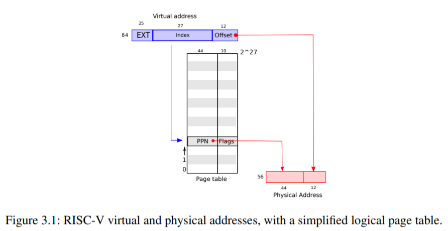
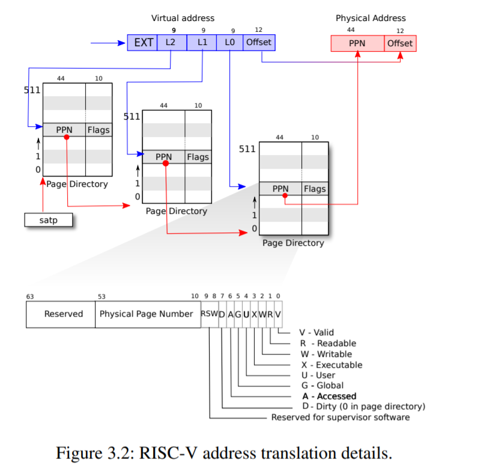

# xv6 作業系統閱讀筆記 (6) 記憶體管理單元 mmu -- 分頁表的使用

每個行程擁有自己的分頁表，可以讓執行檔載入時，擁有完整且獨立的記憶體位址空間 (虛擬位址)，這樣就不需要做很多的《重定位》工作，這是使用分頁表的第一個好處。

使用分頁表，也能讓記憶體的載入比較有效率，不需要一開始就把整份執行檔全部載進來，而是一邊執行一邊載入，這是使用分頁表的第二個好處。

另外、當程式用 fork() 分叉成兩份時，雖然會複製分頁表，但是卻可以共用分頁記憶體，這樣的共用可以提高記憶體的使用效率，這是使用分頁表的第三個好處。

## riscv.h

xv6 的分頁表資料結構，定義在 riscv.h 裡面，名稱是 pagetable_t。

RISC-V 處理器的分頁表結構如下圖所示，其中虛擬位址的前 25 位 EXT 部分是未來擴充用，目前還沒用上。



kernel/riscv.h

```cpp
#define PGSIZE 4096 // bytes per page  每頁 4096 byte
#define PGSHIFT 12  // bits of offset within a page

#define PGROUNDUP(sz)  (((sz)+PGSIZE-1) & ~(PGSIZE-1))
#define PGROUNDDOWN(a) (((a)) & ~(PGSIZE-1)) // 取得頁碼 (截掉最後 12 位元的 offset 部分)

#define PTE_V (1L << 0) // valid, 有效
#define PTE_R (1L << 1) // 可讀取
#define PTE_W (1L << 2) // 可寫入
#define PTE_X (1L << 3) // 可執行
#define PTE_U (1L << 4) // 1 -> user can access

// shift a physical address to the right place for a PTE. 將實體位址(PA)轉為頁表項(PTE)
#define PA2PTE(pa) ((((uint64)pa) >> 12) << 10) // 由於每頁 4096 byte, 所以最小的 12 bits offset 不在頁表項中，可去掉。

#define PTE2PA(pte) (((pte) >> 10) << 12)

#define PTE_FLAGS(pte) ((pte) & 0x3FF)

// extract the three 9-bit page table indices from a virtual address.
#define PXMASK          0x1FF // 9 bits
#define PXSHIFT(level)  (PGSHIFT+(9*(level)))
#define PX(level, va) ((((uint64) (va)) >> PXSHIFT(level)) & PXMASK)

// one beyond the highest possible virtual address.
// MAXVA is actually one bit less than the max allowed by
// Sv39, to avoid having to sign-extend virtual addresses
// that have the high bit set.
#define MAXVA (1L << (9 + 9 + 9 + 12 - 1))

typedef uint64 pte_t;
typedef uint64 *pagetable_t; // 512 PTEs

```

pagetable_t 是 64 位元無號整數 uint64 的指標 (陣列)。其中的每一項稱為 PTE (Page Table Entry)，也就是上述的 pte_t。

每個分頁大小 PGSIZE 為 4096 bytes，所以當實體位址 (PA, Physical Address) 要被轉換為虛擬位址 (VA, Virtual Address) 時，需要被右移 12 位元以取得頁碼。

```cpp
#define PA2PTE(pa) ((((uint64)pa) >> 12) << 10)
#define PTE2PA(pte) (((pte) >> 10) << 12)
```

每一個頁，都可以設定 《V:有效, R:可讀, W:可寫, X:可執行, U:使用者可存取》 等屬性，這些屬性被放在最右邊的 11 個 bit。

```cpp
#define PTE_FLAGS(pte) ((pte) & 0x3FF)
```

xv6 核心的記憶體配置，記錄在 memlayout.h 這個檔案中

kernel/memlayout.h

```cpp
// Physical memory layout

// qemu -machine virt is set up like this,
// based on qemu's hw/riscv/virt.c:
//
// 00001000 -- boot ROM, provided by qemu
// 02000000 -- CLINT
// 0C000000 -- PLIC
// 10000000 -- uart0 
// 10001000 -- virtio disk 
// 80000000 -- boot ROM jumps here in machine mode
//             -kernel loads the kernel here
// unused RAM after 80000000.

// the kernel uses physical memory thus:
// 80000000 -- entry.S, then kernel text and data
// end -- start of kernel page allocation area
// PHYSTOP -- end RAM used by the kernel

// qemu puts UART registers here in physical memory.
#define UART0 0x10000000L
#define UART0_IRQ 10

// virtio mmio interface
#define VIRTIO0 0x10001000
#define VIRTIO0_IRQ 1

// core local interruptor (CLINT), which contains the timer.
#define CLINT 0x2000000L
#define CLINT_MTIMECMP(hartid) (CLINT + 0x4000 + 8*(hartid))
#define CLINT_MTIME (CLINT + 0xBFF8) // cycles since boot.

// qemu puts platform-level interrupt controller (PLIC) here.
#define PLIC 0x0c000000L
#define PLIC_PRIORITY (PLIC + 0x0)
#define PLIC_PENDING (PLIC + 0x1000)
#define PLIC_MENABLE(hart) (PLIC + 0x2000 + (hart)*0x100)
#define PLIC_SENABLE(hart) (PLIC + 0x2080 + (hart)*0x100)
#define PLIC_MPRIORITY(hart) (PLIC + 0x200000 + (hart)*0x2000)
#define PLIC_SPRIORITY(hart) (PLIC + 0x201000 + (hart)*0x2000)
#define PLIC_MCLAIM(hart) (PLIC + 0x200004 + (hart)*0x2000)
#define PLIC_SCLAIM(hart) (PLIC + 0x201004 + (hart)*0x2000)

// the kernel expects there to be RAM
// for use by the kernel and user pages
// from physical address 0x80000000 to PHYSTOP.
#define KERNBASE 0x80000000L
#define PHYSTOP (KERNBASE + 128*1024*1024)

// map the trampoline page to the highest address,
// in both user and kernel space.
#define TRAMPOLINE (MAXVA - PGSIZE)

// map kernel stacks beneath the trampoline,
// each surrounded by invalid guard pages.
#define KSTACK(p) (TRAMPOLINE - ((p)+1)* 2*PGSIZE)

// User memory layout.
// Address zero first:
//   text
//   original data and bss
//   fixed-size stack
//   expandable heap
//   ...
//   TRAPFRAME (p->trapframe, used by the trampoline)
//   TRAMPOLINE (the same page as in the kernel)
#define TRAPFRAME (TRAMPOLINE - PGSIZE)

```

因此我們可以用 C 語言的記憶體映射指令去存取這些內容，例如 uart.c 裏的程式碼，其中的 `WriteReg(THR, c)` 定義為 `(*(Reg(reg)) = (v))` ，也就是 `*(volatile unsigned char *)(UART0+THR) = v` 。

這個指令透過將 v 寫到 UART+THR (0x10000000L+0) 當中，因而傳送一個字元給宿主機顯示。

```cpp
#define Reg(reg) ((volatile unsigned char *)(UART0 + reg))
//...
#define RHR 0                 // receive holding register (for input bytes)
#define THR 0                 // transmit holding register (for output bytes)
//...
#define ReadReg(reg) (*(Reg(reg)))
#define WriteReg(reg, v) (*(Reg(reg)) = (v))
//...
void
uartputc_sync(int c)
{
  push_off();

  if(panicked){
    for(;;)
      ;
  }

  // wait for Transmit Holding Empty to be set in LSR.
  while((ReadReg(LSR) & LSR_TX_IDLE) == 0)
    ;
  WriteReg(THR, c);

  pop_off();
}
```

上述的記憶體配置，在 vm.c 的 kvmmake() 函數落實為程式。

kernel/vm.c

```cpp
/*
 * the kernel's page table.
 */
pagetable_t kernel_pagetable;

extern char etext[];  // kernel.ld sets this to end of kernel code.

extern char trampoline[]; // trampoline.S

// Make a direct-map page table for the kernel.
pagetable_t
kvmmake(void)
{
  pagetable_t kpgtbl;

  kpgtbl = (pagetable_t) kalloc();
  memset(kpgtbl, 0, PGSIZE);

  // uart registers
  kvmmap(kpgtbl, UART0, UART0, PGSIZE, PTE_R | PTE_W);

  // virtio mmio disk interface
  kvmmap(kpgtbl, VIRTIO0, VIRTIO0, PGSIZE, PTE_R | PTE_W);

  // PLIC
  kvmmap(kpgtbl, PLIC, PLIC, 0x400000, PTE_R | PTE_W);

  // map kernel text executable and read-only.
  kvmmap(kpgtbl, KERNBASE, KERNBASE, (uint64)etext-KERNBASE, PTE_R | PTE_X);

  // map kernel data and the physical RAM we'll make use of.
  kvmmap(kpgtbl, (uint64)etext, (uint64)etext, PHYSTOP-(uint64)etext, PTE_R | PTE_W);

  // map the trampoline for trap entry/exit to
  // the highest virtual address in the kernel.
  kvmmap(kpgtbl, TRAMPOLINE, (uint64)trampoline, PGSIZE, PTE_R | PTE_X);

  // map kernel stacks
  proc_mapstacks(kpgtbl);
  
  return kpgtbl;
}

// Initialize the one kernel_pagetable
void
kvminit(void)
{
  kernel_pagetable = kvmmake();
}
// ...
// add a mapping to the kernel page table.
// only used when booting.
// does not flush TLB or enable paging.
void
kvmmap(pagetable_t kpgtbl, uint64 va, uint64 pa, uint64 sz, int perm)
{
  if(mappages(kpgtbl, va, sz, pa, perm) != 0)
    panic("kvmmap");
}
// Create PTEs for virtual addresses starting at va that refer to
// physical addresses starting at pa. va and size might not
// be page-aligned. Returns 0 on success, -1 if walk() couldn't
// allocate a needed page-table page.
int
mappages(pagetable_t pagetable, uint64 va, uint64 size, uint64 pa, int perm)
{
  uint64 a, last;
  pte_t *pte;
  // 映射範圍：從 va 到 va+size
  a = PGROUNDDOWN(va); // 第一頁的頁號
  last = PGROUNDDOWN(va + size - 1); // 最後一頁的頁號
  for(;;){
    if((pte = walk(pagetable, a, 1)) == 0) // 找出頁 a 對應的 pte，若不存在則創造一個可用空頁 (因 alloc=1)
      return -1;
    if(*pte & PTE_V)
      panic("remap");
    *pte = PA2PTE(pa) | perm | PTE_V;
    if(a == last) // 如果已經到了最後一頁，則完成並離開
      break;
    a += PGSIZE;
    pa += PGSIZE;
  }
  return 0;
}
// ...
// Return the address of the PTE in page table pagetable
// that corresponds to virtual address va.  If alloc!=0,
// create any required page-table pages.
//
// The risc-v Sv39 scheme has three levels of page-table
// pages. A page-table page contains 512 64-bit PTEs.
// A 64-bit virtual address is split into five fields:
//   39..63 -- must be zero.
//   30..38 -- 9 bits of level-2 index.
//   21..29 -- 9 bits of level-1 index.
//   12..20 -- 9 bits of level-0 index.
//    0..11 -- 12 bits of byte offset within the page.
pte_t *
walk(pagetable_t pagetable, uint64 va, int alloc)
{
  if(va >= MAXVA)
    panic("walk");

  for(int level = 2; level > 0; level--) { // 逐級下降頁表 (共三級)
    pte_t *pte = &pagetable[PX(level, va)]; // 看看虛擬位址 va 的是否在頁表裏
    if(*pte & PTE_V) { // 若是，則取得頁表。
      pagetable = (pagetable_t)PTE2PA(*pte);
    } else { // 否則，分配新頁表
      if(!alloc || (pagetable = (pde_t*)kalloc()) == 0) // 不分配或分配失敗
        return 0;
      memset(pagetable, 0, PGSIZE); // 將頁表清為 0
      *pte = PA2PTE(pagetable) | PTE_V; // 取得頁表項 PTE
    }
  }
  return &pagetable[PX(0, va)]; // 傳回 0 級頁表
}
```

從以上程式中，您可以發現頁表為三級結構如下圖所示：



其中每一級都用九位元去定址大小為 512 words 的分頁表。

然而，上述的 kvmmake() 只是配置核心 kernel 的分頁表，使用者行程的分頁表，則是在 vm.c 裏的那些 uvm...() 的函數所負責的。

第一個被載入的使用者行程是 init ，在前面的文章中我們看過，有個很短的 initcode 機器碼被用來載入 init 行程，以下重複列出這些碼。

kernel/proc.c

```cpp
// Set up first user process.
void
userinit(void)
{
  struct proc *p;

  p = allocproc();
  initproc = p;
  
  // allocate one user page and copy init's instructions
  // and data into it.
  uvminit(p->pagetable, initcode, sizeof(initcode));
  p->sz = PGSIZE;

  // prepare for the very first "return" from kernel to user.
  p->trapframe->epc = 0;      // user program counter
  p->trapframe->sp = PGSIZE;  // user stack pointer

  safestrcpy(p->name, "initcode", sizeof(p->name));
  p->cwd = namei("/");

  p->state = RUNNABLE;

  release(&p->lock);
}
```

而其中的 initcode 這個變數，則是一段奇特的十六進位碼如下：

```cpp
// a user program that calls exec("/init")
// od -t xC initcode
uchar initcode[] = {
  0x17, 0x05, 0x00, 0x00, 0x13, 0x05, 0x45, 0x02,
  0x97, 0x05, 0x00, 0x00, 0x93, 0x85, 0x35, 0x02,
  0x93, 0x08, 0x70, 0x00, 0x73, 0x00, 0x00, 0x00,
  0x93, 0x08, 0x20, 0x00, 0x73, 0x00, 0x00, 0x00,
  0xef, 0xf0, 0x9f, 0xff, 0x2f, 0x69, 0x6e, 0x69,
  0x74, 0x00, 0x00, 0x24, 0x00, 0x00, 0x00, 0x00,
  0x00, 0x00, 0x00, 0x00
};
```

上面那堆 `uchar initcode[] = { 0x17, 0x05, 0x00 ...` 到底是甚麼呢？

其實就是下列組合語言的機器碼，被直接寫在 initcode[] 陣列裡面了。

user/initcode.S

```s
# Initial process that execs /init.
# This code runs in user space.

#include "syscall.h"

# exec(init, argv)
.globl start
start:
        la a0, init
        la a1, argv
        li a7, SYS_exec
        ecall

# for(;;) exit();
exit:
        li a7, SYS_exit
        ecall
        jal exit

# char init[] = "/init\0";
init:
  .string "/init\0"

# char *argv[] = { init, 0 };
.p2align 2
argv:
  .long init
  .long 0
```

然後回到 vm.c 裏，你可以看到 uvminit() 在核心中分配了一頁給這個 initcode ，這頁程式碼執行時就可以把 init 載入到記憶體了。

```cpp
// Load the user initcode into address 0 of pagetable,
// for the very first process.
// sz must be less than a page.
void
uvminit(pagetable_t pagetable, uchar *src, uint sz)
{
  char *mem;

  if(sz >= PGSIZE)
    panic("inituvm: more than a page");
  mem = kalloc();
  memset(mem, 0, PGSIZE);
  mappages(pagetable, 0, PGSIZE, (uint64)mem, PTE_W|PTE_R|PTE_X|PTE_U);
  memmove(mem, src, sz);
}
```

由於執行檔為 elf 格式，而且是在 fork() 之後用 exec() 函數去載入置換掉的，因此讓我們重複看一下 exec() 這個函數。

您會發現 exec() 先執行了 `proc_pagetable(p)` 這個函數來分配頁表，然後就對每個分段都呼叫 `uvmalloc(pagetable, sz, ph.vaddr + ph.memsz))` 去分配該段的頁空間。

```cpp

int
exec(char *path, char **argv)
{
  char *s, *last;
  int i, off;
  uint64 argc, sz = 0, sp, ustack[MAXARG+1], stackbase;
  struct elfhdr elf;
  struct inode *ip;
  struct proghdr ph;
  pagetable_t pagetable = 0, oldpagetable;
  struct proc *p = myproc();

  begin_op();

  if((ip = namei(path)) == 0){ // 取得 path ELF 檔對應的 inode ptr (ip)
    end_op();
    return -1;
  }
  ilock(ip);

  // Check ELF header
  if(readi(ip, 0, (uint64)&elf, 0, sizeof(elf)) != sizeof(elf)) // 讀取該 inode
    goto bad;
  if(elf.magic != ELF_MAGIC) // 若不是 ELF 則失敗
    goto bad;

  if((pagetable = proc_pagetable(p)) == 0) // 分配頁表
    goto bad;

  // Load program into memory.
  for(i=0, off=elf.phoff; i<elf.phnum; i++, off+=sizeof(ph)){
    if(readi(ip, 0, (uint64)&ph, off, sizeof(ph)) != sizeof(ph))
      goto bad;
    if(ph.type != ELF_PROG_LOAD)
      continue;
    if(ph.memsz < ph.filesz)
      goto bad;
    if(ph.vaddr + ph.memsz < ph.vaddr)
      goto bad;
    uint64 sz1;
    if((sz1 = uvmalloc(pagetable, sz, ph.vaddr + ph.memsz)) == 0) // 為每個ELF段分配內存
      goto bad;
    sz = sz1;
    if(ph.vaddr % PGSIZE != 0)
      goto bad;
    if(loadseg(pagetable, ph.vaddr, ip, ph.off, ph.filesz) < 0) // 把每個段加載到內存中 (loadseg用walkaddr找到分配的內存的物理地址，在這個地址上寫入ELF段的每一頁，用readi從文件中讀取)
      goto bad; 
  }
  iunlockput(ip);
  end_op();
  ip = 0;

  p = myproc();
  uint64 oldsz = p->sz;

  // Allocate two pages at the next page boundary. 為何分配兩頁？第二個是堆疊，那第一個幹嘛用？
  // Use the second as the user stack.  答：第一個是不可訪問頁，當堆疊溢位時會觸發錯誤中斷。
  sz = PGROUNDUP(sz);
  uint64 sz1;
  if((sz1 = uvmalloc(pagetable, sz, sz + 2*PGSIZE)) == 0)
    goto bad;
  sz = sz1;
  uvmclear(pagetable, sz-2*PGSIZE);
  sp = sz;
  stackbase = sp - PGSIZE;

  // Push argument strings, prepare rest of stack in ustack. 在堆疊中推入 argv 字串
  for(argc = 0; argv[argc]; argc++) {
    if(argc >= MAXARG)
      goto bad;
    sp -= strlen(argv[argc]) + 1;
    sp -= sp % 16; // riscv sp must be 16-byte aligned
    if(sp < stackbase)
      goto bad;
    if(copyout(pagetable, sp, argv[argc], strlen(argv[argc]) + 1) < 0) // 複製失敗就離開
      goto bad;
    ustack[argc] = sp;
  }
  ustack[argc] = 0;

  // push the array of argv[] pointers. 推入 argv 的指標
  sp -= (argc+1) * sizeof(uint64);
  sp -= sp % 16;
  if(sp < stackbase)
    goto bad;
  if(copyout(pagetable, sp, (char *)ustack, (argc+1)*sizeof(uint64)) < 0)
    goto bad;

  // arguments to user main(argc, argv)
  // argc is returned via the system call return
  // value, which goes in a0.
  p->trapframe->a1 = sp; // 設定 a1=argv

  // Save program name for debugging.
  for(last=s=path; *s; s++)
    if(*s == '/')
      last = s+1;
  safestrcpy(p->name, last, sizeof(p->name));
    
  // Commit to the user image.
  oldpagetable = p->pagetable; // 註：oldpagetable 指向 fork 時的 process，現在已經換成新 process 了。
  p->pagetable = pagetable;
  p->sz = sz;
  p->trapframe->epc = elf.entry;  // initial program counter = main (進入點為 main)
  p->trapframe->sp = sp; // initial stack pointer
  proc_freepagetable(oldpagetable, oldsz);

  return argc; // this ends up in a0, the first argument to main(argc, argv)

 bad:
  if(pagetable)
    proc_freepagetable(pagetable, sz);
  if(ip){
    iunlockput(ip);
    end_op();
  }
  return -1;
}
```

最後，每個行程都需要的堆疊段，則是在 `uvmalloc(pagetable, sz, sz + 2*PGSIZE))` 這個指令分配的。

上面程式中的 proc_pagetable() 呼叫，定義在 proc.c 裏

kernel/proc.c

```cpp
// Create a user page table for a given process,
// with no user memory, but with trampoline pages.
pagetable_t
proc_pagetable(struct proc *p)
{
  pagetable_t pagetable;

  // An empty page table.
  pagetable = uvmcreate();
  if(pagetable == 0)
    return 0;

  // map the trampoline code (for system call return)
  // at the highest user virtual address.
  // only the supervisor uses it, on the way
  // to/from user space, so not PTE_U.
  if(mappages(pagetable, TRAMPOLINE, PGSIZE,
              (uint64)trampoline, PTE_R | PTE_X) < 0){
    uvmfree(pagetable, 0);
    return 0;
  }

  // map the trapframe just below TRAMPOLINE, for trampoline.S.
  if(mappages(pagetable, TRAPFRAME, PGSIZE,
              (uint64)(p->trapframe), PTE_R | PTE_W) < 0){
    uvmunmap(pagetable, TRAMPOLINE, 1, 0);
    uvmfree(pagetable, 0);
    return 0;
  }

  return pagetable;
}
```

其中透過 uvmcreate() 創建使用者行程的分頁表

```cpp
// create an empty user page table.
// returns 0 if out of memory.
pagetable_t
uvmcreate()
{
  pagetable_t pagetable;
  pagetable = (pagetable_t) kalloc();
  if(pagetable == 0)
    return 0;
  memset(pagetable, 0, PGSIZE);
  return pagetable;
}
```

proc_pagetable() 程式後半部用 `mappages(pagetable, TRAMPOLINE,...` 去映射一段由 kernel 與 user process 共用的 TRAMPOLINE 區域，可以用來作為系統呼叫的使用區。

核心和使用者行程在TRAMPOLINE 的位址都應射到相同的高位址區，這個 TRAMPOLINE 位址也是定義在 memlayout.h 當中

kernel/memlayout.h

```cpp
// the kernel expects there to be RAM
// for use by the kernel and user pages
// from physical address 0x80000000 to PHYSTOP.
#define KERNBASE 0x80000000L
#define PHYSTOP (KERNBASE + 128*1024*1024)

// map the trampoline page to the highest address,
// in both user and kernel space.
#define TRAMPOLINE (MAXVA - PGSIZE)
```

其中的 MAXVA 則是定義在 riscv.h 中

```cpp
// one beyond the highest possible virtual address.
// MAXVA is actually one bit less than the max allowed by
// Sv39, to avoid having to sign-extend virtual addresses
// that have the high bit set.
#define MAXVA (1L << (9 + 9 + 9 + 12 - 1))
```

## 結語

透過以上的追蹤，我們大致理解了 xv6 的分頁表之建構過程，包含核心頁表與使用者頁表等等。

理解了分頁表之後，大概就到了我們這趟 xv6 之旅的最後一站。

希望透過這一系列的 xv6 原始碼閱讀筆記，可以幫助大家理解作業系統是如何設計出來的。

畢竟，基於 RISC-V 處理器，核心只有八千行的 xv6，是我門研究作業系統的良好標的，讓我們可以站在 Ken Thompson, Dennis Richie, 還有 xv6 創建者 Frans Kaashoek, Robert Morris, 與 Russ Cox 等人的肩膀上，看清楚作業系統這個重要領域的技術細節，這是單單閱讀作業系統教科書所難以學會的事情。
