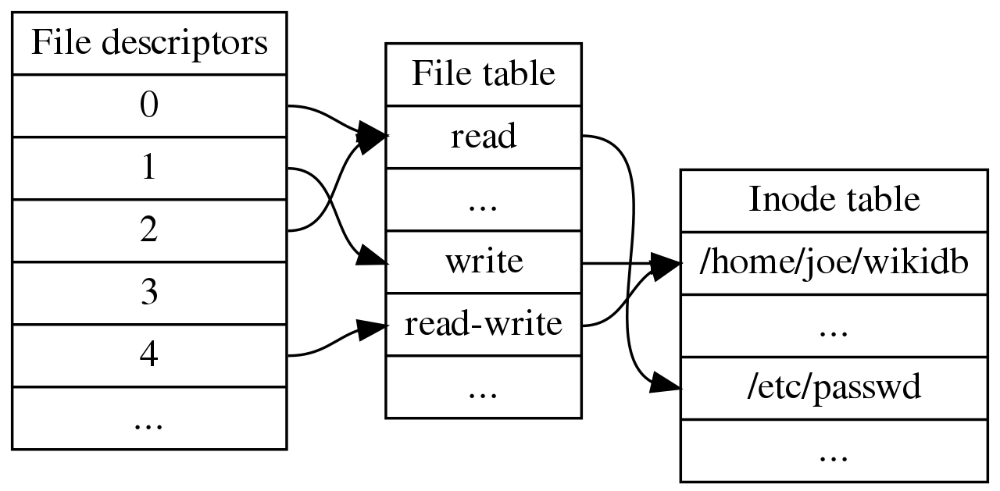
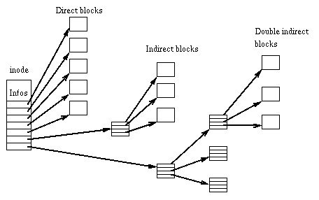

# xv6 的檔案系統

## 層次

```
7. File Descriptor (file.c/FILE)       // ftable.file 是 struct file (FILE) 的陣列
                                       // fd 就是其索引值

6. Pathname (fs.c/dirlookup)           // 透過 namei() 查找對應某路徑的 inode

5. Directory (fs.h/struct dirent)      // 目錄以 dirent 形式存在 inode 中

4. Inode (fs.c/struct inode/dinode)    // 一個檔案對應一個 inode

3. Logging (log.c)                     // 日誌，防止寫到一半出現狀況。

2. Buffer cache (bio.c)                // 區塊讀取函數 bread(dev, i)/bwrite(dev, i) 
                                       // 有緩衝功能。

1. Disk (virtio_disk.c)                // 透過 virtio 協定請求讀寫硬碟
```

UNIX 檔案描述表的相關結構



inode 結構



更詳細的 inode 與超級區塊資訊請參看鳥哥

http://linux.vbird.org/linux_basic/0230filesystem.php#harddisk-inode

ext2 檔案系統: http://linux.vbird.org/linux_basic/0230filesystem/ext2_filesystem.jpg

inode: http://linux.vbird.org/linux_basic/0230filesystem/inode.jpg

## 檔案系統結構

一個磁碟被分割成下列結構，其中寫 1 的代表單一區塊，寫 * 的代表占用多個區塊。


mkfs.c

```
// [ boot block | sb block | log | inode blocks | free bit map | data blocks ]
//      1            1        *         *             1              *
```

每個區塊大小為 1k (1024 bytes)。

fs.h

```
#define BSIZE 1024  // block size
```

mkfs.c 會創建上述結構的 fs.img，以便讓 qemu 載入後，讓 xv6 透過 virtio 讀寫該映像檔。

xv6 透過 virtio 發出讀寫請求，完成後 qemu 會發送中斷給 xv6 通知。

接著看看各個程式的重要片段

## buf.h/bio.c

buf.h

```cpp
struct buf {
  int valid;   // has data been read from disk?
  int disk;    // does disk "own" buf?
  uint dev;
  uint blockno;
  struct sleeplock lock;
  uint refcnt;
  struct buf *prev; // LRU cache list
  struct buf *next;
  uchar data[BSIZE];
};
```

```cpp
// ...
struct {
  struct spinlock lock;
  struct buf buf[NBUF];

  // Linked list of all buffers, through prev/next.
  // Sorted by how recently  the buffer was used.
  // head.next is most recent, head.prev is least.
  struct buf head;
} bcache;
// ...

void
binit(void)
{
  struct buf *b;

  initlock(&bcache.lock, "bcache");

  // Create linked list of buffers
  bcache.head.prev = &bcache.head;
  bcache.head.next = &bcache.head;
  for(b = bcache.buf; b < bcache.buf+NBUF; b++){
    b->next = bcache.head.next;
    b->prev = &bcache.head;
    initsleeplock(&b->lock, "buffer");
    bcache.head.next->prev = b;
    bcache.head.next = b;
  }
}
// ...
// Return a locked buf with the contents of the indicated block.
struct buf*
bread(uint dev, uint blockno)
{
  struct buf *b;

  b = bget(dev, blockno);
  if(!b->valid) {
    virtio_disk_rw(b, 0);
    b->valid = 1;
  }
  return b;
}

// Write b's contents to disk.  Must be locked.
void
bwrite(struct buf *b)
{
  if(!holdingsleep(&b->lock))
    panic("bwrite");
  virtio_disk_rw(b, 1);
}
// ...

void
bpin(struct buf *b) {
  acquire(&bcache.lock);
  b->refcnt++;
  release(&bcache.lock);
}

void
bunpin(struct buf *b) {
  acquire(&bcache.lock);
  b->refcnt--;
  release(&bcache.lock);
}
```

## fs.h/fs.c

fs.h 中的資料結構

```cpp
// On-disk file system format.
// Both the kernel and user programs use this header file.


#define ROOTINO  1   // root i-number
#define BSIZE 1024  // block size

// Disk layout:
// [ boot block | super block | log | inode blocks |
//                                          free bit map | data blocks]
//
// mkfs computes the super block and builds an initial file system. The
// super block describes the disk layout:
struct superblock {
  uint magic;        // Must be FSMAGIC
  uint size;         // Size of file system image (blocks)
  uint nblocks;      // Number of data blocks
  uint ninodes;      // Number of inodes.
  uint nlog;         // Number of log blocks
  uint logstart;     // Block number of first log block
  uint inodestart;   // Block number of first inode block
  uint bmapstart;    // Block number of first free map block
};

#define FSMAGIC 0x10203040

#define NDIRECT 12
#define NINDIRECT (BSIZE / sizeof(uint))
#define MAXFILE (NDIRECT + NINDIRECT)

// On-disk inode structure
struct dinode {
  short type;           // File type
  short major;          // Major device number (T_DEVICE only)
  short minor;          // Minor device number (T_DEVICE only)
  short nlink;          // Number of links to inode in file system
  uint size;            // Size of file (bytes)
  uint addrs[NDIRECT+1];   // Data block addresses
};

// Inodes per block.
#define IPB           (BSIZE / sizeof(struct dinode))

// Block containing inode i
#define IBLOCK(i, sb)     ((i) / IPB + sb.inodestart)

// Bitmap bits per block
#define BPB           (BSIZE*8)

// Block of free map containing bit for block b
#define BBLOCK(b, sb) ((b)/BPB + sb.bmapstart)

// Directory is a file containing a sequence of dirent structures.
#define DIRSIZ 14

struct dirent {
  ushort inum;
  char name[DIRSIZ];
};
```

file.h/inode

```cpp

// in-memory copy of an inode
struct inode {
  uint dev;           // Device number
  uint inum;          // Inode number
  int ref;            // Reference count
  struct sleeplock lock; // protects everything below here
  int valid;          // inode has been read from disk?

  short type;         // copy of disk inode
  short major;
  short minor;
  short nlink;
  uint size;
  uint addrs[NDIRECT+1];
};
```

params.h 總體參數

```cpp
#define NPROC        64  // maximum number of processes
#define NCPU          8  // maximum number of CPUs
#define NOFILE       16  // open files per process
#define NFILE       100  // open files per system
#define NINODE       50  // maximum number of active i-nodes
#define NDEV         10  // maximum major device number
#define ROOTDEV       1  // device number of file system root disk
#define MAXARG       32  // max exec arguments
#define MAXOPBLOCKS  10  // max # of blocks any FS op writes
#define LOGSIZE      (MAXOPBLOCKS*3)  // max data blocks in on-disk log
#define NBUF         (MAXOPBLOCKS*3)  // size of disk block cache
#define FSSIZE       1000  // size of file system in blocks
#define MAXPATH      128   // maximum file path name
```

superblock 相關

```cpp
struct superblock {
  uint magic;        // Must be FSMAGIC
  uint size;         // Size of file system image (blocks)
  uint nblocks;      // Number of data blocks
  uint ninodes;      // Number of inodes.
  uint nlog;         // Number of log blocks
  uint logstart;     // Block number of first log block
  uint inodestart;   // Block number of first inode block
  uint bmapstart;    // Block number of first free map block
};
```

```cpp
// there should be one superblock per disk device, but we run with
// only one device
struct superblock sb; 

// Read the super block.
static void
readsb(int dev, struct superblock *sb)
{
  struct buf *bp;

  bp = bread(dev, 1);
  memmove(sb, bp->data, sizeof(*sb));
  brelse(bp);
}
```

block 相關

```cpp
// Init fs
void
fsinit(int dev) {
  readsb(dev, &sb);
  if(sb.magic != FSMAGIC)
    panic("invalid file system");
  initlog(dev, &sb);
}

// ...
// Allocate a zeroed disk block.
static uint
balloc(uint dev)
{
  int b, bi, m;
  struct buf *bp;

  bp = 0;
  for(b = 0; b < sb.size; b += BPB){
    bp = bread(dev, BBLOCK(b, sb));
    for(bi = 0; bi < BPB && b + bi < sb.size; bi++){
      m = 1 << (bi % 8);
      if((bp->data[bi/8] & m) == 0){  // Is block free?
        bp->data[bi/8] |= m;  // Mark block in use.
        log_write(bp);
        brelse(bp);
        bzero(dev, b + bi);
        return b + bi;
      }
    }
    brelse(bp);
  }
  panic("balloc: out of blocks");
}

```

inode 相關

```cpp
// ...
struct {
  struct spinlock lock;
  struct inode inode[NINODE];
} icache;
// ...
// Allocate an inode on device dev.
// Mark it as allocated by  giving it type type.
// Returns an unlocked but allocated and referenced inode.
struct inode*
ialloc(uint dev, short type)
{
  int inum;
  struct buf *bp;
  struct dinode *dip;

  for(inum = 1; inum < sb.ninodes; inum++){
    bp = bread(dev, IBLOCK(inum, sb));
    dip = (struct dinode*)bp->data + inum%IPB;
    if(dip->type == 0){  // a free inode
      memset(dip, 0, sizeof(*dip));
      dip->type = type;
      log_write(bp);   // mark it allocated on the disk
      brelse(bp);
      return iget(dev, inum);
    }
    brelse(bp);
  }
  panic("ialloc: no inodes");
}
// ...
// Lock the given inode.
// Reads the inode from disk if necessary.
void
ilock(struct inode *ip)
{
  struct buf *bp;
  struct dinode *dip;

  if(ip == 0 || ip->ref < 1)
    panic("ilock");

  acquiresleep(&ip->lock);

  if(ip->valid == 0){
    bp = bread(ip->dev, IBLOCK(ip->inum, sb));
    dip = (struct dinode*)bp->data + ip->inum%IPB;
    ip->type = dip->type;
    ip->major = dip->major;
    ip->minor = dip->minor;
    ip->nlink = dip->nlink;
    ip->size = dip->size;
    memmove(ip->addrs, dip->addrs, sizeof(ip->addrs));
    brelse(bp);
    ip->valid = 1;
    if(ip->type == 0)
      panic("ilock: no type");
  }
}

```

bitmap 相關

```cpp
// Inode content
//
// The content (data) associated with each inode is stored
// in blocks on the disk. The first NDIRECT block numbers
// are listed in ip->addrs[].  The next NINDIRECT blocks are
// listed in block ip->addrs[NDIRECT].

// Return the disk block address of the nth block in inode ip.
// If there is no such block, bmap allocates one.
static uint
bmap(struct inode *ip, uint bn)
{
  uint addr, *a;
  struct buf *bp;

  if(bn < NDIRECT){
    if((addr = ip->addrs[bn]) == 0)
      ip->addrs[bn] = addr = balloc(ip->dev);
    return addr;
  }
  bn -= NDIRECT;

  if(bn < NINDIRECT){
    // Load indirect block, allocating if necessary.
    if((addr = ip->addrs[NDIRECT]) == 0)
      ip->addrs[NDIRECT] = addr = balloc(ip->dev);
    bp = bread(ip->dev, addr);
    a = (uint*)bp->data;
    if((addr = a[bn]) == 0){
      a[bn] = addr = balloc(ip->dev);
      log_write(bp);
    }
    brelse(bp);
    return addr;
  }

  panic("bmap: out of range");
}
// ...
// Read data from inode.
// Caller must hold ip->lock.
// If user_dst==1, then dst is a user virtual address;
// otherwise, dst is a kernel address.
int
readi(struct inode *ip, int user_dst, uint64 dst, uint off, uint n)
{
  uint tot, m;
  struct buf *bp;

  if(off > ip->size || off + n < off)
    return 0;
  if(off + n > ip->size)
    n = ip->size - off;

  for(tot=0; tot<n; tot+=m, off+=m, dst+=m){
    bp = bread(ip->dev, bmap(ip, off/BSIZE));
    m = min(n - tot, BSIZE - off%BSIZE);
    if(either_copyout(user_dst, dst, bp->data + (off % BSIZE), m) == -1) {
      brelse(bp);
      tot = -1;
      break;
    }
    brelse(bp);
  }
  return tot;
}

// Write data to inode.
// Caller must hold ip->lock.
// If user_src==1, then src is a user virtual address;
// otherwise, src is a kernel address.
// Returns the number of bytes successfully written.
// If the return value is less than the requested n,
// there was an error of some kind.
int
writei(struct inode *ip, int user_src, uint64 src, uint off, uint n)
{
  uint tot, m;
  struct buf *bp;

  if(off > ip->size || off + n < off)
    return -1;
  if(off + n > MAXFILE*BSIZE)
    return -1;

  for(tot=0; tot<n; tot+=m, off+=m, src+=m){
    bp = bread(ip->dev, bmap(ip, off/BSIZE));
    m = min(n - tot, BSIZE - off%BSIZE);
    if(either_copyin(bp->data + (off % BSIZE), user_src, src, m) == -1) {
      brelse(bp);
      break;
    }
    log_write(bp);
    brelse(bp);
  }

  if(off > ip->size)
    ip->size = off;

  // write the i-node back to disk even if the size didn't change
  // because the loop above might have called bmap() and added a new
  // block to ip->addrs[].
  iupdate(ip);

  return tot;
}
// ...
```

目錄相關

```cpp
// Look for a directory entry in a directory.
// If found, set *poff to byte offset of entry.
struct inode*
dirlookup(struct inode *dp, char *name, uint *poff)
{
  uint off, inum;
  struct dirent de;

  if(dp->type != T_DIR)
    panic("dirlookup not DIR");

  for(off = 0; off < dp->size; off += sizeof(de)){
    if(readi(dp, 0, (uint64)&de, off, sizeof(de)) != sizeof(de))
      panic("dirlookup read");
    if(de.inum == 0)
      continue;
    if(namecmp(name, de.name) == 0){
      // entry matches path element
      if(poff)
        *poff = off;
      inum = de.inum;
      return iget(dp->dev, inum);
    }
  }

  return 0;
}
// ...
// Look up and return the inode for a path name.
// If parent != 0, return the inode for the parent and copy the final
// path element into name, which must have room for DIRSIZ bytes.
// Must be called inside a transaction since it calls iput().
static struct inode*
namex(char *path, int nameiparent, char *name)
{
  struct inode *ip, *next;

  if(*path == '/')
    ip = iget(ROOTDEV, ROOTINO);
  else
    ip = idup(myproc()->cwd);

  while((path = skipelem(path, name)) != 0){
    ilock(ip);
    if(ip->type != T_DIR){
      iunlockput(ip);
      return 0;
    }
    if(nameiparent && *path == '\0'){
      // Stop one level early.
      iunlock(ip);
      return ip;
    }
    if((next = dirlookup(ip, name, 0)) == 0){
      iunlockput(ip);
      return 0;
    }
    iunlockput(ip);
    ip = next;
  }
  if(nameiparent){
    iput(ip);
    return 0;
  }
  return ip;
}

```

## file.c/h

struct ftable.file 中放了檔案描述器陣列。

```cpp
struct file {
  enum { FD_NONE, FD_PIPE, FD_INODE, FD_DEVICE } type;
  int ref; // reference count
  char readable;
  char writable;
  struct pipe *pipe; // FD_PIPE
  struct inode *ip;  // FD_INODE and FD_DEVICE
  uint off;          // FD_INODE
  short major;       // FD_DEVICE
};

#define major(dev)  ((dev) >> 16 & 0xFFFF)
#define minor(dev)  ((dev) & 0xFFFF)
#define	mkdev(m,n)  ((uint)((m)<<16| (n)))

// map major device number to device functions.
struct devsw {
  int (*read)(int, uint64, int);
  int (*write)(int, uint64, int);
};

extern struct devsw devsw[];

#define CONSOLE 1

```

file.c

```cpp
struct devsw devsw[NDEV];
struct {
  struct spinlock lock;
  struct file file[NFILE];
} ftable;


// Allocate a file structure.
struct file*
filealloc(void) // ccc:open() 時會呼叫
{
  struct file *f;

  acquire(&ftable.lock);
  for(f = ftable.file; f < ftable.file + NFILE; f++){
    if(f->ref == 0){
      f->ref = 1;
      release(&ftable.lock);
      return f;
    }
  }
  release(&ftable.lock);
  return 0;
}


// Increment ref count for file f.
struct file*
filedup(struct file *f)
{
  acquire(&ftable.lock);
  if(f->ref < 1)
    panic("filedup");
  f->ref++;
  release(&ftable.lock);
  return f;
}

// Close file f.  (Decrement ref count, close when reaches 0.)
void
fileclose(struct file *f)
{
  struct file ff;

  acquire(&ftable.lock);
  if(f->ref < 1)
    panic("fileclose");
  if(--f->ref > 0){
    release(&ftable.lock);
    return;
  }
  ff = *f;
  f->ref = 0;
  f->type = FD_NONE;
  release(&ftable.lock);

  if(ff.type == FD_PIPE){
    pipeclose(ff.pipe, ff.writable);
  } else if(ff.type == FD_INODE || ff.type == FD_DEVICE){
    begin_op();
    iput(ff.ip);
    end_op();
  }
}

// Get metadata about file f.
// addr is a user virtual address, pointing to a struct stat.
int
filestat(struct file *f, uint64 addr)
{
  struct proc *p = myproc();
  struct stat st;
  
  if(f->type == FD_INODE || f->type == FD_DEVICE){
    ilock(f->ip);
    stati(f->ip, &st);
    iunlock(f->ip);
    if(copyout(p->pagetable, addr, (char *)&st, sizeof(st)) < 0)
      return -1;
    return 0;
  }
  return -1;
}

// Read from file f.
// addr is a user virtual address.
int
fileread(struct file *f, uint64 addr, int n)
{
  int r = 0;

  if(f->readable == 0)
    return -1;

  if(f->type == FD_PIPE){
    r = piperead(f->pipe, addr, n);
  } else if(f->type == FD_DEVICE){
    if(f->major < 0 || f->major >= NDEV || !devsw[f->major].read)
      return -1;
    r = devsw[f->major].read(1, addr, n);
  } else if(f->type == FD_INODE){
    ilock(f->ip);
    if((r = readi(f->ip, 1, addr, f->off, n)) > 0)
      f->off += r;
    iunlock(f->ip);
  } else {
    panic("fileread");
  }

  return r;
}

// Write to file f.
// addr is a user virtual address.
int
filewrite(struct file *f, uint64 addr, int n)
{
  int r, ret = 0;

  if(f->writable == 0)
    return -1;

  if(f->type == FD_PIPE){
    ret = pipewrite(f->pipe, addr, n);
  } else if(f->type == FD_DEVICE){
    if(f->major < 0 || f->major >= NDEV || !devsw[f->major].write)
      return -1;
    ret = devsw[f->major].write(1, addr, n);
  } else if(f->type == FD_INODE){
    // write a few blocks at a time to avoid exceeding
    // the maximum log transaction size, including
    // i-node, indirect block, allocation blocks,
    // and 2 blocks of slop for non-aligned writes.
    // this really belongs lower down, since writei()
    // might be writing a device like the console.
    int max = ((MAXOPBLOCKS-1-1-2) / 2) * BSIZE;
    int i = 0;
    while(i < n){
      int n1 = n - i;
      if(n1 > max)
        n1 = max;

      begin_op();
      ilock(f->ip);
      if ((r = writei(f->ip, 1, addr + i, f->off, n1)) > 0)
        f->off += r;
      iunlock(f->ip);
      end_op();

      if(r != n1){
        // error from writei
        break;
      }
      i += r;
    }
    ret = (i == n ? n : -1);
  } else {
    panic("filewrite");
  }

  return ret;
}

```

## sysfile.c

問題是，何時才會呼叫開檔存取 fs  中的 fileopen 呢？ 這牽涉到系統呼叫

syscall.c

```cpp

static uint64 (*syscalls[])(void) = {
[SYS_fork]    sys_fork,
[SYS_exit]    sys_exit,
[SYS_wait]    sys_wait,
[SYS_pipe]    sys_pipe,
[SYS_read]    sys_read,
[SYS_kill]    sys_kill,
[SYS_exec]    sys_exec,
[SYS_fstat]   sys_fstat,
[SYS_chdir]   sys_chdir,
[SYS_dup]     sys_dup,
[SYS_getpid]  sys_getpid,
[SYS_sbrk]    sys_sbrk,
[SYS_sleep]   sys_sleep,
[SYS_uptime]  sys_uptime,
[SYS_open]    sys_open,
[SYS_write]   sys_write,
[SYS_mknod]   sys_mknod,
[SYS_unlink]  sys_unlink,
[SYS_link]    sys_link,
[SYS_mkdir]   sys_mkdir,
[SYS_close]   sys_close,
};

void
syscall(void)
{
  int num;
  struct proc *p = myproc();

  num = p->trapframe->a7;
  if(num > 0 && num < NELEM(syscalls) && syscalls[num]) {
    p->trapframe->a0 = syscalls[num]();
  } else {
    printf("%d %s: unknown sys call %d\n",
            p->pid, p->name, num);
    p->trapframe->a0 = -1;
  }
}

```

系統呼叫 syscalls[num] 的時候，只要 num 是 open 的代號，就會呼叫到 sys_open()

```cpp
uint64
sys_open(void)
{
  char path[MAXPATH];
  int fd, omode;
  struct file *f;
  struct inode *ip;
  int n;

  if((n = argstr(0, path, MAXPATH)) < 0 || argint(1, &omode) < 0)
    return -1;

  begin_op();

  if(omode & O_CREATE){
    ip = create(path, T_FILE, 0, 0);
    if(ip == 0){
      end_op();
      return -1;
    }
  } else {
    if((ip = namei(path)) == 0){
      end_op();
      return -1;
    }
    ilock(ip);
    if(ip->type == T_DIR && omode != O_RDONLY){
      iunlockput(ip);
      end_op();
      return -1;
    }
  }

  if(ip->type == T_DEVICE && (ip->major < 0 || ip->major >= NDEV)){
    iunlockput(ip);
    end_op();
    return -1;
  }

  if((f = filealloc()) == 0 || (fd = fdalloc(f)) < 0){
    if(f)
      fileclose(f);
    iunlockput(ip);
    end_op();
    return -1;
  }

  if(ip->type == T_DEVICE){
    f->type = FD_DEVICE;
    f->major = ip->major;
  } else {
    f->type = FD_INODE;
    f->off = 0;
  }
  f->ip = ip;
  f->readable = !(omode & O_WRONLY);
  f->writable = (omode & O_WRONLY) || (omode & O_RDWR);

  if((omode & O_TRUNC) && ip->type == T_FILE){
    itrunc(ip);
  }

  iunlock(ip);
  end_op();

  return fd;
}
```

這些系統呼叫在 user/usys.S 中被定義，於是可以在 C 語言中透過像 open 這樣的方式呼叫

user/usys.S

```s
# generated by usys.pl - do not edit
#include "kernel/syscall.h"
.global fork
fork:
 li a7, SYS_fork
 ecall
 ret
.global exit
exit:
 li a7, SYS_exit
 ecall
 ret
.global wait
wait:
 li a7, SYS_wait
 ecall
 ret
.global pipe
pipe:
 li a7, SYS_pipe
 ecall
 ret
.global read
read:
 li a7, SYS_read
 ecall
 ret
.global write
write:
 li a7, SYS_write
 ecall
 ret
.global close
close:
 li a7, SYS_close
 ecall
 ret
.global kill
kill:
 li a7, SYS_kill
 ecall
 ret
.global exec
exec:
 li a7, SYS_exec
 ecall
 ret
.global open
open:
 li a7, SYS_open
 ecall
 ret
.global mknod
mknod:
 li a7, SYS_mknod
 ecall
 ret
.global unlink
unlink:
 li a7, SYS_unlink
 ecall
 ret
.global fstat
fstat:
 li a7, SYS_fstat
 ecall
 ret
.global link
link:
 li a7, SYS_link
 ecall
 ret
.global mkdir
mkdir:
 li a7, SYS_mkdir
 ecall
 ret
.global chdir
chdir:
 li a7, SYS_chdir
 ecall
 ret
.global dup
dup:
 li a7, SYS_dup
 ecall
 ret
.global getpid
getpid:
 li a7, SYS_getpid
 ecall
 ret
.global sbrk
sbrk:
 li a7, SYS_sbrk
 ecall
 ret
.global sleep
sleep:
 li a7, SYS_sleep
 ecall
 ret
.global uptime
uptime:
 li a7, SYS_uptime
 ecall
 ret

```


系統呼叫表設定好了之後，會透過 trap.c 中的 usertrap 設定之

trap.c

```cpp
// set up to take exceptions and traps while in the kernel.
void
trapinithart(void)
{
  w_stvec((uint64)kernelvec);
}
//...
//
// handle an interrupt, exception, or system call from user space.
// called from trampoline.S
//
void
usertrap(void)
{
  int which_dev = 0;

  if((r_sstatus() & SSTATUS_SPP) != 0) // 是否來自 user mode ?
    panic("usertrap: not from user mode");

  // send interrupts and exceptions to kerneltrap(),
  // since we're now in the kernel.
  w_stvec((uint64)kernelvec); // 設定中斷向量為 kernelvec ?

  struct proc *p = myproc(); // 取得目前 process
  
  // save user program counter.
  p->trapframe->epc = r_sepc(); // 儲存程式計數器 sepc
  
  if(r_scause() == 8){ // 如果是系統呼叫
    // system call

    if(p->killed) // 如果行程已經被殺死
      exit(-1);

    // sepc points to the ecall instruction,
    // but we want to return to the next instruction.
    p->trapframe->epc += 4; // 得儲存 ecall 的下一個指令

    // an interrupt will change sstatus &c registers,
    // so don't enable until done with those registers.
    intr_on(); // 允許裝置中斷

    syscall(); // 執行系統呼叫
  } else if((which_dev = devintr()) != 0){ // 如果是裝置中斷，呼叫 devintr() 處理之。
    // ok
  } else { // 否則，錯誤處理
    printf("usertrap(): unexpected scause %p pid=%d\n", r_scause(), p->pid);
    printf("            sepc=%p stval=%p\n", r_sepc(), r_stval());
    p->killed = 1;
  }

  if(p->killed)
    exit(-1);

  // give up the CPU if this is a timer interrupt.
  if(which_dev == 2) // 如果是時間中斷，禮讓給其他 process
    yield();

  usertrapret(); // 從 usertrap 返回
}


//
// return to user space
//
void
usertrapret(void)
{
  struct proc *p = myproc();

  // we're about to switch the destination of traps from
  // kerneltrap() to usertrap(), so turn off interrupts until
  // we're back in user space, where usertrap() is correct.
  intr_off(); // 禁止裝置中斷

  // send syscalls, interrupts, and exceptions to trampoline.S
  w_stvec(TRAMPOLINE + (uservec - trampoline));
  // 保存 kernel 的相關暫存器
  // set up trapframe values that uservec will need when
  // the process next re-enters the kernel.
  p->trapframe->kernel_satp = r_satp();         // kernel page table
  p->trapframe->kernel_sp = p->kstack + PGSIZE; // process's kernel stack
  p->trapframe->kernel_trap = (uint64)usertrap;
  p->trapframe->kernel_hartid = r_tp();         // hartid for cpuid()

  // set up the registers that trampoline.S's sret will use
  // to get to user space.
  // 回復到使用者模式
  // set S Previous Privilege mode to User.
  unsigned long x = r_sstatus();
  x &= ~SSTATUS_SPP; // clear SPP to 0 for user mode
  x |= SSTATUS_SPIE; // enable interrupts in user mode
  w_sstatus(x);

  // set S Exception Program Counter to the saved user pc.
  w_sepc(p->trapframe->epc); // 設定 sepc 準備返回

  // tell trampoline.S the user page table to switch to.
  uint64 satp = MAKE_SATP(p->pagetable); // 切換回使用者分頁表

  // jump to trampoline.S at the top of memory, which 
  // switches to the user page table, restores user registers,
  // and switches to user mode with sret.
  uint64 fn = TRAMPOLINE + (userret - trampoline); // 呼叫 trampoline.S 切換回使用者行程。
  ((void (*)(uint64,uint64))fn)(TRAPFRAME, satp);
}
// ...

// check if it's an external interrupt or software interrupt,
// and handle it.
// returns 2 if timer interrupt,
// 1 if other device,
// 0 if not recognized.
int
devintr()
{
  uint64 scause = r_scause();

  if((scause & 0x8000000000000000L) &&
     (scause & 0xff) == 9){ // 1. 硬體外部中斷
    // this is a supervisor external interrupt, via PLIC.

    // irq indicates which device interrupted.
    int irq = plic_claim();

    if(irq == UART0_IRQ){ // UART 中斷
      uartintr();
    } else if(irq == VIRTIO0_IRQ){ // 磁碟中斷
      virtio_disk_intr();
    } else if(irq){
      printf("unexpected interrupt irq=%d\n", irq);
    }

    // the PLIC allows each device to raise at most one
    // interrupt at a time; tell the PLIC the device is
    // now allowed to interrupt again.
    if(irq)
      plic_complete(irq); // 可以允許再次中斷了。

    return 1;
  } else if(scause == 0x8000000000000001L){ // 2. 時間中斷
    // software interrupt from a machine-mode timer interrupt,
    // forwarded by timervec in kernelvec.S.

    if(cpuid() == 0){
      clockintr();
    }
    
    // acknowledge the software interrupt by clearing
    // the SSIP bit in sip.
    w_sip(r_sip() & ~2); // 註：sip 是 software interrupt-pending

    return 2;
  } else {
    return 0;
  }
}


```

而 usertrap 則是在軟體中斷被呼叫時進去的，呼叫點在 trampoline.S 裏

trampoline.S

```s
	#
        # code to switch between user and kernel space.
        #
        # this code is mapped at the same virtual address
        # (TRAMPOLINE) in user and kernel space so that
        # it continues to work when it switches page tables.
	#
	# kernel.ld causes this to be aligned
        # to a page boundary.
        #
	.section trampsec
.globl trampoline
trampoline:
.align 4
.globl uservec
uservec:# 進入使用者中斷    
	#
        # trap.c sets stvec to point here, so
        # traps from user space start here,
        # in supervisor mode, but with a
        # user page table.
        #
        # sscratch points to where the process's p->trapframe is
        # mapped into user space, at TRAPFRAME.
        #
        # ------------ 以下是儲存 user process 暫存器的程式段落 ------------------
	# swap a0 and sscratch    # 原本 sscratch = p->trapframe, 現在兩者交換 swap(sscratch, a0)
        # so that a0 is TRAPFRAME # 所以現在 a0 = p->trapframe
        csrrw a0, sscratch, a0 

        # save the user registers in TRAPFRAME # 儲存所有 user process 的暫存器到 p->trapframe
        sd ra, 40(a0)
        sd sp, 48(a0)
        sd gp, 56(a0)
        sd tp, 64(a0)
        sd t0, 72(a0)
        sd t1, 80(a0)
        sd t2, 88(a0)
        sd s0, 96(a0)
        sd s1, 104(a0)
        sd a1, 120(a0)
        sd a2, 128(a0)
        sd a3, 136(a0)
        sd a4, 144(a0)
        sd a5, 152(a0)
        sd a6, 160(a0)
        sd a7, 168(a0)
        sd s2, 176(a0)
        sd s3, 184(a0)
        sd s4, 192(a0)
        sd s5, 200(a0)
        sd s6, 208(a0)
        sd s7, 216(a0)
        sd s8, 224(a0)
        sd s9, 232(a0)
        sd s10, 240(a0)
        sd s11, 248(a0)
        sd t3, 256(a0)
        sd t4, 264(a0)
        sd t5, 272(a0)
        sd t6, 280(a0)

	# save the user a0 in p->trapframe->a0
        csrr t0, sscratch # sscratch 就是剛剛和 a0 交換的，所以就是 p->trapframe
        sd t0, 112(a0)    # 將 p->trapframe 存入 112(p->trapframe)
        # ------- 以下是恢復核心暫存器的處理程式 --------------------
        # restore kernel stack pointer from p->trapframe->kernel_sp
        ld sp, 8(a0)      # 恢復堆疊

        # make tp hold the current hartid, from p->trapframe->kernel_hartid
        ld tp, 32(a0)     # tp = kernel.hartid

        # load the address of usertrap(), p->trapframe->kernel_trap
        ld t0, 16(a0)     # t0 = usertrap

        # restore kernel page table from p->trapframe->kernel_satp
        ld t1, 0(a0)
        csrw satp, t1     # 恢復核心的分頁表
        sfence.vma zero, zero # 清除 TLB 讓緩存失效

        # a0 is no longer valid, since the kernel page
        # table does not specially map p->tf.

        # jump to usertrap(), which does not return
        jr t0             # 跳到 usertrap()

.globl userret
userret:# 從使用者中斷返回
        # userret(TRAPFRAME, pagetable)
        # switch from kernel to user.
        # usertrapret() calls here.
        # a0: TRAPFRAME, in user page table.
        # a1: user page table, for satp.

        # switch to the user page table.
        csrw satp, a1              # 切回使用者分頁表
        sfence.vma zero, zero
        # ------- 以下是恢復使用者暫存器的處理程式 --------------------
        # put the saved user a0 in sscratch, so we
        # can swap it with our a0 (TRAPFRAME) in the last step.
        ld t0, 112(a0)
        csrw sscratch, t0

        # restore all but a0 from TRAPFRAME
        ld ra, 40(a0)
        ld sp, 48(a0)
        ld gp, 56(a0)
        ld tp, 64(a0)
        ld t0, 72(a0)
        ld t1, 80(a0)
        ld t2, 88(a0)
        ld s0, 96(a0)
        ld s1, 104(a0)
        ld a1, 120(a0)
        ld a2, 128(a0)
        ld a3, 136(a0)
        ld a4, 144(a0)
        ld a5, 152(a0)
        ld a6, 160(a0)
        ld a7, 168(a0)
        ld s2, 176(a0)
        ld s3, 184(a0)
        ld s4, 192(a0)
        ld s5, 200(a0)
        ld s6, 208(a0)
        ld s7, 216(a0)
        ld s8, 224(a0)
        ld s9, 232(a0)
        ld s10, 240(a0)
        ld s11, 248(a0)
        ld t3, 256(a0)
        ld t4, 264(a0)
        ld t5, 272(a0)
        ld t6, 280(a0)

	# restore user a0, and save TRAPFRAME in sscratch
        csrrw a0, sscratch, a0
        
        # return to user mode and user pc.
        # usertrapret() set up sstatus and sepc.
        sret

```

